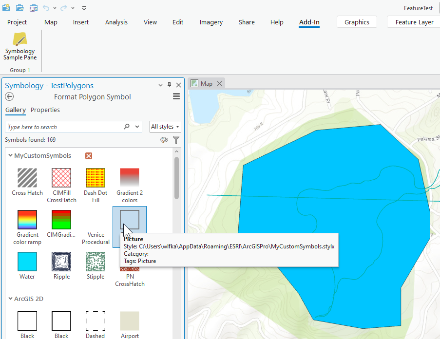

## Symbology

<!-- TODO: Write a brief abstract explaining this sample -->
This sample creates custom point, line and polygon symbol items that you can use to render feature layers.    
These symbol items are stored in a personal style file in your project that you can re-use.  
  


<a href="https://pro.arcgis.com/en/pro-app/sdk/" target="_blank">View it live</a>

<!-- TODO: Fill this section below with metadata about this sample-->
```
Language:              C#
Subject:               Map Authoring
Contributor:           ArcGIS Pro SDK Team <arcgisprosdk@esri.com>
Organization:          Esri, https://www.esri.com
Date:                  11/04/2024
ArcGIS Pro:            3.4
Visual Studio:         2022
.NET Target Framework: net8.0-windows
```

## Resources

[Community Sample Resources](https://github.com/Esri/arcgis-pro-sdk-community-samples#resources)

### Samples Data

* Sample data for ArcGIS Pro SDK Community Samples can be downloaded from the [Releases](https://github.com/Esri/arcgis-pro-sdk-community-samples/releases) page.  

## How to use the sample
<!-- TODO: Explain how this sample can be used. To use images in this section, create the image file in your sample project's screenshots folder. Use relative url to link to this image using this syntax:  -->
1. In Visual Studio click the Build menu. Then select Build Solution.
2. Launch the debugger to open ArcGIS Pro.  
3. Open any project file.   
4. In Add-in tab, click the "Show Symbology pane" button.  
5. In the Symbology pane, you can see the custom Point, Line and Polygon symbols available in this sample. Select each of these items in the combo box to see the available symbols.  
    
6. In the project, access the Style project items available in the current project using the Catalog Pane.  
7. Click the MyCustomSymbols style project item. This is a personal style file created by the sample. It comprises all the symbols you saw in the Symbology pane.  
    
8. You can now use these custom symbols to render featurelayers in your project using the ArcGIS Pro Symbology UI.  
    
  

<!-- End -->

&nbsp;&nbsp;&nbsp;&nbsp;&nbsp;&nbsp;
&nbsp;&nbsp;&nbsp;&nbsp;&nbsp;&nbsp;&nbsp;&nbsp;&nbsp;&nbsp;&nbsp;&nbsp;
[Home](https://github.com/Esri/arcgis-pro-sdk/wiki) | <a href="https://pro.arcgis.com/en/pro-app/latest/sdk/api-reference" target="_blank">API Reference</a> | [Requirements](https://github.com/Esri/arcgis-pro-sdk/wiki#requirements) | [Download](https://github.com/Esri/arcgis-pro-sdk/wiki#installing-arcgis-pro-sdk-for-net) | <a href="https://github.com/esri/arcgis-pro-sdk-community-samples" target="_blank">Samples</a>
