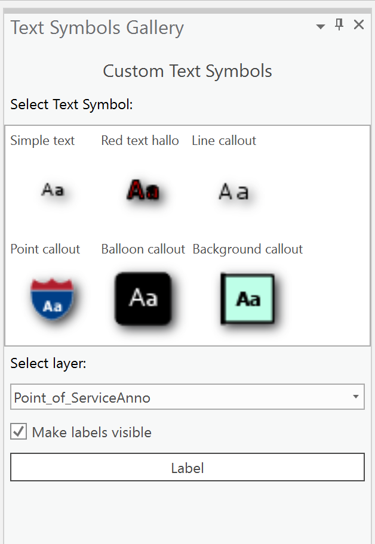

## TextSymbols

<!-- TODO: Write a brief abstract explaining this sample -->
This sample creates custom text symbol items that you can use to label feature layers and Annotation layers.    
These text symbol items are stored in a personal style file in your project that you can re-use.   
Community Sample data (see under the "Resources" section for downloading sample data) has a TextSymbols.ppkx  project package that contains Annotation and Feature layers that can be used for this sample.   
This project package is can be found under C:\Data\TextSymbols folder. Alternatively, you can also use any Annotation and Feature layers to work with this sample.  
  


<a href="https://pro.arcgis.com/en/pro-app/sdk/" target="_blank">View it live</a>

<!-- TODO: Fill this section below with metadata about this sample-->
```
Language:              C#
Subject:               Map Authoring
Contributor:           ArcGIS Pro SDK Team <arcgisprosdk@esri.com>
Organization:          Esri, https://www.esri.com
Date:                  04/04/2024
ArcGIS Pro:            3.3
Visual Studio:         2022
.NET Target Framework: net8.0-windows
```

## Resources

[Community Sample Resources](https://github.com/Esri/arcgis-pro-sdk-community-samples#resources)

### Samples Data

* Sample data for ArcGIS Pro SDK Community Samples can be downloaded from the [Releases](https://github.com/Esri/arcgis-pro-sdk-community-samples/releases) page.  

## How to use the sample
<!-- TODO: Explain how this sample can be used. To use images in this section, create the image file in your sample project's screenshots folder. Use relative url to link to this image using this syntax:  -->
1. In Visual Studio click the Build menu. Then select Build Solution.
2. Launch the debugger to open ArcGIS Pro.  
3. Open any project file that has a map with feature layers and/or Annotation layers.   
4. Activate the map.  
5. In the Add-in tab, click the "Text Symbols Gallery" button.  
6. In the Text Symbols Gallery dockpane, you can see the custom text symbols available in this sample.   
   
7. Select a text symbol.  
8. Select the Layer you want to label from the collection of feature layers in the combo box.  
9. Click the Label button to apply the lables.   
  

<!-- End -->

&nbsp;&nbsp;&nbsp;&nbsp;&nbsp;&nbsp;
&nbsp;&nbsp;&nbsp;&nbsp;&nbsp;&nbsp;&nbsp;&nbsp;&nbsp;&nbsp;&nbsp;&nbsp;
[Home](https://github.com/Esri/arcgis-pro-sdk/wiki) | <a href="https://pro.arcgis.com/en/pro-app/latest/sdk/api-reference" target="_blank">API Reference</a> | [Requirements](https://github.com/Esri/arcgis-pro-sdk/wiki#requirements) | [Download](https://github.com/Esri/arcgis-pro-sdk/wiki#installing-arcgis-pro-sdk-for-net) | <a href="https://github.com/esri/arcgis-pro-sdk-community-samples" target="_blank">Samples</a>
