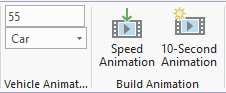
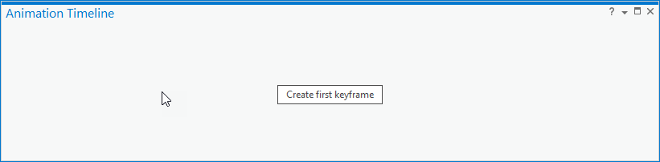
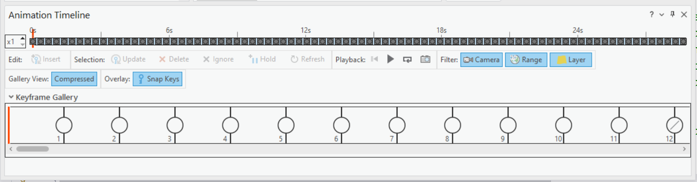
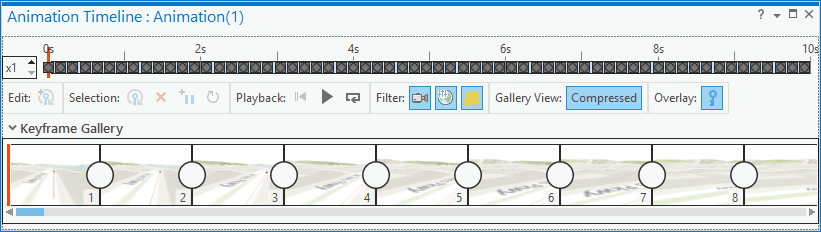

## AnimationTools

<!-- TODO: Write a brief abstract explaining this sample -->
This sample illustrates how animation keyframes can be generated with camera positions which follow 3D vehicle features.  There is the option to create keyframes with durations which simulate vehicle speed, or a brief 10-second animation. The animations are ready for export to video using the standard animation tools.    
  


<a href="http://pro.arcgis.com/en/pro-app/sdk/" target="_blank">View it live</a>

<!-- TODO: Fill this section below with metadata about this sample-->
```
Language:              C#
Subject:               Map Exploration
Contributor:           ArcGIS Pro SDK Team <arcgisprosdk@esri.com>
Organization:          Esri, http://www.esri.com
Date:                  7/01/2020
ArcGIS Pro:            2.6
Visual Studio:         2017, 2019
.NET Target Framework: 4.8
```

## Resources

* [API Reference online](https://pro.arcgis.com/en/pro-app/sdk/api-reference)
* <a href="https://pro.arcgis.com/en/pro-app/sdk/" target="_blank">ArcGIS Pro SDK for .NET (pro.arcgis.com)</a>
* [arcgis-pro-sdk-community-samples](https://github.com/Esri/arcgis-pro-sdk-community-samples)
* [ArcGIS Pro DAML ID Reference](https://github.com/Esri/arcgis-pro-sdk/wiki/ArcGIS-Pro-DAML-ID-Reference)
* [FAQ](https://github.com/Esri/arcgis-pro-sdk/wiki/FAQ)
* [ArcGIS Pro SDK icons](https://github.com/Esri/arcgis-pro-sdk/releases/tag/2.4.0.19948)


### Samples Data

* Sample data for ArcGIS Pro SDK Community Samples can be downloaded from the [repo releases](https://github.com/Esri/arcgis-pro-sdk-community-samples/releases) page.  

## How to use the sample
<!-- TODO: Explain how this sample can be used. To use images in this section, create the image file in your sample project's screenshots folder. Use relative url to link to this image using this syntax:  -->
1. Download the Community Sample data (see under the 'Resources' section for downloading sample data). The sample data contains a dataset called 'VehicleAnimation'.  Make sure that the Sample data is unzipped under c:\data and the folder "C:\Data\VehicleAnimation\" is available.  
1. Open this solution in Visual Studio 2017.  
1. Click the Build menu and select Build Solution.  
1. Click the Start button to open ArcGIS Pro. ArcGIS Pro will open.  
1. Open the project "VehicleAnimation.aprx" found in folder "C:\Data\VehicleAnimation\".  
1. The demo dataset contains polyline route and 3D point layers for three different vehicles – a car, sailboat and helicopter.  There project’s bookmarks which will take you to the start of each vehicle route.  The project opens at the beginning of the car route. Each of the 3D point layers has a range already set so that only one vehicle point feature is visible at a time.  
1. Click on the Animation Tab, and you will find two new sample groups added to the end of the tab – “Vehicle Animation Settings” and Build Animation”.    
  
  
1. Click on the Timeline button in the Playback group to open the Timeline pane.  Make sure that you have a new, empty animation in the Timeline.  Note:  It is essential that the timeline window be empty of keyframes showing the “Create first keyframe” button before proceeding with building an animation.  Dock the pane at the bottom of the Pro UI if necessary for better viewing.    
  
  
1. First, create a speed animation for the car.  Enter your desired speed value in the edit box at the top of the Vehicle Animation Settings group or proceed with the default value of 55 miles per hour.  
1. Make sure that “Car” is chosen in the combobox in the Vehicle Animation Settings group.  
1. Press the “Speed Animation” button in the Build Animation group. You will be prompted to confirm if your choices are correct.  If so, press “OK”.  
1. New keyframes will be built in the animation timeline. The speed animation option builds the keyframes with a duration allowing for the simulation of the correct speed in miles per hour, for the car to travel the full route.  Using the default speed of 55 mph, the car animation duration will be just over 28 seconds.  
  
  
1. You will see an Info message box that informs you that you can view the timeline, and a recommended Frames Per Second setting value to use when exporting a video from the animation. Note and use that value for best results based on the full duration of the animation.  
1. Play the animation and/or export a video to see the car movement and note how the keyframes have been generated with camera settings which allow close viewing of the vehicle’s movement along the route.  
1. Next, create a 10-second animation for the car.  Delete the existing animation, or create a new animation, using the tools in the “Manage” group.  Reminder:  It is essential that the timeline window be empty of keyframes showing the “Create first keyframe” button before proceeding with building an animation.  
1. Ensure the Car option is chosen in the settings combobox, and press the “10-Second Animation” button in the Build Animation group.  When prompted to confirm, press “OK”.  
1. As before, new keyframes will be built in the animation timeline. The 10-second animation option builds the keyframes for a total animation duration of 10 seconds.  You will see the Info message box again informing you to export videos this time with a 25 Frames Per Second setting, which is optimal for the 10-second duration with approximately 250 keyframes generated.  
  
  
1. Again, play the new animation and/or export a video to see the car movement and how the keyframes have been generated with camera settings which allow close viewing of the vehicles movement along the route.  
1. If you like, repeat the steps above using the sailboat and helicopter vehicles.  Use the project bookmarks to move to the beginning of their respective routes.  
  


<!-- End -->

&nbsp;&nbsp;&nbsp;&nbsp;&nbsp;&nbsp;
&nbsp;&nbsp;&nbsp;&nbsp;&nbsp;&nbsp;&nbsp;&nbsp;&nbsp;&nbsp;&nbsp;&nbsp;
[Home](https://github.com/Esri/arcgis-pro-sdk/wiki) | <a href="https://pro.arcgis.com/en/pro-app/sdk/api-reference" target="_blank">API Reference</a> | [Requirements](https://github.com/Esri/arcgis-pro-sdk/wiki#requirements) | [Download](https://github.com/Esri/arcgis-pro-sdk/wiki#installing-arcgis-pro-sdk-for-net) | <a href="https://github.com/esri/arcgis-pro-sdk-community-samples" target="_blank">Samples</a>
