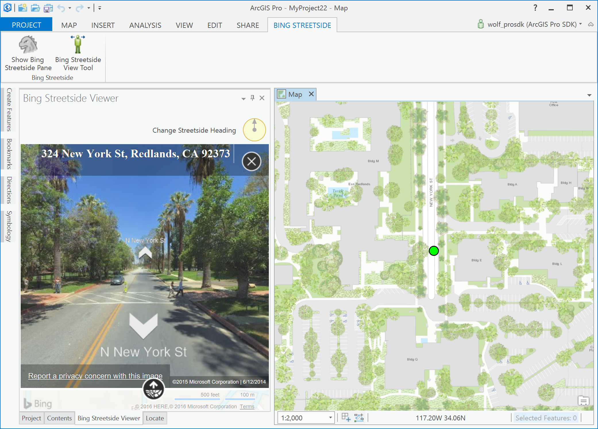
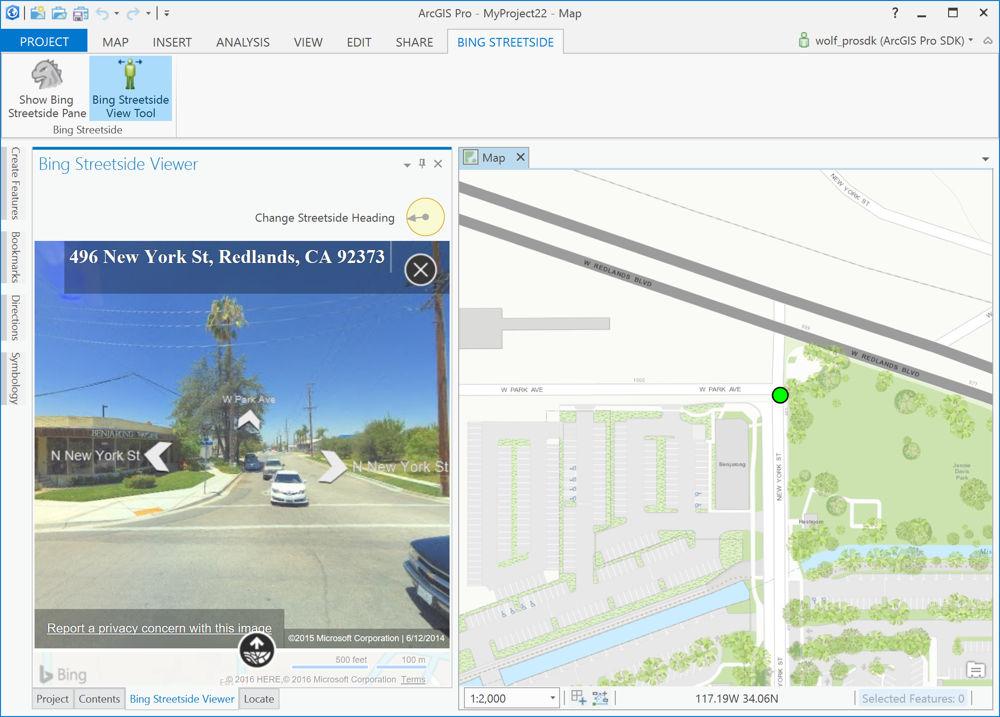
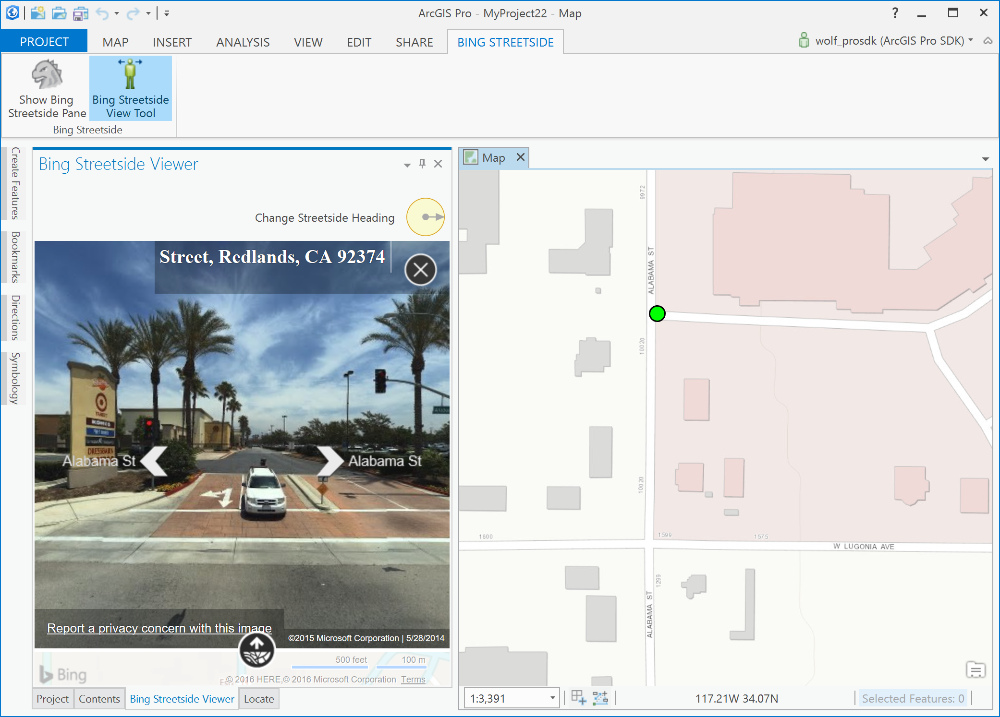

## BingStreetside

<!-- TODO: Write a brief abstract explaining this sample -->
This sample demonstrates the usagle of the WebBrowser control and how to interface between C# and HTML5/JavaScript and vise versa.    
The sample is using a Bing Map's Streetside API to demonstrate these functions.  In order to use this sample you have to apply with Bing Maps for a Bing Maps API developer key.  You can find the instructions on how to do this below.    
  


<a href="http://pro.arcgis.com/en/pro-app/sdk/" target="_blank">View it live</a>

<!-- TODO: Fill this section below with metadata about this sample-->
```
Language:              C# 6.0
Subject:               Map Exploration
Contributor:           ArcGIS Pro SDK Team <arcgisprosdk@esri.com>
Organization:          Esri, http://www.esri.com
Date:                  6/28/2017
ArcGIS Pro:            2.0
Visual Studio:         2015, 2017
.NET Target Framework: 4.6.1
```

## Resources

* [API Reference online](http://pro.arcgis.com/en/pro-app/sdk/api-reference)
* <a href="http://pro.arcgis.com/en/pro-app/sdk/" target="_blank">ArcGIS Pro SDK for .NET (pro.arcgis.com)</a>
* [arcgis-pro-sdk-community-samples](http://github.com/Esri/arcgis-pro-sdk-community-samples)
* [ArcGISPro Registry Keys](http://github.com/Esri/arcgis-pro-sdk/wiki/ArcGIS-Pro-Registry-Keys)
* [FAQ](http://github.com/Esri/arcgis-pro-sdk/wiki/FAQ)
* [ArcGIS Pro SDK icons](https://github.com/Esri/arcgis-pro-sdk/releases/tag/1.4.0.7198)
* [ProConcepts: ArcGIS Pro Add in Samples](https://github.com/Esri/arcgis-pro-sdk-community-samples/wiki/ProConcepts-ArcGIS-Pro-Add-in-Samples)


* [ProSnippets: 2.0 Migration](http://github.com/Esri/arcgis-pro-sdk/wiki/ProSnippets-Migrating-to-2.0)  
* [ProSnippets: 2.0 Migration Samples](http://github.com/Esri/arcgis-pro-sdk/wiki/ProSnippets-2.0-Migration-Samples)  
* [ProConcepts: 2.0 Migration](http://github.com/Esri/arcgis-pro-sdk/wiki/ProConcepts-2.0-Migration-Guide)  

### Samples Data

* Sample data for ArcGIS Pro SDK Community Samples can be downloaded from the [repo releases](https://github.com/Esri/arcgis-pro-sdk-community-samples/releases) page.  

## How to use the sample
<!-- TODO: Explain how this sample can be used. To use images in this section, create the image file in your sample project's screenshots folder. Use relative url to link to this image using this syntax:  -->
Using Bing Maps API: To use the Bing Maps APIs, you must have a (Bing Maps Key)[https://msdn.microsoft.com/en-us/library/dd877180.aspx].  
Note: When you use the Bing Maps APIs with a Bing Maps Key, usage transactions are logged. See Understanding (Bing Maps Transactions)[https://msdn.microsoft.com/en-us/library/ff859477.aspx] for more information.  
Creating a Bing Maps Key  
  
1. Go to the Bing Maps Dev Center at https://www.bingmapsportal.com/.   
** If you have a Bing Maps account, sign in with the Microsoft account that you used to create the account or create a new one.For new accounts, follow the instructions in (Creating a Bing Maps Account)[https://msdn.microsoft.com/en-us/library/gg650598.aspx].  
2. Select Keys under My Account.  
3. Provide the following information to create a key:  
** Application name: Required.The name of the application.  
** Application URL: The URL of the application.  
** Key type: Required. Select the key type that you want to create.You can find descriptions of key and application types (here)[https://www.microsoft.com/maps/create-a-bing-maps-key.aspx].  
** Application type: Required. Select the application type that best represents the application that will use this key.You can find descriptions of key and application types (here)[https://www.microsoft.com/maps/create-a-bing-maps-key.aspx].    
4.	Type the characters of the security code, and then click Create. The new key displays in the list of available keys.Use this key to authenticate your Bing Maps application as described in the documentation for the Bing Maps API you are using.  
   
Note: the Bing map preview SDK overview used in this sample can be found here: https://www.bing.com/mapspreview/sdk/mapcontrol/isdk#overview  
  
Using the sample:  
  
1. In Visual Studio click the Build menu. Then select Build Solution.  
1. Click Start button to open ArcGIS Pro.  
1. ArcGIS Pro will open.   
1. Create a new project using the Map.aptx template.    
1. With a map view active go to the "Bing Streetside" tab and click the "Show Bing Streetside Pane" button.  
1. This will open the "Bing Streetside Viewer" dock pane.  
  
  
1. Paste the "Bing Maps Key" that you obtained from Microsoft (see instructions above) and click the "Define Bing Map Key" button.    
1. For convenience you can also define your Bing Key under the following code comment: "TODO: define your bing map key here:"  
1. The "Bing Streetside Viewer" dock pane now displays Bing Map's street view pane (starting at Esri).  
  
  
1. Click on the "N New York St" arrow pointing north on the "Bing Streetside Viewer" and see the location on the map pane being updated.    
  
  
1. The view heading on the "Bing Map Streetside" view can be changed by clicking on the "Change Heading" control above the "Bing Map Streetside" control and dragging the heading arrow into a new direction.    
  
  
1. Click the "Bing Streetside View Tool" button and click on a new street location on the map pane.  
1. Notice that "Bing Map Streetside" will update it's view to the new clicked on location.  
  
  


<!-- End -->

&nbsp;&nbsp;&nbsp;&nbsp;&nbsp;&nbsp;
&nbsp;&nbsp;&nbsp;&nbsp;&nbsp;&nbsp;&nbsp;&nbsp;&nbsp;&nbsp;&nbsp;&nbsp;
[Home](https://github.com/Esri/arcgis-pro-sdk/wiki) | <a href="http://pro.arcgis.com/en/pro-app/sdk/api-reference" target="_blank">API Reference</a> | [Requirements](https://github.com/Esri/arcgis-pro-sdk/wiki#requirements) | [Download](https://github.com/Esri/arcgis-pro-sdk/wiki#installing-arcgis-pro-sdk-for-net) | <a href="http://github.com/esri/arcgis-pro-sdk-community-samples" target="_blank">Samples</a>
