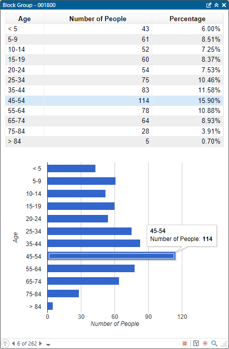

##CustomPopup

<!-- TODO: Write a brief abstract explaining this sample -->
 This sample shows how to author custom pop-up content to display in a pop-up window.   
 In this example we are generating html and javascript code using the Google Charts api to create rich and interactive content in the pop-up.   
 This example also shows how to add your own commands to the bottom of the pop-up window.   
   


<a href="http://pro.arcgis.com/en/pro-app/sdk/" target="_blank">View it live</a>

<!-- TODO: Fill this section below with metadata about this sample-->
```
Language:      C#
Subject:       Map-Exploration
Contributor:   ArcGIS Pro SDK Team <arcgisprosdk@esri.com>
Organization:  Esri, http://www.esri.com
Date:          3/1/2016
ArcGIS Pro:    1.2
Visual Studio: 2013, 2015
```

##Resources

* [API Reference online](http://pro.arcgis.com/en/pro-app/sdk/api-reference)
* <a href="http://pro.arcgis.com/en/pro-app/sdk/" target="_blank">ArcGIS Pro SDK for .NET (pro.arcgis.com)</a>
* [arcgis-pro-sdk-community-samples](http://github.com/Esri/arcgis-pro-sdk-community-samples)
* [ArcGIS Pro DAML ID Reference](http://github.com/Esri/arcgis-pro-sdk/wiki/ArcGIS Pro DAML ID Reference)
* [FAQ](http://github.com/Esri/arcgis-pro-sdk/wiki/FAQ)
* [ArcGIS Pro SDK icons](https://github.com/Esri/arcgis-pro-sdk/releases/tag/1.1.0.3308)
* [ProConcepts: ArcGIS Pro Add in Samples](https://github.com/Esri/arcgis-pro-sdk-community-samples/wiki/ProConcepts-ArcGIS-Pro-Add-in-Samples)
* [Sample data for ArcGIS Pro SDK Community Samples](https://github.com/Esri/arcgis-pro-sdk-community-samples/releases)


##How to use the sample
<!-- TODO: Explain how this sample can be used. To use images in this section, create the image file in your sample project's screenshots folder. Use relative url to link to this image using this syntax:  -->
 1. In Visual Studio click the Build menu. Then select Build Solution.  
 2. Click Start button to open ArcGIS Pro.  
 3. ArcGIS Pro will open.   
 4. Open a map view. Click on the Add-In tab on the ribbon.  
 5. Within this tab there is a Custom Pop-up tool. Click it to activate the tool.  
 6. In the map click and drag a box around the features you want to identify.  
 7. The pop-up window should display and you should see a table showing the values for all the visible numeric fields in the layer.   
 It will also display a pie chart for those same fields.  
 8. As you click through the pop-up results the content is being generated dynamically for each feature.  
 9. The pop-up window also has a custom command "Show statistics" at the bottom of the window that when clicked shows additional information about the feature.  
  
  
   


[](Esri Tags: ArcGIS-Pro-SDK)
[](Esri Language: C-Sharp)​

<p align = center>
<b> ArcGIS Pro 1.2 SDK for Microsoft .NET Framework</b>
</p>
&nbsp;&nbsp;&nbsp;&nbsp;&nbsp;&nbsp;&nbsp;&nbsp;&nbsp;&nbsp;&nbsp;&nbsp;&nbsp;&nbsp;&nbsp;&nbsp;&nbsp;&nbsp;&nbsp;&nbsp;[Home](https://github.com/Esri/arcgis-pro-sdk/wiki) | <a href="http://pro.arcgis.com/en/pro-app/sdk" target="_blank">ArcGIS Pro SDK</a> | <a href="http://pro.arcgis.com/en/pro-app/sdk/api-reference/index.html" target="_blank">API Reference</a> | [Requirements](#requirements) | [Download](#installing-arcgis-pro-sdk-for-net) |  <a href="http://github.com/esri/arcgis-pro-sdk-community-samples" target="_blank">Samples</a>
