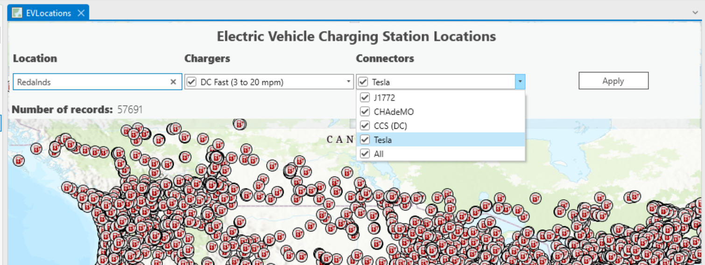
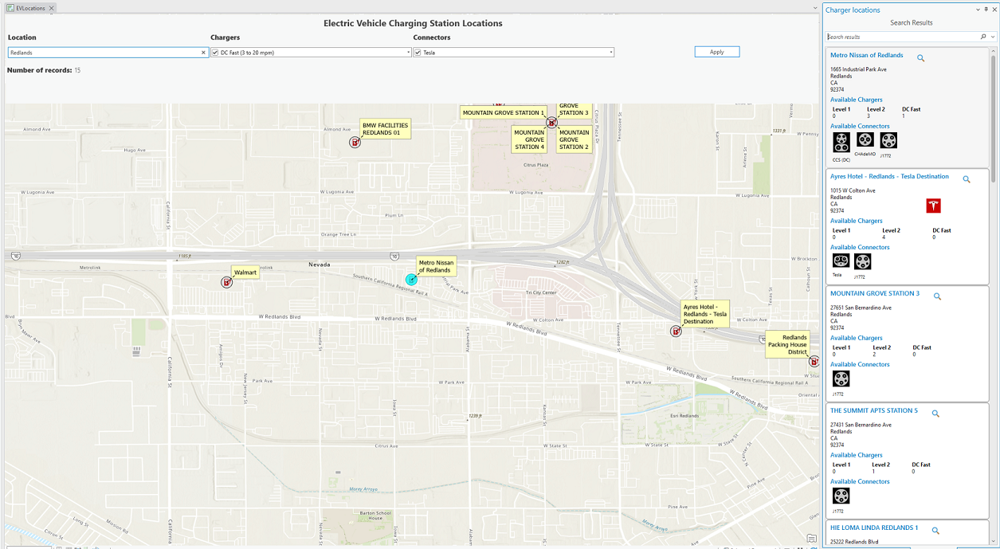

## EVChargers

<!-- TODO: Write a brief abstract explaining this sample -->
This sample uses an embeddable control on a Mapview to allow advanced filter search of USA and Canada Electrical vehicle charger locations. You can search locations, charger and connector types.  
The results will be displayed in a dockpane.  
  


<a href="https://pro.arcgis.com/en/pro-app/sdk/" target="_blank">View it live</a>

<!-- TODO: Fill this section below with metadata about this sample-->
```
Language:              C#
Subject:               Map Exploration
Contributor:           ArcGIS Pro SDK Team <arcgisprosdk@esri.com>
Organization:          Esri, https://www.esri.com
Date:                  04/04/2024
ArcGIS Pro:            3.3
Visual Studio:         2022
.NET Target Framework: net8.0-windows
```

## Resources

[Community Sample Resources](https://github.com/Esri/arcgis-pro-sdk-community-samples#resources)

### Samples Data

* Sample data for ArcGIS Pro SDK Community Samples can be downloaded from the [Releases](https://github.com/Esri/arcgis-pro-sdk-community-samples/releases) page.  

## How to use the sample
<!-- TODO: Explain how this sample can be used. To use images in this section, create the image file in your sample project's screenshots folder. Use relative url to link to this image using this syntax:  -->
1. Download the Community Sample data (see under the 'Resources' section for downloading sample data).  The sample data contains a Pro package called 'LocationOfEVChargers' in c:\Data\DisplayFilters.
2. Open this sample in Visual Studio.    
3. Click the build menu and select Build Solution.  
4. Launch the debugger to open ArcGIS Pro.  
5. Open the project "c:\Data\DisplayFilters\LocationOfEVChargers" Pro project package.  
6. Open and activate the EVLocations map. This map has a EVChargers feature layer. It is a point dataset with over 57,000 charger locations in the US and Canada.  
7. Click on the Add-in tab.   
8. Click the 'Charger locations' button. This will activate an embeddable control that stretches to fit the width of the active MapView. This control has search filters to interact with the charger locations.  
  
9. Enter a location (Ex. Redlands), and pick a charger (Level 1, Level 2, Fast) or Connector type (Tesla, J1772, etc) you are interested in. Or select all of them.  
10. Click the Apply button. This will set a definition query on the feature layer using your filter options. The charger locations that satisfy your filter options will be displayed and labelled.  
11. The map view will zoom to the selected results. A dockpane will also appear in Pro that itemizes the results. Each result item will show more details about the charger location - Address, Charger type, connector type, etc.  
  
12. Click on each item in the dockpane to zoom and flash to the feature on the map view.  
13. Additionally, you can use the cursor to select a charger locations on the Map view. This will also select the item in the results dockpane.  
  

<!-- End -->

&nbsp;&nbsp;&nbsp;&nbsp;&nbsp;&nbsp;
&nbsp;&nbsp;&nbsp;&nbsp;&nbsp;&nbsp;&nbsp;&nbsp;&nbsp;&nbsp;&nbsp;&nbsp;
[Home](https://github.com/Esri/arcgis-pro-sdk/wiki) | <a href="https://pro.arcgis.com/en/pro-app/latest/sdk/api-reference" target="_blank">API Reference</a> | [Requirements](https://github.com/Esri/arcgis-pro-sdk/wiki#requirements) | [Download](https://github.com/Esri/arcgis-pro-sdk/wiki#installing-arcgis-pro-sdk-for-net) | <a href="https://github.com/esri/arcgis-pro-sdk-community-samples" target="_blank">Samples</a>
