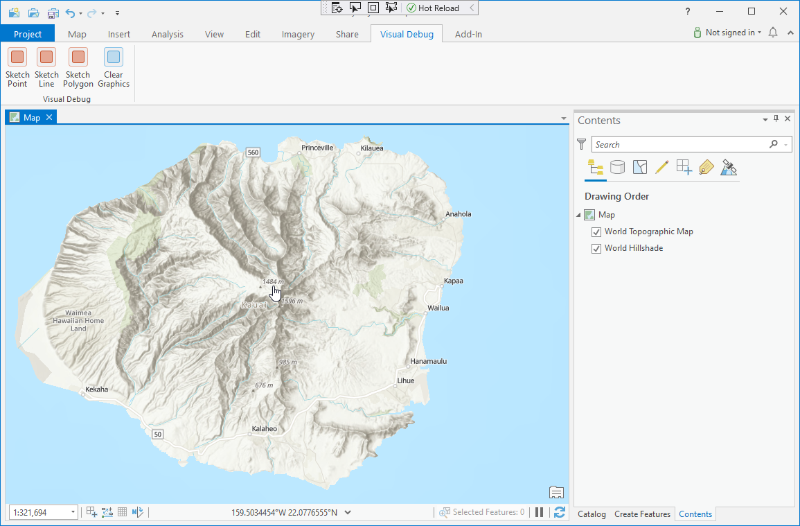
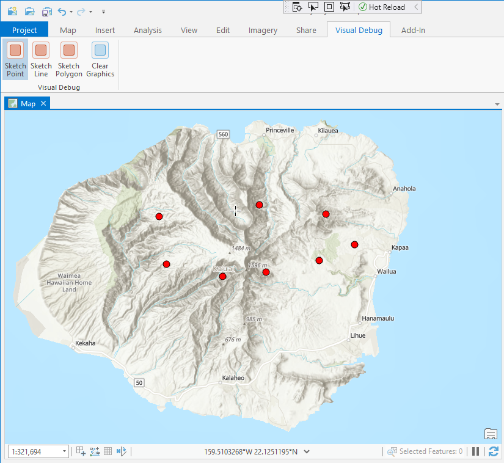
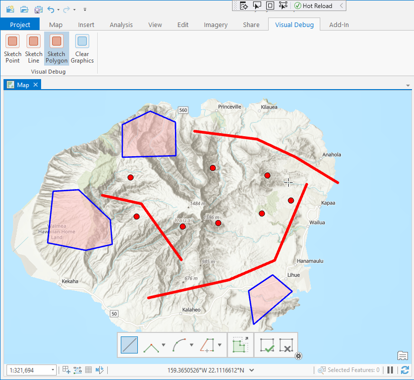

## GraphicOverlay4Debug

<!-- TODO: Write a brief abstract explaining this sample -->
"GraphicOverlay4Debug" shows how to use the graphics overlay to add point, line, and polygon features mainly to allow 'visual debugging' of geometries in your mapview.  
  


<a href="https://pro.arcgis.com/en/pro-app/sdk/" target="_blank">View it live</a>

<!-- TODO: Fill this section below with metadata about this sample-->
```
Language:              C#
Subject:               Framework
Contributor:           ArcGIS Pro SDK Team <arcgisprosdk@esri.com>
Organization:          Esri, https://www.esri.com
Date:                  02/22/2023
ArcGIS Pro:            3.1
Visual Studio:         2022
.NET Target Framework: net6.0-windows
```

## Resources

[Community Sample Resources](https://github.com/Esri/arcgis-pro-sdk-community-samples#resources)

### Samples Data

* Sample data for ArcGIS Pro SDK Community Samples can be downloaded from the [Releases](https://github.com/Esri/arcgis-pro-sdk-community-samples/releases) page.  

## How to use the sample
<!-- TODO: Explain how this sample can be used. To use images in this section, create the image file in your sample project's screenshots folder. Use relative url to link to this image using this syntax:  -->
1. In Visual Studio click the Build menu. Then select Build Solution.  
1. Launch the debugger to ArcGIS Pro.  
1. In ArcGIS Pro open a new project with an empty map and after the map is displayed select the 'Visual Debug' tab  
  
  
1. Select the 'Sketch Point' tool and start to sketch points on the map.  Each sketched point will be added to the map as a graphic overlay.  
  
  
1. Select the 'Sketch Line' and 'Sketch Polygon' tools to add lines and polygons to the graphic overlay.  
  
  
1. Click on the 'Clear Graphics' button to clear all overlay graphics.  
In order to make use the 'visual debug' capabilities you can simply:  
  
1. Copy the two regions from the sample module.cs file into your module.cs: #region Overlay Helpers, and #region Symbol Helpers  
1. Then paste the following code snippet in order to display your geometry as a graphic overlay  
1. QueuedTask.Run(() => Module1.AddOverlay(geometry, Module1.GetPointSymbolRef())); // for points  
1. QueuedTask.Run(() => Module1.AddOverlay(geometry, Module1.GetLineSymbolRef())); // for lines  
1. QueuedTask.Run(() => Module1.AddOverlay(geometry, Module1.GetPolygonSymbolRef())); // for polygons  
1. Module1.ClearGraphics(); // to clear the graphic overlay  
  


<!-- End -->

&nbsp;&nbsp;&nbsp;&nbsp;&nbsp;&nbsp;
&nbsp;&nbsp;&nbsp;&nbsp;&nbsp;&nbsp;&nbsp;&nbsp;&nbsp;&nbsp;&nbsp;&nbsp;
[Home](https://github.com/Esri/arcgis-pro-sdk/wiki) | <a href="https://pro.arcgis.com/en/pro-app/latest/sdk/api-reference" target="_blank">API Reference</a> | [Requirements](https://github.com/Esri/arcgis-pro-sdk/wiki#requirements) | [Download](https://github.com/Esri/arcgis-pro-sdk/wiki#installing-arcgis-pro-sdk-for-net) | <a href="https://github.com/esri/arcgis-pro-sdk-community-samples" target="_blank">Samples</a>
