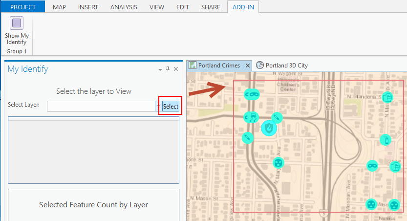
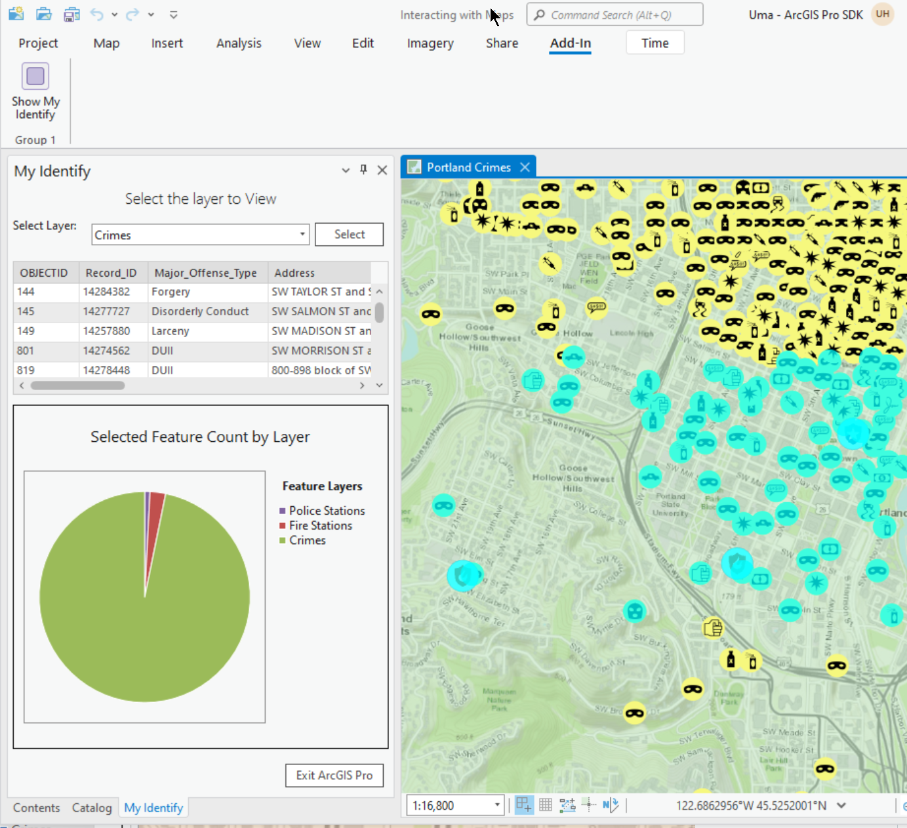
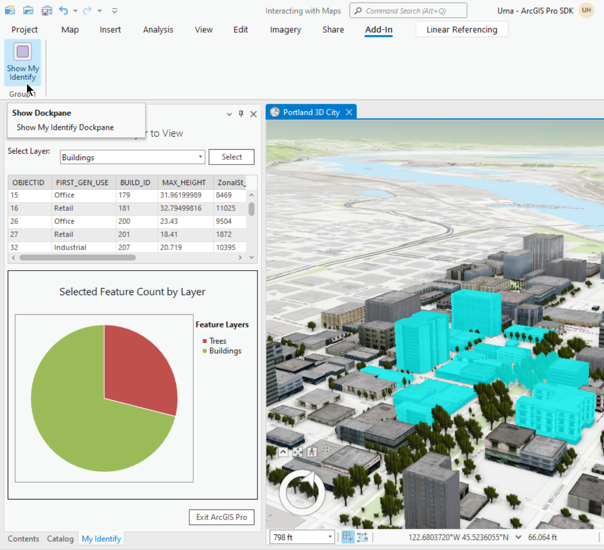

## IdentifyWindow

<!-- TODO: Write a brief abstract explaining this sample -->
This sample illustrates working with ArcGIS Pro's map view and how to interact.  The sample provides the following functionality  
  
1. Show the layer for the current active map view.  
1. Select features on the current active map view.  
1. Display the attribute data for all selected features.  
1. Display a chart control with data driven by feature selection.  
  


<a href="http://pro.arcgis.com/en/pro-app/sdk/" target="_blank">View it live</a>

<!-- TODO: Fill this section below with metadata about this sample-->
```
Language:              C# 6.0
Subject:               Framework
Contributor:           ArcGIS Pro SDK Team <arcgisprosdk@esri.com>
Organization:          Esri, http://www.esri.com
Date:                  6/28/2017
ArcGIS Pro:            2.0
Visual Studio:         2015, 2017
.NET Target Framework: 4.6.1
```

## Resources

* [API Reference online](http://pro.arcgis.com/en/pro-app/sdk/api-reference)
* <a href="http://pro.arcgis.com/en/pro-app/sdk/" target="_blank">ArcGIS Pro SDK for .NET (pro.arcgis.com)</a>
* [arcgis-pro-sdk-community-samples](http://github.com/Esri/arcgis-pro-sdk-community-samples)
* [ArcGISPro Registry Keys](http://github.com/Esri/arcgis-pro-sdk/wiki/ArcGIS-Pro-Registry-Keys)
* [FAQ](http://github.com/Esri/arcgis-pro-sdk/wiki/FAQ)
* [ArcGIS Pro SDK icons](https://github.com/Esri/arcgis-pro-sdk/releases/tag/1.4.0.7198)
* [ProConcepts: ArcGIS Pro Add in Samples](https://github.com/Esri/arcgis-pro-sdk-community-samples/wiki/ProConcepts-ArcGIS-Pro-Add-in-Samples)


* [ProSnippets: 2.0 Migration](http://github.com/Esri/arcgis-pro-sdk/wiki/ProSnippets-Migrating-to-2.0)  
* [ProSnippets: 2.0 Migration Samples](http://github.com/Esri/arcgis-pro-sdk/wiki/ProSnippets-2.0-Migration-Samples)  
* [ProConcepts: 2.0 Migration](http://github.com/Esri/arcgis-pro-sdk/wiki/ProConcepts-2.0-Migration-Guide)  

### Samples Data

* Sample data for ArcGIS Pro SDK Community Samples can be downloaded from the [repo releases](https://github.com/Esri/arcgis-pro-sdk-community-samples/releases) page.  

## How to use the sample
<!-- TODO: Explain how this sample can be used. To use images in this section, create the image file in your sample project's screenshots folder. Use relative url to link to this image using this syntax:  -->
1. Download the Community Sample data (see under the 'Resources' section for downloading sample data).  The sample data contains a dataset called 'Interacting with Maps' with both 2D and 3D data.  Make sure that the Sample data is unzipped in c:\data and "C:\Data\Interacting with Maps" is available.  
1. Open this solution in Visual Studio 2015.    
1. Click the build menu and select Build Solution.  
1. This solution is using the **System.Windows.Controls.DataVisualization.Toolkit Nuget**.  If needed, you can install the Nuget from the "Nuget Package Manager Console" by using this script: "Install-Package System.Windows.Controls.DataVisualization.Toolkit".  
1. Click the Start button to open ArCGIS Pro.  ArcGIS Pro will open.  
1. Open the project "Interacting with Maps.aprx" in the "C:\Data\Interacting with Maps" folder since this project contains 2D and 3D data.  
1. Click on the Add-in tab and see that a 'Show my identify' button was added.  
1. The 'Show my identify' button opens the 'My Identify' pane.   
1. Click the 'Select' button and 'rubber band over the features on your map pane.  
  
  
1. Select a single layer from the 'Select Layer' drop down.  
1. Both the grid and chart controls are now displaying data for the selected feature set  
  
  
1. Switch to the Portland 3D City map view and perform the same feature selection on the map view and then the 'select layer' drop down selection on the 'My Identify' pane  
  
  


<!-- End -->

&nbsp;&nbsp;&nbsp;&nbsp;&nbsp;&nbsp;
&nbsp;&nbsp;&nbsp;&nbsp;&nbsp;&nbsp;&nbsp;&nbsp;&nbsp;&nbsp;&nbsp;&nbsp;
[Home](https://github.com/Esri/arcgis-pro-sdk/wiki) | <a href="http://pro.arcgis.com/en/pro-app/sdk/api-reference" target="_blank">API Reference</a> | [Requirements](https://github.com/Esri/arcgis-pro-sdk/wiki#requirements) | [Download](https://github.com/Esri/arcgis-pro-sdk/wiki#installing-arcgis-pro-sdk-for-net) | <a href="http://github.com/esri/arcgis-pro-sdk-community-samples" target="_blank">Samples</a>
