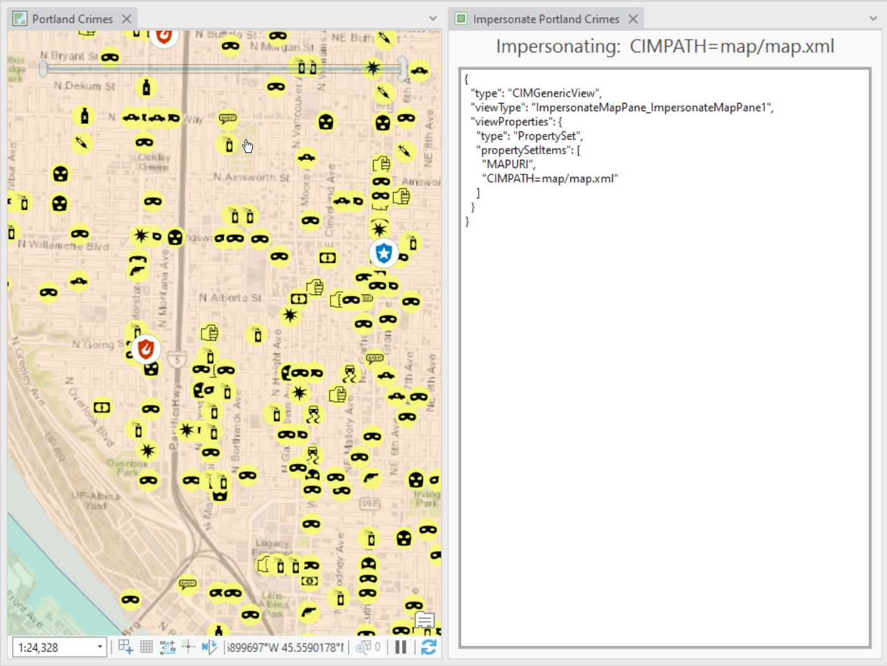

## ImpersonateMapPane

<!-- TODO: Write a brief abstract explaining this sample -->
This sample illustrates how to create a new map pane that impersonates an existing map pane. A control will be added to the new pane allowing you to view the map CIM.  A custom  
TOC implementation will also be demonstrated.A new Visual Studio template 'ArcGIS Pro Map Pane Impersonation' has been added at ArcGIS Pro 2.0.    
  


<a href="https://pro.arcgis.com/en/pro-app/sdk/" target="_blank">View it live</a>

<!-- TODO: Fill this section below with metadata about this sample-->
```
Language:              C#
Subject:               Map-Exploration
Contributor:           ArcGIS Pro SDK Team <arcgisprosdk@esri.com>
Organization:          Esri, https://www.esri.com
Date:                  10/01/2023
ArcGIS Pro:            3.2
Visual Studio:         2022
.NET Target Framework: net6.0-windows
```

## Resources

[Community Sample Resources](https://github.com/Esri/arcgis-pro-sdk-community-samples#resources)

### Samples Data

* Sample data for ArcGIS Pro SDK Community Samples can be downloaded from the [Releases](https://github.com/Esri/arcgis-pro-sdk-community-samples/releases) page.  

## How to use the sample
<!-- TODO: Explain how this sample can be used. To use images in this section, create the image file in your sample project's screenshots folder. Use relative url to link to this image using this syntax:  -->
1. Download the Community Sample data (see under the 'Resources' section for downloading sample data)
2. Make sure that the Sample data is unzipped in c:\data  
3. The project used for this sample is 'C:\data\Interacting with Maps\Interacting with Maps.aprx'  
4. In Visual Studio click the Build menu.Then select Build Solution.   
5. Click Start button to open ArcGIS Pro.  
6. ArcGIS Pro will open, select the Interacting with Maps.aprx project  
7. Select the 'Add-in' tab on the ArcGIS Pro ribbon. See the 'Open ImpersonateMapPane1' button  
  
8. Click the button and see the Impersonate pane open.  Reposition the pane to view it side by side with the 2D map  
  

<!-- End -->

&nbsp;&nbsp;&nbsp;&nbsp;&nbsp;&nbsp;
&nbsp;&nbsp;&nbsp;&nbsp;&nbsp;&nbsp;&nbsp;&nbsp;&nbsp;&nbsp;&nbsp;&nbsp;
[Home](https://github.com/Esri/arcgis-pro-sdk/wiki) | <a href="https://pro.arcgis.com/en/pro-app/latest/sdk/api-reference" target="_blank">API Reference</a> | [Requirements](https://github.com/Esri/arcgis-pro-sdk/wiki#requirements) | [Download](https://github.com/Esri/arcgis-pro-sdk/wiki#installing-arcgis-pro-sdk-for-net) | <a href="https://github.com/esri/arcgis-pro-sdk-community-samples" target="_blank">Samples</a>
