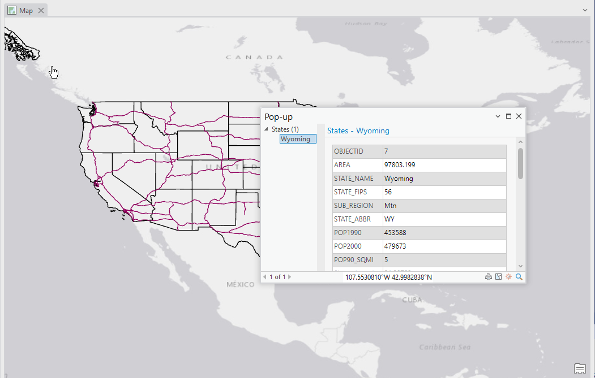
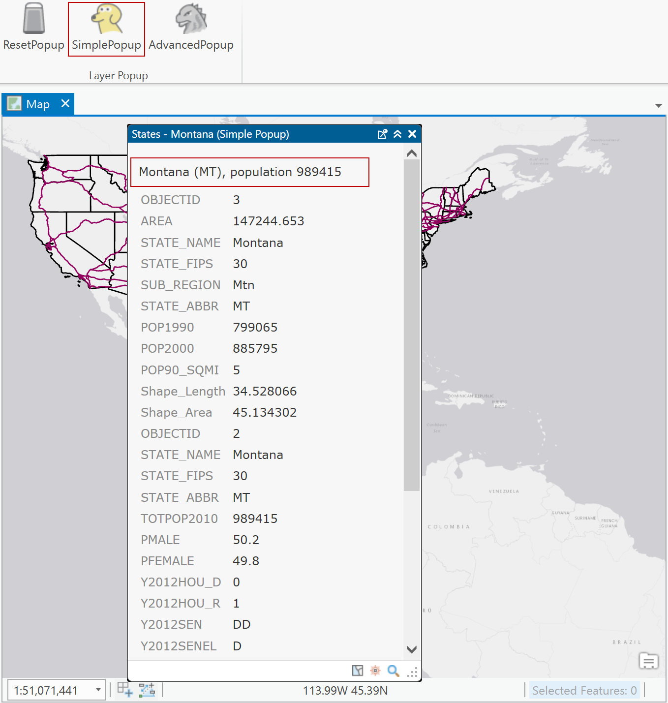
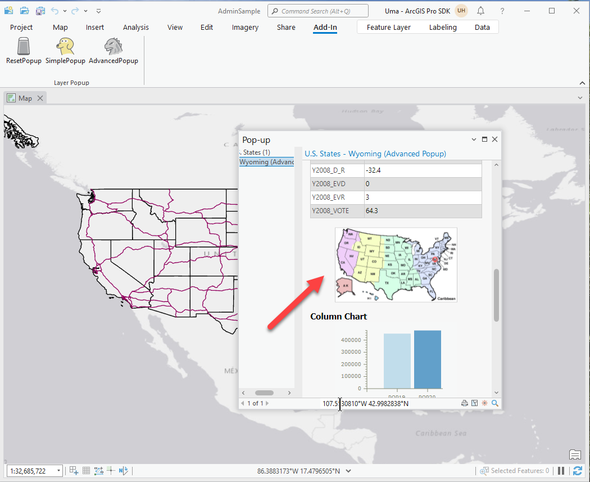

## LayerPopups

<!-- TODO: Write a brief abstract explaining this sample -->
This sample illustrates how to customize ArcGIS Pro's Layer Pop-up screen.  The sample shows how to define layer popups that will be persisted in the layer's CIM definition and defines a set of 'helper' classes modelled after the similar pattern ArcGIS.Desktop.Mapping implements for Renderer definitions. Popups can be defined that incorporate text, field values, images, charts, etc.  
  


<a href="http://pro.arcgis.com/en/pro-app/sdk/" target="_blank">View it live</a>

<!-- TODO: Fill this section below with metadata about this sample-->
```
Language:              C# 6.0
Subject:               Map Exploration
Contributor:           ArcGIS Pro SDK Team <arcgisprosdk@esri.com>
Organization:          Esri, http://www.esri.com
Date:                  6/28/2017
ArcGIS Pro:            2.0
Visual Studio:         2015, 2017
.NET Target Framework: 4.6.1
```

## Resources

* [API Reference online](http://pro.arcgis.com/en/pro-app/sdk/api-reference)
* <a href="http://pro.arcgis.com/en/pro-app/sdk/" target="_blank">ArcGIS Pro SDK for .NET (pro.arcgis.com)</a>
* [arcgis-pro-sdk-community-samples](http://github.com/Esri/arcgis-pro-sdk-community-samples)
* [ArcGISPro Registry Keys](http://github.com/Esri/arcgis-pro-sdk/wiki/ArcGIS-Pro-Registry-Keys)
* [FAQ](http://github.com/Esri/arcgis-pro-sdk/wiki/FAQ)
* [ArcGIS Pro SDK icons](https://github.com/Esri/arcgis-pro-sdk/releases/tag/1.4.0.7198)
* [ProConcepts: ArcGIS Pro Add in Samples](https://github.com/Esri/arcgis-pro-sdk-community-samples/wiki/ProConcepts-ArcGIS-Pro-Add-in-Samples)


* [ProSnippets: 2.0 Migration](http://github.com/Esri/arcgis-pro-sdk/wiki/ProSnippets-Migrating-to-2.0)  
* [ProSnippets: 2.0 Migration Samples](http://github.com/Esri/arcgis-pro-sdk/wiki/ProSnippets-2.0-Migration-Samples)  
* [ProConcepts: 2.0 Migration](http://github.com/Esri/arcgis-pro-sdk/wiki/ProConcepts-2.0-Migration-Guide)  

### Samples Data

* Sample data for ArcGIS Pro SDK Community Samples can be downloaded from the [repo releases](https://github.com/Esri/arcgis-pro-sdk-community-samples/releases) page.  

## How to use the sample
<!-- TODO: Explain how this sample can be used. To use images in this section, create the image file in your sample project's screenshots folder. Use relative url to link to this image using this syntax:  -->
1. Download the Community Sample data (see under the 'Resources' section for downloading sample data).  The sample data contains a project called 'AdminSample.aprx' that includes data that is used by this sample.  Make sure that the Sample data is unzipped in c:\data and "C:\Data\Admin" is available.  
1. Open this solution in Visual Studio 2015.    
1. Click the build menu and select Build Solution.  
1. Click the Start button to open ArCGIS Pro.  ArcGIS Pro will open.  
1. Open the project "AdminSample.aprx" in the "C:\Data\Admin\" folder since this project contains data referenced by the sample code.  
1. Click on the Add-in tab and see that three buttons in a 'Layer Popup' group were added.  
    
  
1. Click on any of the US state polygons to see the 'standard' layer popup.   
    
  
1. Close the popup.    
1. Click the 'SimplePopup' button and click on any of the US state polygons to see the 'simple' layer popup.  Notice the changed title and the additional text above the field data.    
    
  
1. Close the popup.    
1. Click the 'AdvancedPopup' button and click on any of the US state polygons to see the 'advanced' layer popup.  Notice the additional graphs on the bottom of the layer popup window.    
    
  
1. Close the popup.  
1. Click the 'ResetPopup' button to reset the layer popup to its original view.    
  


<!-- End -->

&nbsp;&nbsp;&nbsp;&nbsp;&nbsp;&nbsp;
&nbsp;&nbsp;&nbsp;&nbsp;&nbsp;&nbsp;&nbsp;&nbsp;&nbsp;&nbsp;&nbsp;&nbsp;
[Home](https://github.com/Esri/arcgis-pro-sdk/wiki) | <a href="http://pro.arcgis.com/en/pro-app/sdk/api-reference" target="_blank">API Reference</a> | [Requirements](https://github.com/Esri/arcgis-pro-sdk/wiki#requirements) | [Download](https://github.com/Esri/arcgis-pro-sdk/wiki#installing-arcgis-pro-sdk-for-net) | <a href="http://github.com/esri/arcgis-pro-sdk-community-samples" target="_blank">Samples</a>
