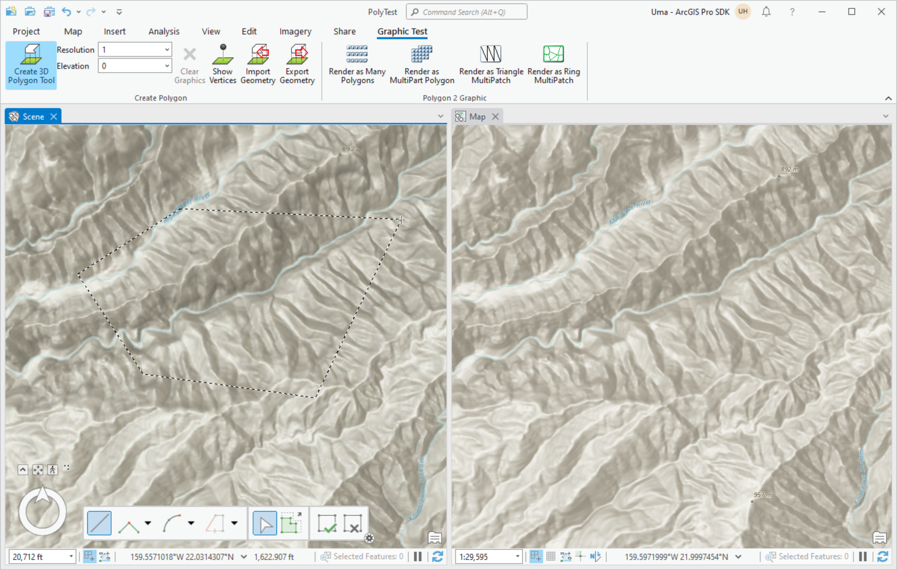
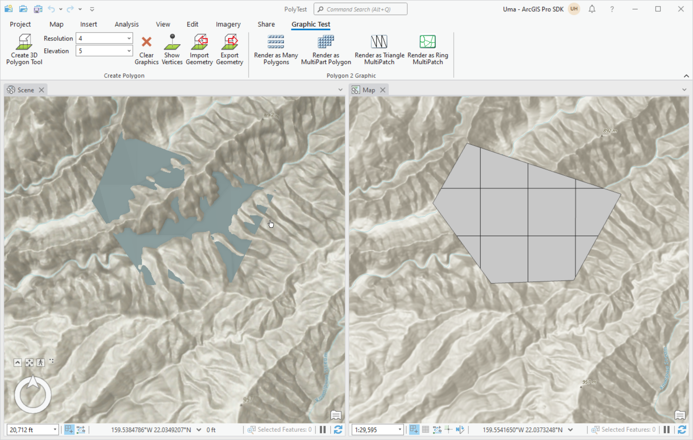
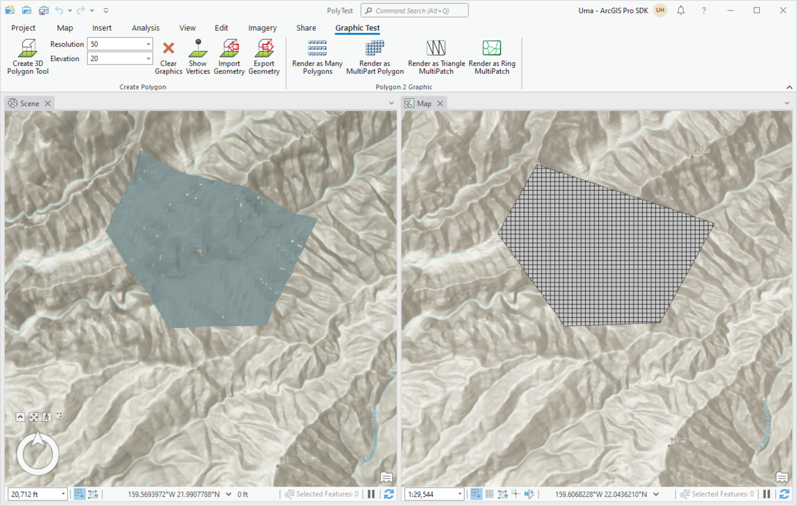

## OverlayGroundSurface

<!-- TODO: Write a brief abstract explaining this sample -->
OverlayGroundSurface illustrates how to draw geometries over a ground surface using AddOverlay.    
  


<a href="http://pro.arcgis.com/en/pro-app/sdk/" target="_blank">View it live</a>

<!-- TODO: Fill this section below with metadata about this sample-->
```
Language:              C#
Subject:               Map Exploration
Contributor:           ArcGIS Pro SDK Team <arcgisprosdk@esri.com>
Organization:          Esri, http://www.esri.com
Date:                  12/01/2020
ArcGIS Pro:            2.7
Visual Studio:         2019
.NET Target Framework: 4.8
```

## Resources

* [API Reference online](https://pro.arcgis.com/en/pro-app/sdk/api-reference)
* <a href="https://pro.arcgis.com/en/pro-app/sdk/" target="_blank">ArcGIS Pro SDK for .NET (pro.arcgis.com)</a>
* [arcgis-pro-sdk-community-samples](https://github.com/Esri/arcgis-pro-sdk-community-samples)
* [ArcGIS Pro DAML ID Reference](https://github.com/Esri/arcgis-pro-sdk/wiki/ArcGIS-Pro-DAML-ID-Reference)
* [FAQ](https://github.com/Esri/arcgis-pro-sdk/wiki/FAQ)
* [ArcGIS Pro SDK icons](https://github.com/Esri/arcgis-pro-sdk/releases/tag/2.4.0.19948)


### Samples Data

* Sample data for ArcGIS Pro SDK Community Samples can be downloaded from the [repo releases](https://github.com/Esri/arcgis-pro-sdk-community-samples/releases) page.  

## How to use the sample
<!-- TODO: Explain how this sample can be used. To use images in this section, create the image file in your sample project's screenshots folder. Use relative url to link to this image using this syntax:  -->
1. Download the Community Sample data (see under the 'Resources' section for downloading sample data).  The sample data contains a folder called 'C:\Data\Configurations\Projects' with sample data required for this solution.  Make sure that the Sample data (specifically CommunitySampleData-3D-mm-dd-yyyy.zip) is unzipped into c:\data and c:\data\PolyTest is available.  
1. This solution is using the **Newtonsoft.Json NuGet**.  If needed, you can install the NuGet from the "NuGet Package Manager Console" by using this script: "Install-Package Newtonsoft.Json".  
1. In Visual Studio click the Build menu. Then select Build Solution.  
1. Click Start button to debug ArcGIS Pro.  
1. Open the Pro project file: PolyTest.aprx in the C:\Data\PolyTest\ folder.  Open the 'Graphic Test' tab in ArcGIS Pro.  
  
  
1. Make sure that the 'Scene' is selected as the active map in ArcGIS Pro and then click on the 'Create 3D Polygon Tool'.  
1. Digitize a polygon on the map.  Once a polygon has been digitized the buttons under the 'Polygon 2 Graphic' group are now enabled.  These buttons can be used to 'slice' the digitized polygon into smaller parts.  
  
  
1. Note that the number of slices across the X axis can be controlled with the Resolution pull-down.  The 'Elevation' pull-down can be used add an additional elevation offset to the Z axis when the polygon is rendered in a scene.  
1. Select: Resolution 4 and Elevation 5 on the respective pull-down and click the 'Make Ring MultiPatch' button.  
1. The Add-in now converts the digitized polygon into a multipatch geometry and renders the multipatch in 2D and 3D.  
  
  
1. Select: Resolution 50 and Elevation 20 on the respective pull-down and click the 'Make Ring MultiPatch' button.  
1. The Add-in now converts the digitized polygon into a higher resolution multipatch geometry and renders the multipatch in 3D and 3D.  
  
  


<!-- End -->

&nbsp;&nbsp;&nbsp;&nbsp;&nbsp;&nbsp;
&nbsp;&nbsp;&nbsp;&nbsp;&nbsp;&nbsp;&nbsp;&nbsp;&nbsp;&nbsp;&nbsp;&nbsp;
[Home](https://github.com/Esri/arcgis-pro-sdk/wiki) | <a href="https://pro.arcgis.com/en/pro-app/sdk/api-reference" target="_blank">API Reference</a> | [Requirements](https://github.com/Esri/arcgis-pro-sdk/wiki#requirements) | [Download](https://github.com/Esri/arcgis-pro-sdk/wiki#installing-arcgis-pro-sdk-for-net) | <a href="https://github.com/esri/arcgis-pro-sdk-community-samples" target="_blank">Samples</a>
