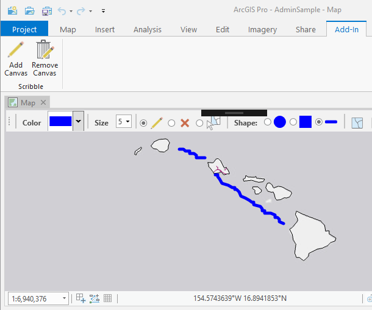

## ScribbleControl_ArcGISPro

<!-- TODO: Write a brief abstract explaining this sample -->
This sample provides a control that allows you to do on-screen drawing  on top of map/scene views. This sample is an example of adding custom overlay controls to map views.  
  


<a href="https://pro.arcgis.com/en/pro-app/sdk/" target="_blank">View it live</a>

<!-- TODO: Fill this section below with metadata about this sample-->
```
Language:              C#
Subject:               Map Exploration
Contributor:           ArcGIS Pro SDK Team <arcgisprosdk@esri.com>
Organization:          Esri, https://www.esri.com
Date:                  05/06/2025
ArcGIS Pro:            3.5
Visual Studio:         2022
.NET Target Framework: net8.0-windows
```

## Resources

[Community Sample Resources](https://github.com/Esri/arcgis-pro-sdk-community-samples#resources)

### Samples Data

* Sample data for ArcGIS Pro SDK Community Samples can be downloaded from the [Releases](https://github.com/Esri/arcgis-pro-sdk-community-samples/releases) page.  

## How to use the sample
<!-- TODO: Explain how this sample can be used. To use images in this section, create the image file in your sample project's screenshots folder. Use relative url to link to this image using this syntax:  -->
1. In Visual Studio click the Build menu. Then select Build Solution.
2. This solution is using the **DotNetProjects.Extended.Wpf.Toolkit**.    
3. Launch debugger to open ArcGIS Pro.  
4. Open a map view   
5. Click on Add-in tab and click the "Add Canvas" button in the "Scribble" group  
6. A Scribble control will be added on top of the map view  
7. The Scribble control will resize to fit the MapView (notice the faint gray border around the edges of the MapView)  
8. Scribble with any of the toolbar scribble tools on top of the map view  
9. Shapes can also be inserted by right-clicking on the Scribble canvas  
10. To remove the Scribble overlay, click "Remove Canvas"  
  
  

<!-- End -->

&nbsp;&nbsp;&nbsp;&nbsp;&nbsp;&nbsp;
&nbsp;&nbsp;&nbsp;&nbsp;&nbsp;&nbsp;&nbsp;&nbsp;&nbsp;&nbsp;&nbsp;&nbsp;
[Home](https://github.com/Esri/arcgis-pro-sdk/wiki) | <a href="https://pro.arcgis.com/en/pro-app/latest/sdk/api-reference" target="_blank">API Reference</a> | [Requirements](https://github.com/Esri/arcgis-pro-sdk/wiki#requirements) | [Download](https://github.com/Esri/arcgis-pro-sdk/wiki#installing-arcgis-pro-sdk-for-net) | <a href="https://github.com/esri/arcgis-pro-sdk-community-samples" target="_blank">Samples</a>
