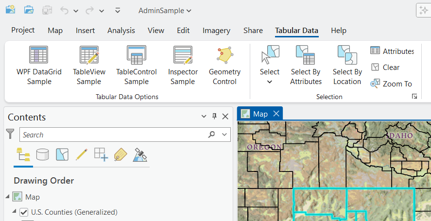
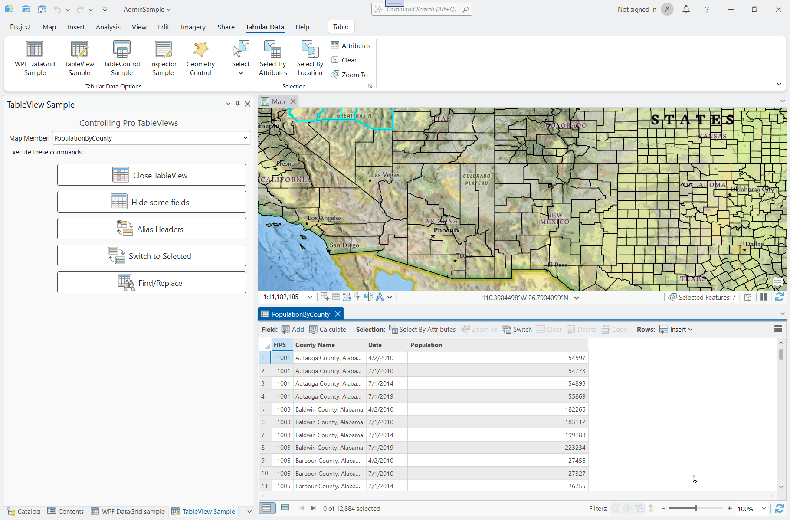
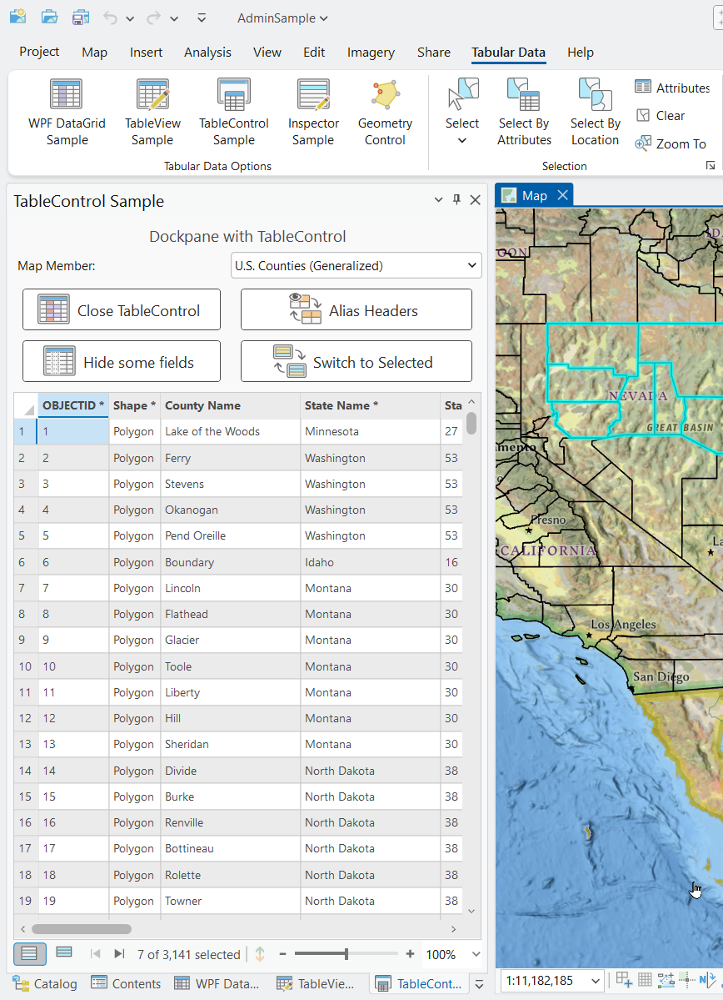
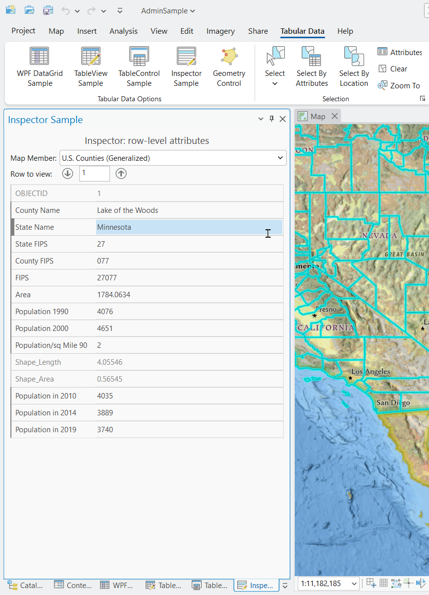
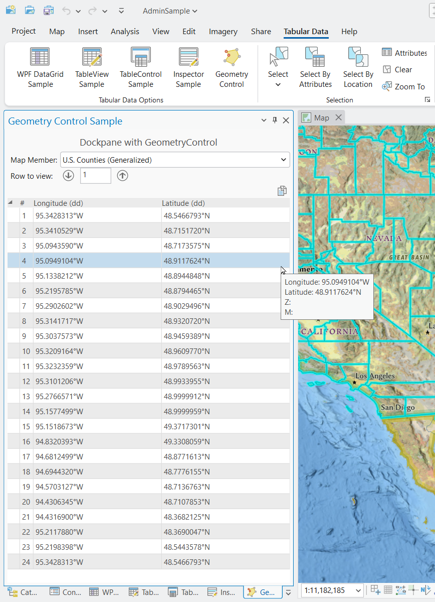

## TabularDataOptions

<!-- TODO: Write a brief abstract explaining this sample -->
This sample illustrates Visualization Options for Tabular Data:  
- .Net (WPF out-of-box) options to display tabular data:  
  - WPF DataGrid Control – read only  
- ArcGIS Pro options to display tabular data:  
  - TableView – read / write  
  - TableControl – read only  
- View one record(row) at a time  
  - Inspector – read / write  
  - Geometry Control – read only  
  


<a href="https://pro.arcgis.com/en/pro-app/sdk/" target="_blank">View it live</a>

<!-- TODO: Fill this section below with metadata about this sample-->
```
Language:              C#
Subject:               Framework
Contributor:           ArcGIS Pro SDK Team <arcgisprosdk@esri.com>
Organization:          Esri, https://www.esri.com
Date:                  05/06/2025
ArcGIS Pro:            3.5
Visual Studio:         2022
.NET Target Framework: net8.0-windows
```

## Resources

[Community Sample Resources](https://github.com/Esri/arcgis-pro-sdk-community-samples#resources)

### Samples Data

* Sample data for ArcGIS Pro SDK Community Samples can be downloaded from the [Releases](https://github.com/Esri/arcgis-pro-sdk-community-samples/releases) page.  

## How to use the sample
<!-- TODO: Explain how this sample can be used. To use images in this section, create the image file in your sample project's screenshots folder. Use relative url to link to this image using this syntax:  -->
1. Download the Community Sample data (see under the "Resources" section for downloading sample data).  The sample data contains a project called "AdminSample.ppkx" with data suitable for this sample.  Make sure that the Sample data is unzipped in c:\data and "C:\Data\TabularDataOptions\AdminSample.ppkx" is available.
2. Open this solution in Visual Studio.  
3. Click the build menu and select Build Solution.  
4. Click the Start button to open ArCGIS Pro. ArcGIS Pro will open.    
5. Open the "C:\Data\TabularDataOptions\AdminSample.ppkx" project.  
6. Open the "Map" view and click the "Tabular Data" tab.  
  
7. Click the "WPF DataGrid Sample" button to open the WPF DataGrid sample dockpane.  In the dockpane, chose a map member from the drop-down to load the data into the WPF DataGrid controls.  
  
8. Click the "TableView Sample" button to open the TableView sample dockpane.  In the dockpane, chose a map member from the drop-down, click "Open TableView" to open the table view for the corresponding map member.  Use the Table View function buttons to test the associated table view function.  
  
9. Click the "TableControl Sample" button to open the TableControl sample dockpane.  In the dockpane, chose a map member from the drop-down, click "Open TableControl" to open the table control for the corresponding map member.  Use the Table Control function buttons to test the associated table control function.  
  
10. Click the "Inspector Sample" button to open the Inspector sample dockpane.  In the dockpane, chose a map member from the drop-down to load the first row (by object id) into the inspector control.  Use the up and down arrows to scroll through the corresponding rows of data.  
  
11. Click the "Geometry Control Sample" button to open the Geometry Control sample dockpane.  In the dockpane, chose a map member from the drop-down to load the first row's geometry (by object id) into the Geometry Control.  Use the up and down arrows to scroll through the corresponding rows of data.  
  
  

<!-- End -->

&nbsp;&nbsp;&nbsp;&nbsp;&nbsp;&nbsp;
&nbsp;&nbsp;&nbsp;&nbsp;&nbsp;&nbsp;&nbsp;&nbsp;&nbsp;&nbsp;&nbsp;&nbsp;
[Home](https://github.com/Esri/arcgis-pro-sdk/wiki) | <a href="https://pro.arcgis.com/en/pro-app/latest/sdk/api-reference" target="_blank">API Reference</a> | [Requirements](https://github.com/Esri/arcgis-pro-sdk/wiki#requirements) | [Download](https://github.com/Esri/arcgis-pro-sdk/wiki#installing-arcgis-pro-sdk-for-net) | <a href="https://github.com/esri/arcgis-pro-sdk-community-samples" target="_blank">Samples</a>
