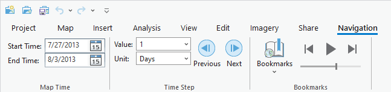

## TimeNavigation

<!-- TODO: Write a brief abstract explaining this sample -->
This sample provides a new tab and controls that allow you to set the time in the map view, step through time, and navigate between time enabled bookmarks in the map.  
  


<a href="https://pro.arcgis.com/en/pro-app/sdk/" target="_blank">View it live</a>

<!-- TODO: Fill this section below with metadata about this sample-->
```
Language:              C#
Subject:               Map-Exploration
Contributor:           ArcGIS Pro SDK Team <arcgisprosdk@esri.com>
Organization:          Esri, https://www.esri.com
Date:                  10/01/2023
ArcGIS Pro:            3.2
Visual Studio:         2022
.NET Target Framework: net6.0-windows
```

## Resources

[Community Sample Resources](https://github.com/Esri/arcgis-pro-sdk-community-samples#resources)

### Samples Data

* Sample data for ArcGIS Pro SDK Community Samples can be downloaded from the [Releases](https://github.com/Esri/arcgis-pro-sdk-community-samples/releases) page.  

## How to use the sample
<!-- TODO: Explain how this sample can be used. To use images in this section, create the image file in your sample project's screenshots folder. Use relative url to link to this image using this syntax:  -->
1. Download the Community Sample data(see under the 'Resources' section for downloading sample data).  The sample data contains required data for this sample add-in.  Make sure that the Sample data is unzipped in c:\data and "C:\Data\Interacting with Maps" is available.
2. In Visual Studio click the Build menu.Then select Build Solution.    
3. Launch the debugger to open ArcGIS Pro.  
4. Open the "C:\Data\Interacting with Maps\Interacting with Maps.aprx" project which contains the required data needed for this sample.  
5. Open the Portland Crimes map.  
6. Click on the new Navigation tab on the ribbon.    
    
7. Within this tab there are 3 groups that provide functionality to navigate through time.  
8. The Map Time group provides two date picker controls to set the start and end time in the map.  
9. The Time Step group provides two combo boxes to set the time step interval. The previous and next button can be used to offset the map time forward or back by the specified time step interval.  
10. The Bookmarks group provides a gallery of time enabled bookmarks for the map. Clicking a bookmark in the gallery will zoom the map to that location and time.   
It also provides play, previous and next buttons that can be used to navigate between the time enabled bookmarks.   
These commands are only enabled when there are at least 2 bookmarks in the map. Finally it provides a slider that can be used to set how quickly to move between bookmarks during playback.  
  

<!-- End -->

&nbsp;&nbsp;&nbsp;&nbsp;&nbsp;&nbsp;
&nbsp;&nbsp;&nbsp;&nbsp;&nbsp;&nbsp;&nbsp;&nbsp;&nbsp;&nbsp;&nbsp;&nbsp;
[Home](https://github.com/Esri/arcgis-pro-sdk/wiki) | <a href="https://pro.arcgis.com/en/pro-app/latest/sdk/api-reference" target="_blank">API Reference</a> | [Requirements](https://github.com/Esri/arcgis-pro-sdk/wiki#requirements) | [Download](https://github.com/Esri/arcgis-pro-sdk/wiki#installing-arcgis-pro-sdk-for-net) | <a href="https://github.com/esri/arcgis-pro-sdk-community-samples" target="_blank">Samples</a>
