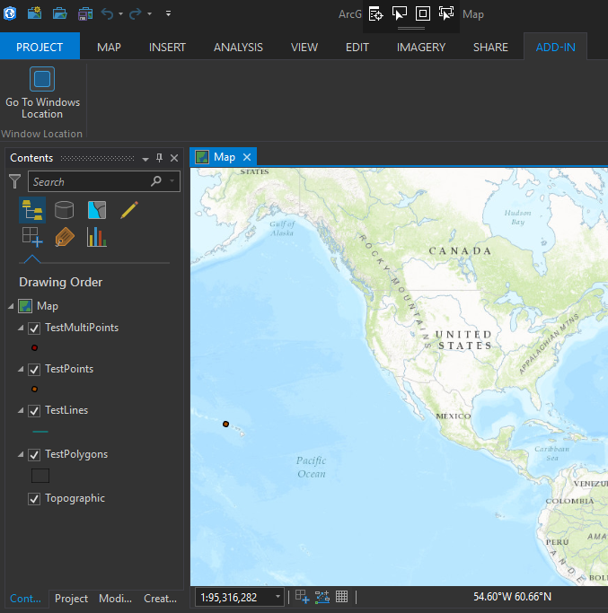
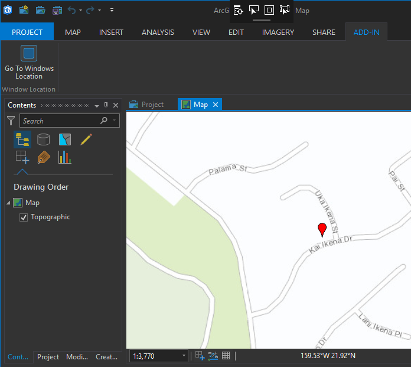
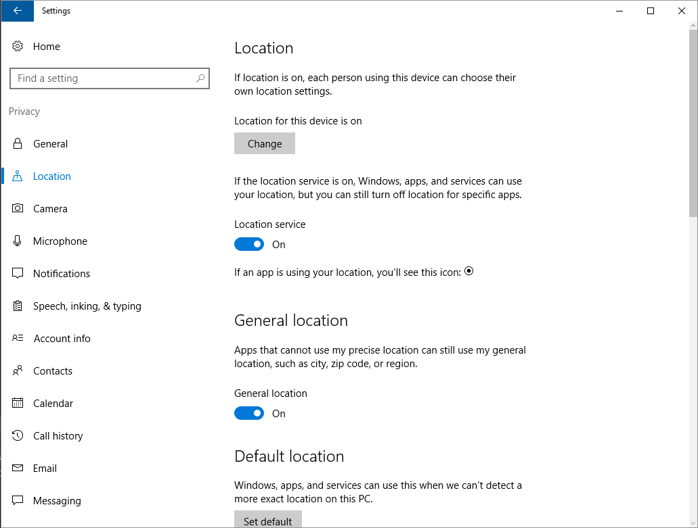

## WindowsLocationTool

<!-- TODO: Write a brief abstract explaining this sample -->
This sample implements a tool that uses the System.Device.Location namespace to get the current location in order to zoom the current map view to that location.  
Note: In Windows 10 the accuracy of the location information depends on the source. The latitude and longitude may vary within the following ranges:  
* GPS : within approximately 10 meters  
* Wi-Fi : between approximately 30 meters and 500 meters  
* Cell towers : between approximately 300 meters and 3,000 meters  
* IP address : between approximately 1,000 meters and 5,000 meters In addition to latitude and longitude, GPS also provides information about heading, speed, and altitude.This additional information is optional when the location information comes from other sources.  
The user sets the privacy of their location data with the location privacy settings in the Settings app.Your app can access the user's location only when:  
Location for this device... is turned on (not applicable to Windows 10 Mobile)  
The location services setting, Location, is turned on  
Under Choose apps that can use your location, your app is set to on  
  


<a href="http://pro.arcgis.com/en/pro-app/sdk/" target="_blank">View it live</a>

<!-- TODO: Fill this section below with metadata about this sample-->
```
Language:              C# 7.0
Subject:               Framework
Contributor:           ArcGIS Pro SDK Team <arcgisprosdk@esri.com>
Organization:          Esri, http://www.esri.com
Date:                  6/28/2017
ArcGIS Pro:            2.0
Visual Studio:         2017
.NET Target Framework: 4.6.1
```

## Resources

* [API Reference online](http://pro.arcgis.com/en/pro-app/sdk/api-reference)
* <a href="http://pro.arcgis.com/en/pro-app/sdk/" target="_blank">ArcGIS Pro SDK for .NET (pro.arcgis.com)</a>
* [arcgis-pro-sdk-community-samples](http://github.com/Esri/arcgis-pro-sdk-community-samples)
* [ArcGISPro Registry Keys](http://github.com/Esri/arcgis-pro-sdk/wiki/ArcGIS-Pro-Registry-Keys)
* [FAQ](http://github.com/Esri/arcgis-pro-sdk/wiki/FAQ)
* [ArcGIS Pro SDK icons](https://github.com/Esri/arcgis-pro-sdk/releases/tag/1.4.0.7198)
* [ProConcepts: ArcGIS Pro Add in Samples](https://github.com/Esri/arcgis-pro-sdk-community-samples/wiki/ProConcepts-ArcGIS-Pro-Add-in-Samples)


* [ProSnippets: 2.0 Migration](http://github.com/Esri/arcgis-pro-sdk/wiki/ProSnippets-Migrating-to-2.0)  
* [ProSnippets: 2.0 Migration Samples](http://github.com/Esri/arcgis-pro-sdk/wiki/ProSnippets-2.0-Migration-Samples)  
* [ProConcepts: 2.0 Migration](http://github.com/Esri/arcgis-pro-sdk/wiki/ProConcepts-2.0-Migration-Guide)  

### Samples Data

* Sample data for ArcGIS Pro SDK Community Samples can be downloaded from the [repo releases](https://github.com/Esri/arcgis-pro-sdk-community-samples/releases) page.  

## How to use the sample
<!-- TODO: Explain how this sample can be used. To use images in this section, create the image file in your sample project's screenshots folder. Use relative url to link to this image using this syntax:  -->
Note: The GeoCoordinateWatcher class supplies coordinate-based location data from the current location provider. The current location provider is prioritized as the highest on the computer, based on a number of factors, such as the age and accuracy of the data from all providers, the accuracy requested by location applications, and the power consumption and performance impact associated with the location provider. The current location provider might change over time, for instance, when a GPS device loses its satellite signal indoors and a Wi-Fi triangulation provider becomes the most accurate provider on the computer.  
To begin accessing location data, create a GeoCoordinateWatcher and call Start or TryStart to initiate the acquisition of data from the current location provider.  
The Status property can be checked to determine if data is available.If data is available, you can get the location one time from the Position property, or receive continuous location updates by handling the PositionChanged event.  
The Permission, Status, and Position properties support INotifyPropertyChanged, so that an application can data-bind to these properties.  
In Windows 7, all the System.Device.Location classes are fully functional if a location provider is installed and able to resolve the computer's location  
  
1. In Visual Studio click the Build menu. Then select Build Solution.  
1. Click Start button to open ArcGIS Pro.  
1. ArcGIS Pro will open.   
1. Create a new map using the Map template. Click on the 'Add-in' tab on the ArcGIS Pro ribbon and notice the "Windows Location" group.    
    
  
1. Click on the 'Zoom To Windows Location' button to zoom to the location given by windows location services.    
    
  
1. Note that 'Location Privacy settings' have to allow the location to be used on your machine.  Use the control panel to configure location settings.  
    
  


<!-- End -->

&nbsp;&nbsp;&nbsp;&nbsp;&nbsp;&nbsp;
&nbsp;&nbsp;&nbsp;&nbsp;&nbsp;&nbsp;&nbsp;&nbsp;&nbsp;&nbsp;&nbsp;&nbsp;
[Home](https://github.com/Esri/arcgis-pro-sdk/wiki) | <a href="http://pro.arcgis.com/en/pro-app/sdk/api-reference" target="_blank">API Reference</a> | [Requirements](https://github.com/Esri/arcgis-pro-sdk/wiki#requirements) | [Download](https://github.com/Esri/arcgis-pro-sdk/wiki#installing-arcgis-pro-sdk-for-net) | <a href="http://github.com/esri/arcgis-pro-sdk-community-samples" target="_blank">Samples</a>
