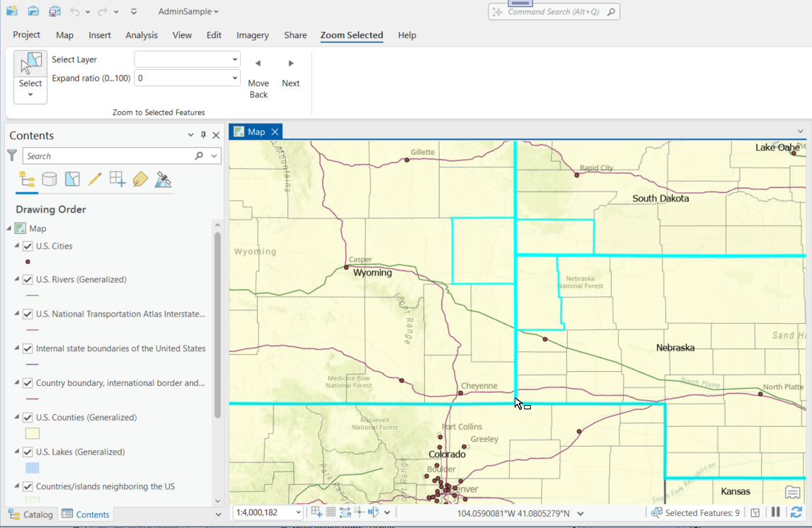
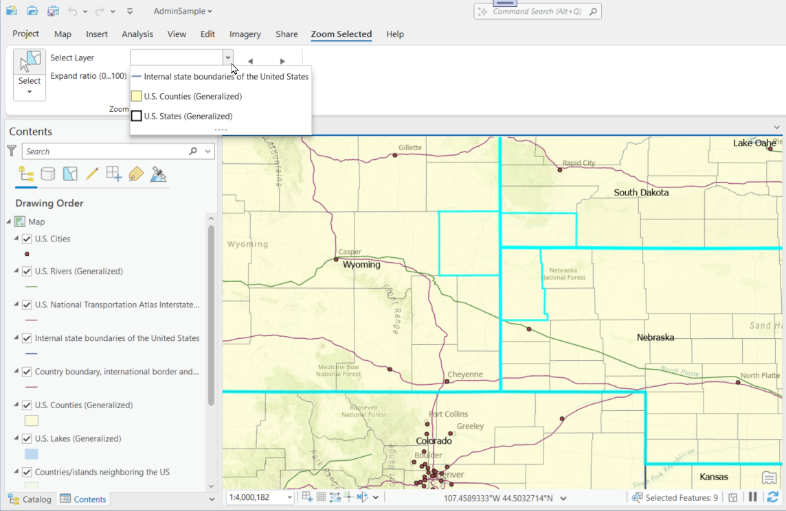
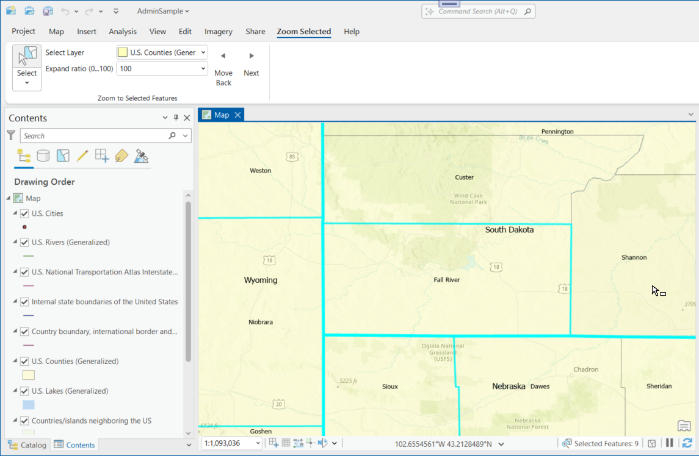

## ZoomToSelectedFeatures

<!-- TODO: Write a brief abstract explaining this sample -->
This sample uses a dropdown of all layers with selected features and once a layer with selections is chosen two button allow scrolling through the selected features..  
  


<a href="https://pro.arcgis.com/en/pro-app/sdk/" target="_blank">View it live</a>

<!-- TODO: Fill this section below with metadata about this sample-->
```
Language:              C#
Subject:               Framework
Contributor:           ArcGIS Pro SDK Team <arcgisprosdk@esri.com>
Organization:          Esri, https://www.esri.com
Date:                  11/04/2024
ArcGIS Pro:            3.4
Visual Studio:         2022
.NET Target Framework: net8.0-windows
```

## Resources

[Community Sample Resources](https://github.com/Esri/arcgis-pro-sdk-community-samples#resources)

### Samples Data

* Sample data for ArcGIS Pro SDK Community Samples can be downloaded from the [Releases](https://github.com/Esri/arcgis-pro-sdk-community-samples/releases) page.  

## How to use the sample
<!-- TODO: Explain how this sample can be used. To use images in this section, create the image file in your sample project's screenshots folder. Use relative url to link to this image using this syntax:  -->
1. In Visual studio rebuild the solution.
2. Debug the add-in.  
3. ArcGIS Pro opens, choose any project with feature layers.  
4. With the active map view, select the 'Zoom Selected' tab on the Pro ribbon.  
5. Choose the 'Select Tool' and select some features in the map view.  
  
6. Once features are selected, the 'Select Layer' dropdown will be populated with the layers that have selected features.  
7. Use the dropdown to select a layer with selected features.  
  
8. Use the 'Move Back' and 'Move Forward' buttons to scroll through the selected features.  
  
9. Use the 'Expand ratio' drop down to choose the expand ratio for the zoom.  0 uses the extent of the selected feature, 100 expands the extent by 100%.  
  

<!-- End -->

&nbsp;&nbsp;&nbsp;&nbsp;&nbsp;&nbsp;
&nbsp;&nbsp;&nbsp;&nbsp;&nbsp;&nbsp;&nbsp;&nbsp;&nbsp;&nbsp;&nbsp;&nbsp;
[Home](https://github.com/Esri/arcgis-pro-sdk/wiki) | <a href="https://pro.arcgis.com/en/pro-app/latest/sdk/api-reference" target="_blank">API Reference</a> | [Requirements](https://github.com/Esri/arcgis-pro-sdk/wiki#requirements) | [Download](https://github.com/Esri/arcgis-pro-sdk/wiki#installing-arcgis-pro-sdk-for-net) | <a href="https://github.com/esri/arcgis-pro-sdk-community-samples" target="_blank">Samples</a>
