## BringUpSubnetworkNamesOnDiagramEdges

<!-- TODO: Write a brief abstract explaining this sample -->
This add-in demonstrates how to retrieve attributes on network elements associated with diagram features whether these network elements are aggregated in the diagram.It also exemplifies how to fill the new Info field added with utility network version 7 using the retrieved attributes.  
In particular, how to verify that all the aggregated network elements belong to a same subnetwork and save the name of the related subnetwork in the Info field.  
**Note:** This code sample is generic and can be used for any utility network dataset once upgraded to version 7. However, for the rendering of the diagram edges based on the Info field values and, in particular, to display them in a specific color regarding their subnetwork name, you need to set up a custom diagram layer definition on the diagram template.    
**Comment:** This add-in sample code works with ArcGIS Pro 3.3 and utility network version 7. For prior ArcGIS Pro and utility network versions, we provide another add-in code sample command called ToggleSwitches that allows to get quite similar results. The difference between the two add-ins mainly concerns the management of the diagram edge colors.  
With the ToggleSwitches add-in, when users click the Color Subnetwork command, the subnetwork name for each diagram edge in the active diagram is retrieved using a quite complex code.This custom code exports the content of the diagram, parses the resulting JSON structures, and query the associated network elements to determine the subnetwork name related to each diagram edge.Then, each edge is added to a list regarding its subnetwork name and the color rendering per subnetwork is fully managed by code for each diagram edge list. This code is also the one used when applying the Toggle Switches command, once the status of the selected switch(es) has just toggled and the related subnetwork(s) updated to get the subnetwork name changes immediately reflected on the diagram edge colors.  
With the BringUpSubnetworkNameOnDiagramEdge add-in, the color of the diagram edges per subnetwork is no longer managed by code.It is directly set up on the diagram layer definition at the diagram template level and based on the subnetwork name stored in the new Info field for each diagram edge.This field is updated each time users click the Update Info add-in command.The custom code for this command takes advantage of the new SetDiagramElementInfo method added with ArcGIS Pro SDK for .NET at 3.3 to fill up the Info field values.The subnetwork name stored in this field during the process is also retrieved in an easier way starting at 3.3 thanks to the new GetFeatureAttributes SDK method that directly returns the desired attribute values for the network elements represented in your diagram whether they are aggregated.The code related to the Toggle Switch command that is provided with this add-in is the same as in the previous add-in for its first part; that is, the part of the code that toggles the switch position, validate the network topology and update the related subnetworks.Then, for the 2nd part of the code, it simply chains the new 3.3 code developed for the Update Info command to store the updated subnetwork name in the Info field for each diagram edge. When the diagram map refreshes at the end of the Toggle Switches process, the template layer definition re-applies and the diagram edge color automatically reflects any subnetwork name changes in the Info field.  
  


<a href="https://pro.arcgis.com/en/pro-app/sdk/" target="_blank">View it live</a>

<!-- TODO: Fill this section below with metadata about this sample-->
```
Language:              C#
Subject:               NetworkDiagram
Contributor:           ArcGIS Pro SDK Team <arcgisprosdk@esri.com>
Organization:          Esri, https://www.esri.com
Date:                  04/04/2024
ArcGIS Pro:            3.3
Visual Studio:         2022
.NET Target Framework: net8.0-windows7.0
```

## Resources

[Community Sample Resources](https://github.com/Esri/arcgis-pro-sdk-community-samples#resources)

### Samples Data

* Sample data for ArcGIS Pro SDK Community Samples can be downloaded from the [Releases](https://github.com/Esri/arcgis-pro-sdk-community-samples/releases) page.  

## How to use the sample
<!-- TODO: Explain how this sample can be used. To use images in this section, create the image file in your sample project's screenshots folder. Use relative url to link to this image using this syntax:  -->
1. In Visual Studio click the Build menu. Then select Build Solution.
2. Click Start button to open ArcGIS Pro.  ArcGIS Pro will open.   
3. Open C:\Data\NetworkDiagrams\FillsUpDiagramFeatureInfoField_UNv7\FillsUpDiagramFeatureInfoField_UNv7.aprx   
4. Click on the Map tab on the ribbon. Then, in the Navigate group, expand Bookmarks and click North 7 SbNtwk Ctrls.   
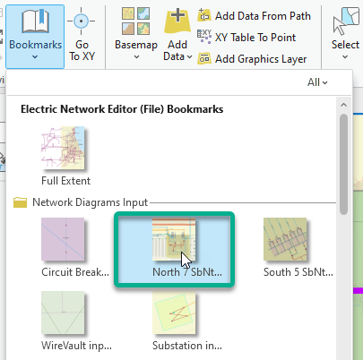  
5. The network map centers on the North Substation in which you can see 7 distribution subnetwork controllers that display with a gray symbol at the end of the blue Medium Voltage Conductor lines. Hold down the Shift keyboard key and use the Select Feature tool to select each of these 7 distribution subnetwork controllers.   
  
6. In the Navigate group, expand Bookmarks and click South 5 SbNtwk Ctrls.   
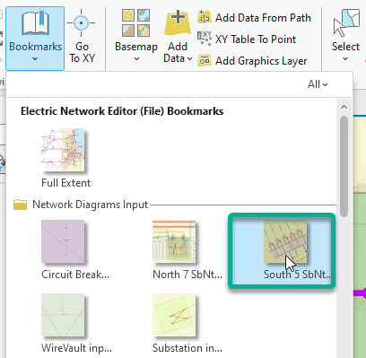  
7. Still with the Shift keyboard key held down, click each of the 5 distribution subnetwork controllers in the south substation to add them to the current selection. You end with 12 Distribution subnetwork controllers selected in the network map:   
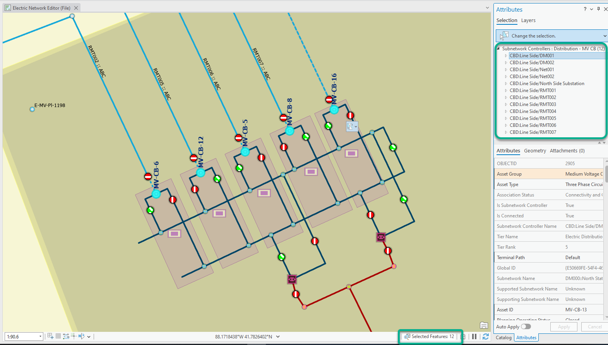  
8. Click on the Utility Network tab in the ribbon. Then, in the Diagram group, click the New down arrow and pick up SwitchingFromDistributionSubnetworkCtrl in the list.   
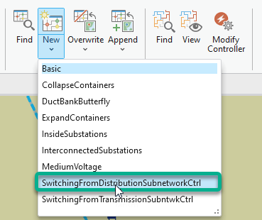  
**Note:** You can have a look to the model builder called SwitchingFromDistributionSubnetworkCtrl in the CutomDiagramTemplates toolbox installed with this project if you want to know more about the network diagram rules configured for this template.  
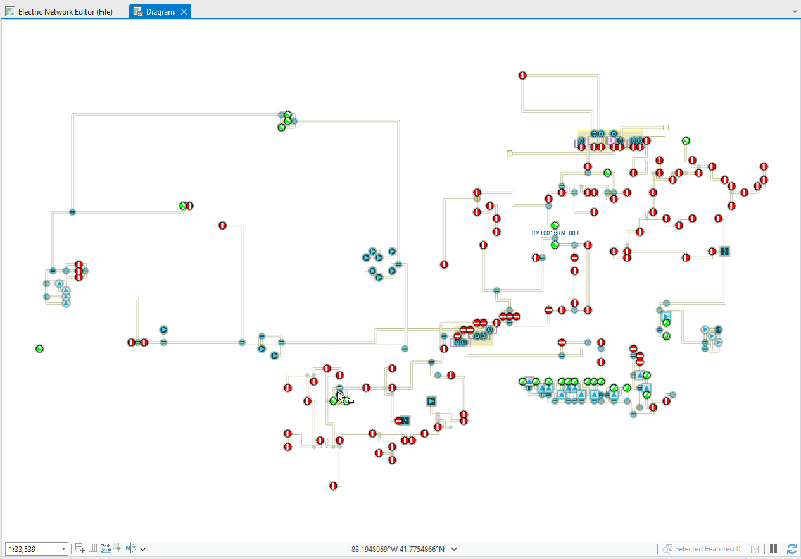  
A new diagram map opens representing a simplification of the 12 subnetworks associated with the 12 subnetwork controllers selected in the network map as input.  
This diagram mainly focuses on critical devices, such as switches.  The other portions of the subnetworks are aggregated under these remaining switches or under reduction edges that connect these switches.  
10. Click on the Add-in tab on the ribbon and in the Bring Up Info group, click Update Info.  
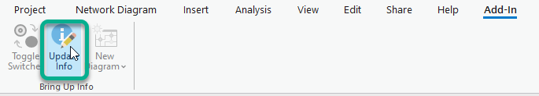  
The active diagram refreshes and shows different colors per subnetwork on the diagram edges.   
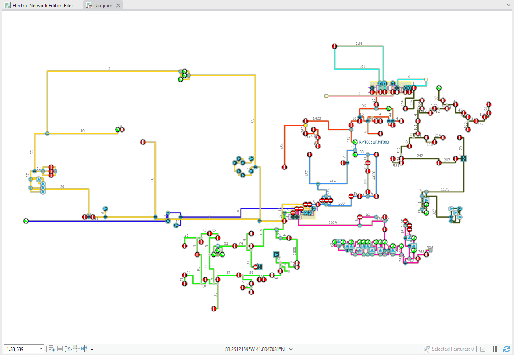  
11. In the Contents pane, expand the Temporary diagram layer and scroll down until you see the Reduction Edges sublayer.   
12. Right click the Reduction Edges sublayer and click Attribute Table. Info, the fourth field in the open table, is the field that the Update Info command has just filled up. It stores text values that group two different information separated using a backslash for each reduction edge. The 1st information is the subnetwork name related to the reduction edge. The 2nd information is the count of network elements that each reduction edge aggregates.   
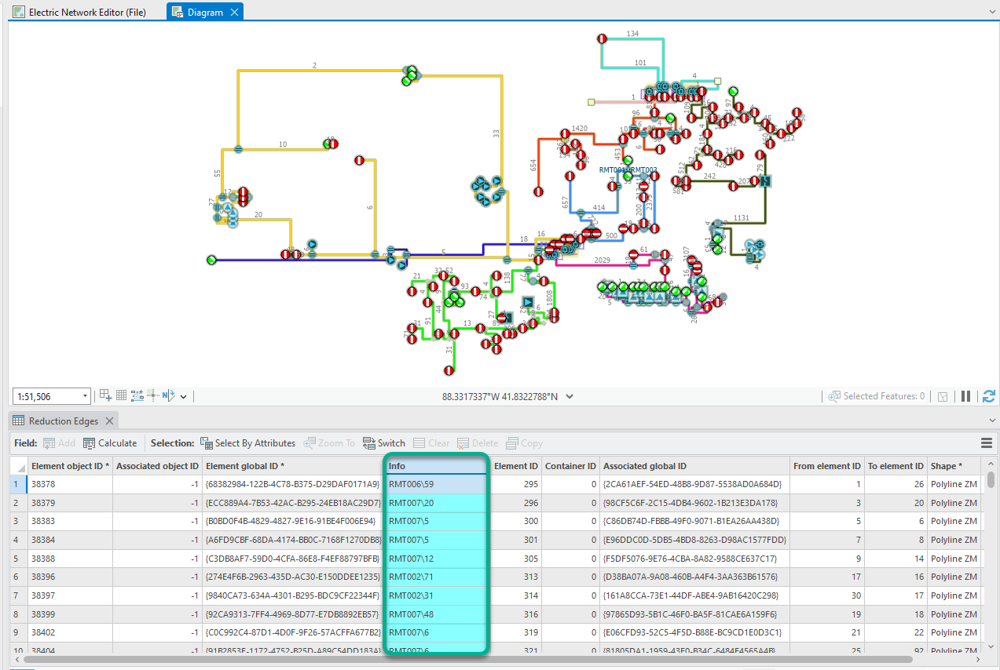  
If you have a look to the way the symbology is set up on the reduction edges, you can see that there is an Arcade script set up to extract the 1st information value from this Info field; that is, the subnetwork name, and uses it to colorize the diagram edges in different colors.   
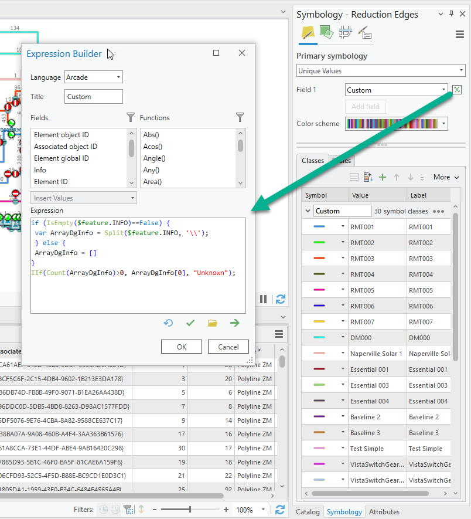  
In the same way, if you have a look to the labeling properties currently set for the reduction edges, you can see that there is another Arcade script configured to extract the 2nd information value: that is, the count of the network elements that each reduction edge aggregates. This count displays in gray at the middle of each reduction edge.   
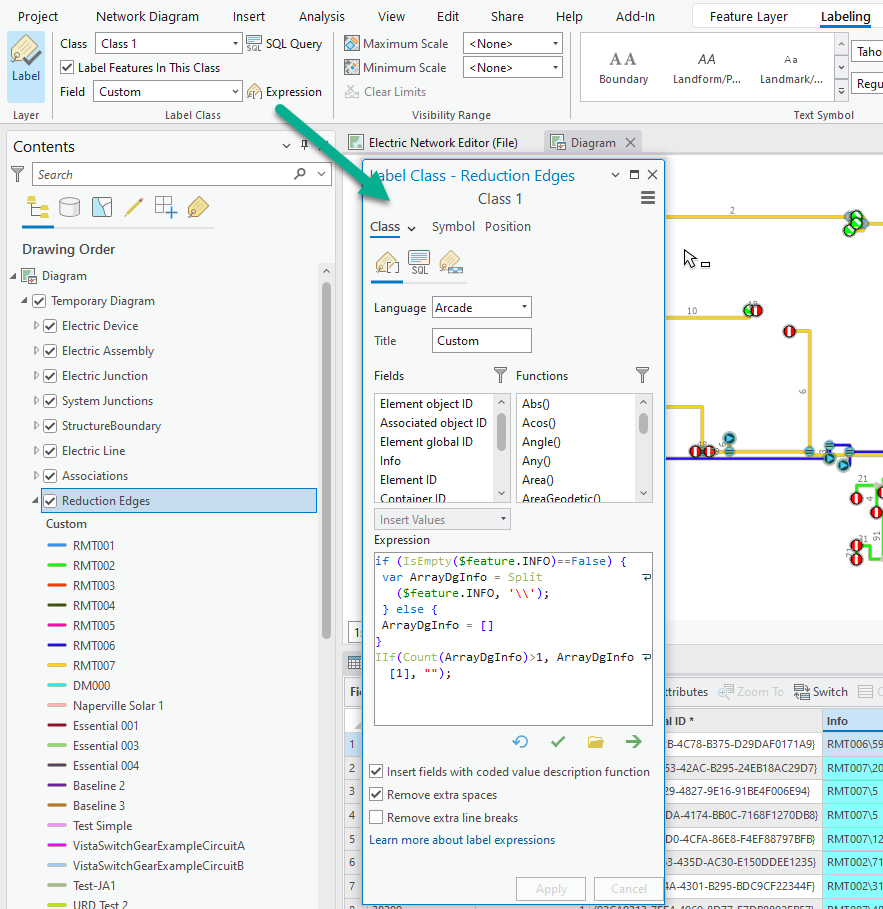  
13. Zoom in on the diagram area highlighted in dark blue like in the screenshot below:   
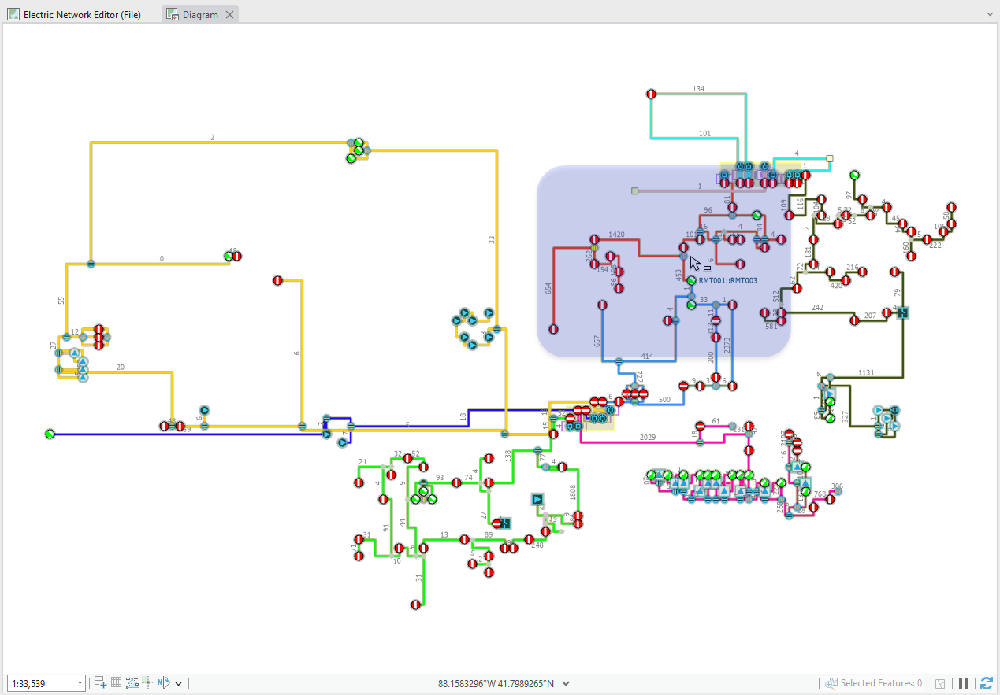  
14. Select the Medium Voltage Switch which Asset ID is MV-SW-24 along the red RMT003 subnetwork like in the following screenshot; this is the one just above the switch labeled RMT001:RMT003   
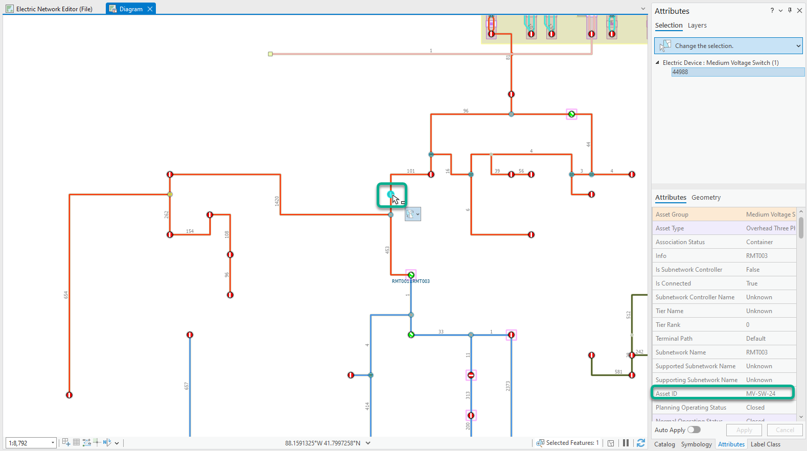  
15. Click on the Add-in tab on the ribbon and in the Bring Up Info group, click Toggle Switches.  
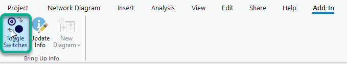  
The process chains the following steps: the switch status is toggled (it moved from Closed to Open)   
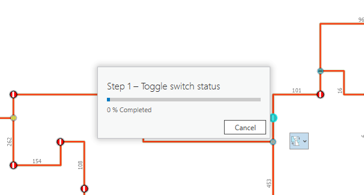  
Then, the topology is validated and saved, the related subnetwork is updated, and the Info field values are updated to reflect subnetwork name changes.   
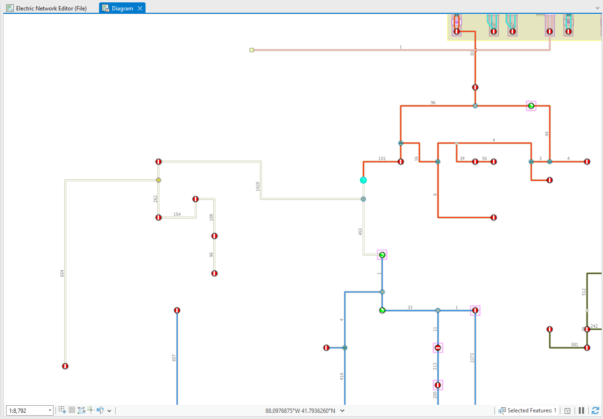  
There are some diagram edges previously related to the red RMT003 subnetwork that become de-energized; they became out of any subnetwork and display as empty lines. If you use the Explore tool and click one of these diagram edges, the Pop-up dialog that opens shows Unknow before the backslash that delimits the 1st information stored in the Info field   
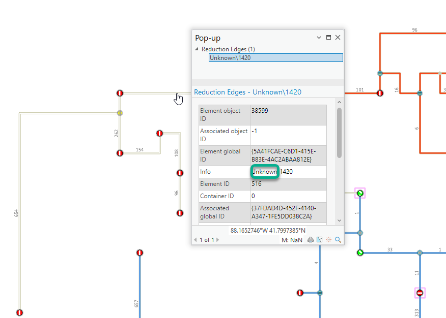  
16. Select the medium voltage switch just below, the first of the blue RMT001 subnetwork that is currently open; this is, the one previously labeled as RMT001:RMT003.   
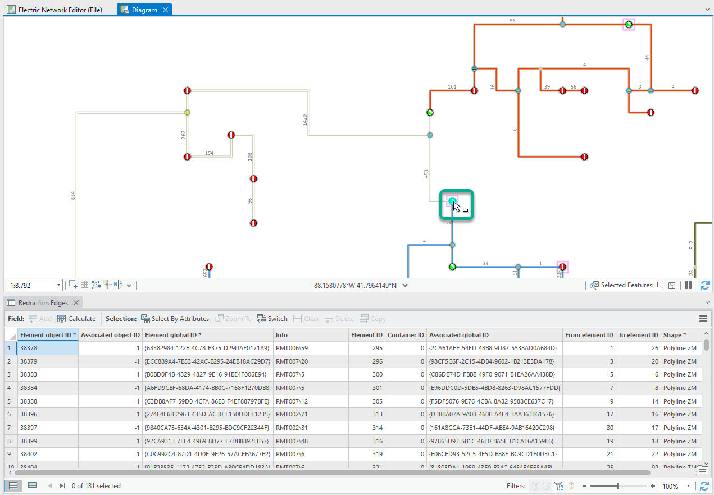  
17. In the Bring Up Info group, click on the Toggle Switches tool. The same process executes. The network features previously de-energized are now fed by the subnetwork controller CB:Line Side/RMT001; the diagram edges which represent features that now belong to this RMT001 subnetwork are colorized in blue.   
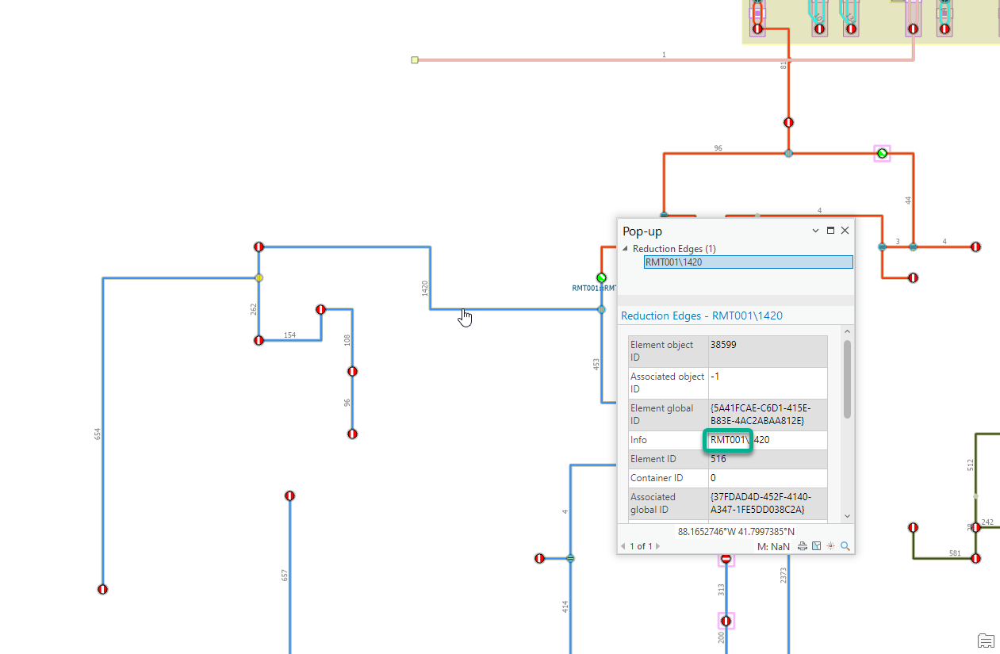  
18. Select the two medium voltage switches for which you've changed the status since the beginning of this workflow.   
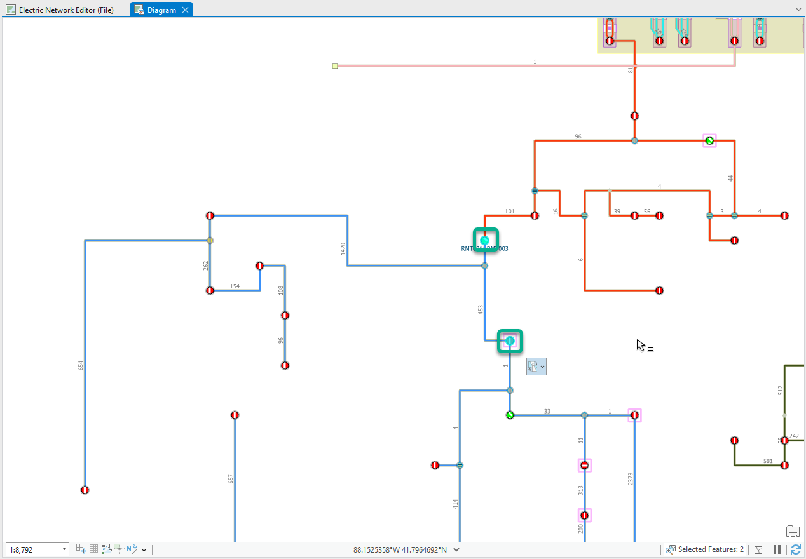  
19. In the Toggle Switches group, click on the Toggle Switches tool. The status of the two selected switches are toggled and the two related subnetworks are updated. The utility network is back to its initial state.   
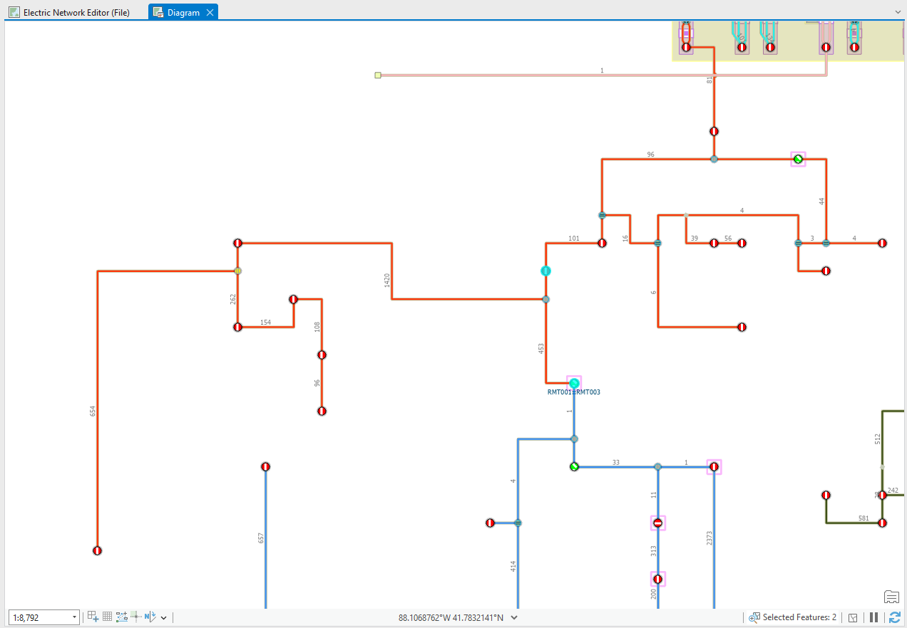  
  

<!-- End -->

&nbsp;&nbsp;&nbsp;&nbsp;&nbsp;&nbsp;
&nbsp;&nbsp;&nbsp;&nbsp;&nbsp;&nbsp;&nbsp;&nbsp;&nbsp;&nbsp;&nbsp;&nbsp;
[Home](https://github.com/Esri/arcgis-pro-sdk/wiki) | <a href="https://pro.arcgis.com/en/pro-app/latest/sdk/api-reference" target="_blank">API Reference</a> | [Requirements](https://github.com/Esri/arcgis-pro-sdk/wiki#requirements) | [Download](https://github.com/Esri/arcgis-pro-sdk/wiki#installing-arcgis-pro-sdk-for-net) | <a href="https://github.com/esri/arcgis-pro-sdk-community-samples" target="_blank">Samples</a>
