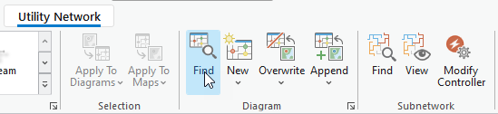
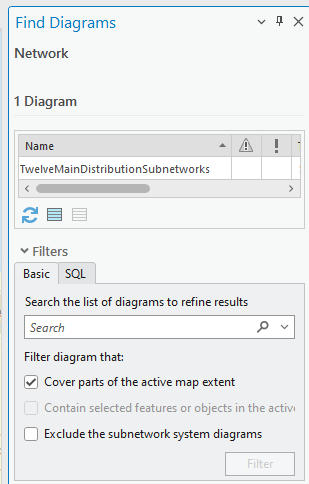
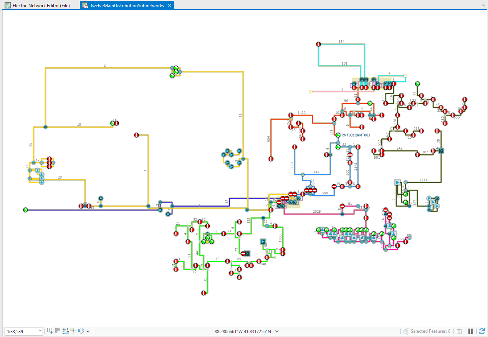
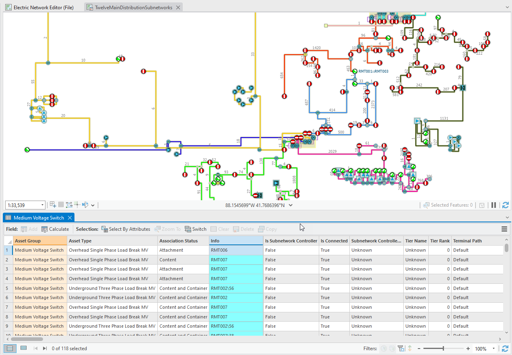
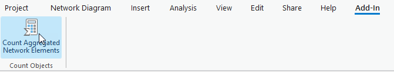
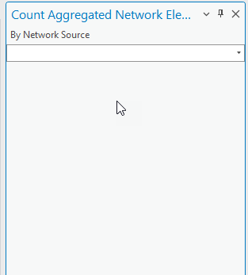
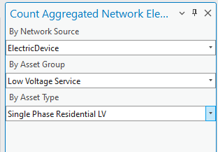
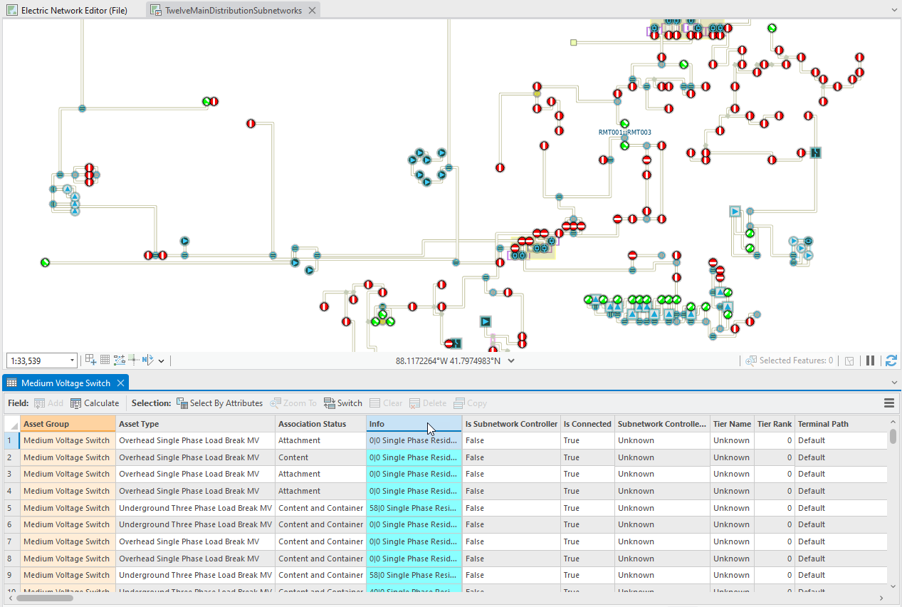
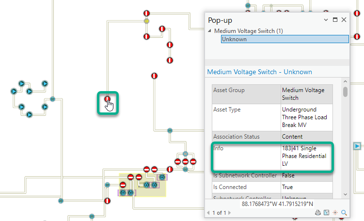
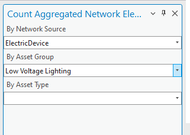

## CountAggregatedNetworkElements

<!-- TODO: Write a brief abstract explaining this sample -->
This add-in demonstrates how to fill the new Info field added with utility network version 7 using the attributes retrieved from the network elements associated with diagram features.  
In this sample, the developed add-in command opens a custom pane where the user can set the specific type of network elements he wants to retrieve and count among all the aggregated network elements related to any diagram feature.  
The add ins code sample then stores two different information separated using a single vertical line in the Info field for each diagram feature.The 1st information is the total count of network elements that the diagram feature aggregates.  
The 2nd information is the count of the specific aggregated network elements that the user wishes.  
**Note:** This code sample is generic and can be used for any utility network dataset once upgraded to version 7.  
  


<a href="https://pro.arcgis.com/en/pro-app/sdk/" target="_blank">View it live</a>

<!-- TODO: Fill this section below with metadata about this sample-->
```
Language:              C#
Subject:               NetworkDiagram
Contributor:           ArcGIS Pro SDK Team <arcgisprosdk@esri.com>
Organization:          Esri, https://www.esri.com
Date:                  11/04/2024
ArcGIS Pro:            3.4
Visual Studio:         2022
.NET Target Framework: net8.0-windows
```

## Resources

[Community Sample Resources](https://github.com/Esri/arcgis-pro-sdk-community-samples#resources)

### Samples Data

* Sample data for ArcGIS Pro SDK Community Samples can be downloaded from the [Releases](https://github.com/Esri/arcgis-pro-sdk-community-samples/releases) page.  

## How to use the sample
<!-- TODO: Explain how this sample can be used. To use images in this section, create the image file in your sample project's screenshots folder. Use relative url to link to this image using this syntax:  -->
     
  
1. In Visual Studio click the Build menu. Then select Build Solution.
2. Click Start button to open ArcGIS Pro.   
ArcGIS Pro will open.  
3. Open C:\Data\NetworkDiagrams\FillsUpDiagramFeatureInfoField_UNv7\FillsUpDiagramFeatureInfoField_UNv7.aprx  
4. Click on the Utility Network tab on the ribbon. Then, in the Diagram group, click Find Diagrams.  
  
The Find Diagrams pane opens. It shows a diagram that has been already stored; its name is TwelveMainDistributionSubnetworks.  
  
5. Double-click TwelveMainDistributionSubnetworks in the diagram list.  
The stored diagram opens in a new diagram map.  
  
It represents a simplification of 12 distribution subnetworks. This diagram mainly focuses on critical devices, such as switches, the other portions of the subnetworks being aggregated under these remaining switches or under reduction edges that connect these switches  
6. In the Contents pane, expand the TwelveMainDistributionSubnetworks diagram layer and scroll down until you see the Medium Voltage Switch sublayer.  
7. Right click the Medium Voltage Switch sublayer and click Attribute Table.  
  
Info, the fourth field in the open table, is the new field added for any diagram feature within utility network version 7. For the time being and for this sample diagram, it shows values that have been filled using the BringUpSubnetworkNameOnDiagramEdges sample add-in command.  
You are going to retrieve and compute some other information using the newly installed CountAggregatedNetworkElements  
8. Click on the Add-in tab on the ribbon and in the Count Objects group, click Count Aggregated Network Elements.  
  
The Count Aggregated Network Elements pane window opens.  
  
Suppose that for each diagram feature in the active diagram, you want to retrieve the count of the low voltage single phase residentials it serves. To get this information, you must set up the three lists in the pane as follows:  
9. In the By Network Source dropdown list, pick up Electric Device.  
10. Then, expand the By Asset Group list and select Low Voltage Service.  
11. At last, expand the By Asset Type list and click Single Phase Residential LV  
  
12. At the bottom of the pane, click Apply  
The process starts and retrieves the particular network elements you ask for that are aggregated for each diagram feature in the active diagram.It builds a string that concatenates the total count of network elements that each diagram feature represents and the count of the low voltage single phase residentials it aggregates.  
This new built string is saved in the Info field for each diagram feature.  
The open Medium Voltage Switch attribute table refreshes to reflect these new Info field values.  
  
13. Use the Explore tool and click some of the Medium Voltage Switch diagram features. The Pop-up dialog opens and shows the Info field value for the clicked diagram feature.  
  
14. In the Count Aggregated Network Elements pane window, at the left bottom corner, click the Refresh button to re-initialize the list  
15. Then, pick up the network source, the network source/asset group couple or the network source/asset group/asset type triplet you want.For example, select Electric Device in the 1st list, then select Low Voltage Lighting.  
  
16. At the bottom of the pane, click Apply.  
17. Click the Explore tool and click any diagram feature you want to know about the count of the low voltage lighting it deserves.  
  
  

<!-- End -->

&nbsp;&nbsp;&nbsp;&nbsp;&nbsp;&nbsp;
&nbsp;&nbsp;&nbsp;&nbsp;&nbsp;&nbsp;&nbsp;&nbsp;&nbsp;&nbsp;&nbsp;&nbsp;
[Home](https://github.com/Esri/arcgis-pro-sdk/wiki) | <a href="https://pro.arcgis.com/en/pro-app/latest/sdk/api-reference" target="_blank">API Reference</a> | [Requirements](https://github.com/Esri/arcgis-pro-sdk/wiki#requirements) | [Download](https://github.com/Esri/arcgis-pro-sdk/wiki#installing-arcgis-pro-sdk-for-net) | <a href="https://github.com/esri/arcgis-pro-sdk-community-samples" target="_blank">Samples</a>
