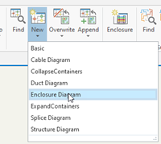
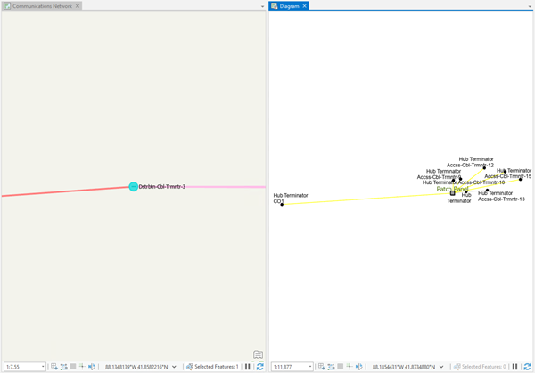
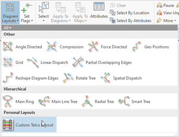
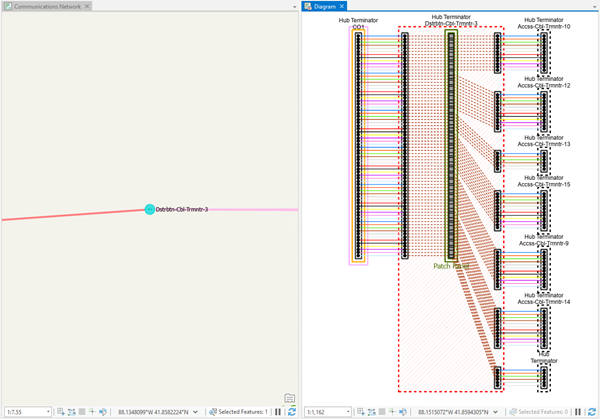
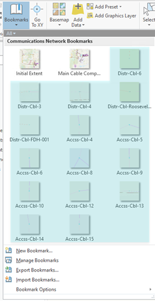
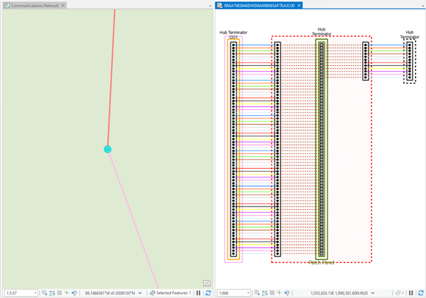
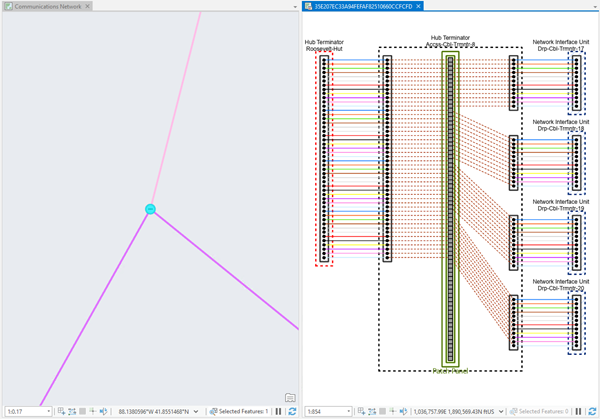

## How to use the sample
<!-- TODO: Explain how this sample can be used. To use images in this section, create the image file in your sample project's screenshots folder. Use relative url to link to this image using this syntax:  -->
With this add-in sample, you will get familiar with the Geometry, NetworkDiagrams and Mapping API methods that allow you to develop your own diagram layout algorithm (see EnclosureLayout source code file) and learn how to extend the Layout gallery with your own custom layout (see config.daml file).
You will also learn how to develop an add-in command to generate diagrams and execute your own layout to them before their display.
NOTE: The EnclosureLayout diagram layout is developed as a sample add-in to use with the particular sample UN dataset provided with it. Moreover, the code sample is very tied to the content of diagrams based on the Enclosure Diagram template.

1. In Visual Studio, click the Build menu.  Then select Build Solution.  
1. Click Start button to open ArcGIS Pro.  
1. ArcGIS Pro will open.  
1. Open C:\Data\NetworkDiagram\Communications_UNSDKSample.aprx
Make sure the Communications Network map is open as the active map.

--- Generate a sample diagram and manually apply the add-in Custom Layout available from the Layout gallery to arrange its contents ---
1. Click on the Map tab on the ribbon. Then, in the Navigate group, expand Bookmarks and click Distr_Cbl_3 in the bookmark list.

The map zooms-in on a hub terminator distribution cable component device represented by a salmon circle with 3 dots at its center.
1. Use the Selection tool and click this hub terminator device so it becomes selected in the network map. Then, on the Utility Network tab in the ribbon, in the Diagram group, click the drop down arrow under New and click Enclosure Diagram.

A diagram based on the Enclosure Diagram template is generated. It opens and displays in a new diagram map.
Here under is what you should get after you display the network map and the newly generated diagram map side by side:

For your information, the Enclosure Diagram template is configured to execute a set of diagram rules to build the content of the generated diagram. There are Expand Container rules configured to retrieve communication junction objects that are contents of the input cable component; in particular, Chassis, Connector and Port group.
Then, these junction objects are expanded themselves thanks to other Expand Container rules to retrieve some other content junction objects. Among these junction objects, those that are Connector, Port, Port Group or Splice are queried and set as starting points from which a Trace rule is configured to execute a Connected trace ending at the next fiber. Then, any linear containers and orphan junctions are removed from the diagram graph.
NOTE: You can have a look to the model builder called Enclosure Diagram in the project toolbox to get the network diagram rules configured for this template in details.
1. In the Network Diagram tab in the ribbon, in the Layout gallery, click Custom Telco Layout in the Personal Layouts section:

The EnclosureLayout add-in command applies to the diagram content and arranges the fibers that are in and out the Distr-Cbl-3 cable container. The diagram map is refreshed to reflect the changes:

1. Close the diagram map.
1. Clear the selection in the Communications Network map.

--- Use the Generate Enclosure add-in command to generate a sample diagram which content is automatically arranged before its open according to the same Custom Telco Layout ---
1. Click on the Map tab on the ribbon. Then, in the Navigate group, expand Bookmarks and click any bookmark you want among those highlighted in the image below.

Depending on the clicked bookmark, the map zooms-in on either a hub terminator access cable component device (light pink circle with 3 dots at its center) or a hub terminator distribution cable component device (salmon circle with 3 dots at its center).
1. Click the access or ditribution cable component device at the center of the network map so it becomes selected. Then, on the Utility Network tab in the ribbon, in the Telco group, click Enclosure.
A diagram based on the Enclosure Diagram template is created in memory. The EnclosureLayout algorithm applies to its in-memory content to arrange the fibers that are in and out this cable component device. Then, a diagram map opens to display this newly generated diagram.
The graphic below shows the enclosure diagram you obtain when you select the hub terminator cable component device located at the Distr_Cbl_6 bookmark:

This 2nd graphic below shows the enclosure diagram resulting from the hub terminator access component device located at the Accss_Cbl_8 bookmark:

