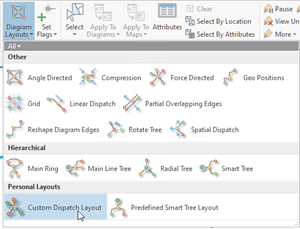

## CustomizeNetworkDiagramLayoutExecution

<!-- TODO: Write a brief abstract explaining this sample -->
With this add-in sample, you will get familiar with the Geometry, NetworkDiagrams, and Mapping API methods that allow you to develop your own diagram layout algorithm (see CustomDispatchLayout source code file).    
You will also learn how to preset parameters for any network diagram core layouts, and execute them through add-in commands instead of the core Apply xx Layout geoprocessing tool(see PredefinedSmartTreeLayout code source file). Applying network diagram layouts to your diagrams in  this way is really fast and easy for users.    
You will also know more about how to extend the Layout gallery with your preset network diagrams and with your own custom layout (see config.daml file).    
Sample data for ArcGIS Pro SDK Community Samples can be downloaded from the [Releases](https://github.com/Esri/arcgis-pro-sdk-community-samples/releases) page.   
> NOTE: The CustomDispatchLayout diagram layout code is a generic code sample and can be applied to any diagram even on other utility network dataset than the one provided with this sample.   
  


<a href="https://pro.arcgis.com/en/pro-app/sdk/" target="_blank">View it live</a>

<!-- TODO: Fill this section below with metadata about this sample-->
```
Language:              C#
Subject:               NetworkDiagram
Contributor:           ArcGIS Pro SDK Team <arcgisprosdk@esri.com>
Organization:          Esri, https://www.esri.com
Date:                  11/04/2024
ArcGIS Pro:            3.4
Visual Studio:         2022
.NET Target Framework: net8.0-windows
```

## Resources

[Community Sample Resources](https://github.com/Esri/arcgis-pro-sdk-community-samples#resources)

### Samples Data

* Sample data for ArcGIS Pro SDK Community Samples can be downloaded from the [Releases](https://github.com/Esri/arcgis-pro-sdk-community-samples/releases) page.  

## How to use the sample
<!-- TODO: Explain how this sample can be used. To use images in this section, create the image file in your sample project's screenshots folder. Use relative url to link to this image using this syntax:  -->
1. In Visual Studio, click the Build menu. Then select Build Solution.
2. Click Start button to open ArcGIS Pro.      
3. ArcGIS Pro will open.      
4. Open **C:\Data\NetworkDiagrams\SDKSampleNetwork\SDKSampleNetwork.aprx**. Make sure the Electric FGDB Editor map is open as the active map.    
5. Click on the Map tab on the ribbon. Then, in the Navigate group, expand Bookmarks and click Full Extent in the bookmark list.    
6. In the Utility Network tab in the ribbon, in the Subnetwork group, click Find Subnetwork Features: The Find Subnetworks pane window opens.    
7. Right-click the row corresponding to the RMT007 subnetwork and click Trace Subnetwork.    
        
    The trace executes and selects 316 network features in the active map.    
8. Zoom to the selection set.    
9. In the Utility Network tab on the ribbon, in the Network Diagram group, click the drop-down arrow under New and click CollapseContainers:    
        
    Starting from the network features selected in the map and using the template clicked in the drop-down list, a new diagram is created.It opens in a new diagram map.    
10. In the Network Diagram tab in the ribbon, in the Layout gallery, click Custom Dispatch Layout in the Personal Layouts section:    
        
    The add-in Custom Dispatch Layout applies to the diagram content and dispatch the diagram features so they are spread out to each other.The diagram map is refreshed to reflect the changes:    
        
11. In the Network Diagram tab in the ribbon, in the Layout gallery, click Predefined Smart Tree Layout in the Personal Layouts section:    
        
    The add-in Predefined Smart Tree Layout applies to the diagram content and execute the core Smart Tree layout with the expected parameters. The diagram map is refreshed to reflect the changes:    
        
    > NOTE: When there is diagram features selected in the diagram map, these two layouts execute on the only selection set.    
  

<!-- End -->

&nbsp;&nbsp;&nbsp;&nbsp;&nbsp;&nbsp;
&nbsp;&nbsp;&nbsp;&nbsp;&nbsp;&nbsp;&nbsp;&nbsp;&nbsp;&nbsp;&nbsp;&nbsp;
[Home](https://github.com/Esri/arcgis-pro-sdk/wiki) | <a href="https://pro.arcgis.com/en/pro-app/latest/sdk/api-reference" target="_blank">API Reference</a> | [Requirements](https://github.com/Esri/arcgis-pro-sdk/wiki#requirements) | [Download](https://github.com/Esri/arcgis-pro-sdk/wiki#installing-arcgis-pro-sdk-for-net) | <a href="https://github.com/esri/arcgis-pro-sdk-community-samples" target="_blank">Samples</a>
