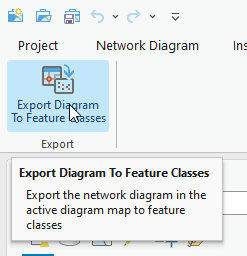
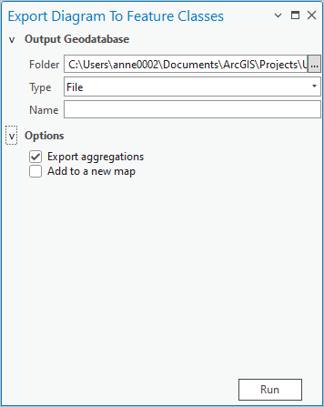
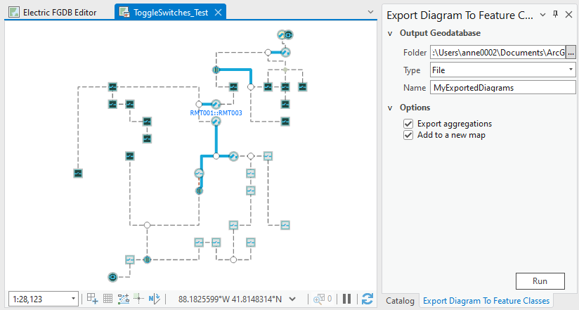
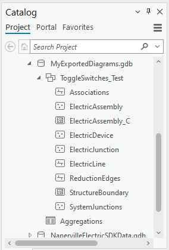
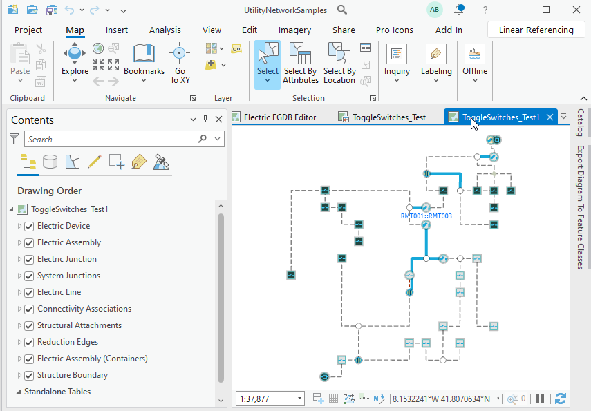

## ExportDiagramToFeatureClasses

<!-- TODO: Write a brief abstract explaining this sample -->
There are some ArcGIS Pro functions you can use to export diagrams. For example, the Export Diagram Content geoprocessing tool allows you to export a JSON file that describes a network diagram content (see https://pro.arcgis.com/en/pro-app/latest/tool-reference/network-diagram/export-diagram-content.htm). The output JSON file can then be used for network calculation and analysis or to feed external system.   
Starting from an open network diagram map, you can also use the Export Map functions available on the Share tab in the Output group, to export the active diagram map as a file including vector and raster formats.  
  
This add-in demonstrates another way to export a network diagram. It applies to any network diagram present in an active diagram map and exports its content into a set of feature classes in a feature dataset in a local geodatabase (File or Mobile). The output feature dataset can then be added to a map, shared with others, and so on.  
  
If you want, you can also turn on some extra options to:  
- Export the diagram aggregations into a specific table in the output geodatabase  
- Add the exported features to a new map under feature layers built with the same layer properties as under the original network diagram layer.  
  
> NOTE: The ExportDiagramToFeatureClasses add-in code is a generic code sample that performs any network diagram related to any utility or trace network dataset.  
  


<a href="https://pro.arcgis.com/en/pro-app/sdk/" target="_blank">View it live</a>

<!-- TODO: Fill this section below with metadata about this sample-->
```
Language:              C#
Subject:               NetworkDiagram
Contributor:           ArcGIS Pro SDK Team <arcgisprosdk@esri.com>
Organization:          Esri, https://www.esri.com
Date:                  11/04/2024
ArcGIS Pro:            3.4
Visual Studio:         2022
.NET Target Framework: net8.0-windows
```

## Resources

[Community Sample Resources](https://github.com/Esri/arcgis-pro-sdk-community-samples#resources)

### Samples Data

* Sample data for ArcGIS Pro SDK Community Samples can be downloaded from the [Releases](https://github.com/Esri/arcgis-pro-sdk-community-samples/releases) page.  

## How to use the sample
<!-- TODO: Explain how this sample can be used. To use images in this section, create the image file in your sample project's screenshots folder. Use relative url to link to this image using this syntax:  -->
1. In Visual Studio, click the Build menu. Then select Build Solution.
2. Start ArcGIS Pro.    
3. Open your favorite utility network or trace network ArcGIS Pro project.  
4. Open the network diagram you want to export or generate a new network diagram.  
5. In the Add-In tab on the ribbon, click Export Diagram To Feature Classes:  
  
6. The Export Diagram To Feature Classes pane window opens:  
  
7. Expand the Output Geodatabase section to specify the output geodatabase into which you want to export your network diagram.  
8. Click the browse button next to the Folder text area. Then, browse to and select the output folder where this geodatabase already exists or will be created.  
9. From the Type drop down list, pick up the type of output geodatabase you want to create—File or Mobile.  
10. In the Name text area, type the name of the output geodatabase.  
11. Then, expand the Options section.  
12. To export the diagram aggregations, make sure the 'Export aggregations' option is checked.  
13. If you want the exported diagram features to display in a new map once the export completes, check 'Add to a new map'.  
14. The Export Diagram To Feature Classes pane window should look like as follows:  
  
15. Make sure the diagram map you want to export is the active map and click Run.  
16. The export process starts. A message displays at the bottom of the pane window when it completes.  
  
17. In the Catalog pane window, go to the specified output folder and expand the output geodatabase where your diagram should have been exported. The next paragraphs explain how it is exported.  
  
    
In the specified output geodatabase, you should see a new feature dataset whose name corresponds to the exported network diagram layer name. Under this feature dataset, there is a set of feature classes whose names correspond to utility or trace network source class names. There is a feature class with a given network source class name when there is at least one diagram feature representing such a network source feature in the original diagram. For example, if there are structure junctions in the original diagram, the StructureJunction class is created under the exported feature dataset and all the structure diagram junctions are exported in this class. When there is no structure junction in the original diagram, there is no StructureJunction class in the exported feature dataset.  
Any diagram feature whose geometry type changed in the original diagram regarding to its source network feature geometry is exported in a feature class with a specific suffix in its name. This happens for any point network feature that exists as a diagram polygon container in the original diagram. Such a diagram container is exported in a feature class whose name has the _C suffix. For example, a junction box diagram container is exported in the StructureJunction_C feature class.  
In the same way, any polygon network feature or line network feature that exists in the original diagram as a diagram junction is exported in a feature class whose name has the _J suffix. For example a Substation diagram junction is exported in the StructureBoundary_J feature class.  
Under this feature dataset, you can also see a ReductionEdges line feature class for any exported reduction diagram edge, a SystemJunctions point feature class for the exported system junctions, and an Associations line feature class for the connectivity associations and structural attachments present in the exported diagram.  
With the 'Export aggregations' option checked, you also get the Aggregations table created in the output geodatabase. This table lists the GlobalIDs of all the network features that are collapsed or reduced in the diagram with the diagram element ID of the diagram feature that aggregates them (AggregationDEID), and  you can export various diagrams in the same output geodatabase. In this case, a feature dataset is created for each exported diagram. Since class names are unique inside the entire geodatabase, the names of the newly created feature classes are automatically suffixed with numbers to avoid duplicated names.  
When the 'Add to a new map' option is checked, the process continues after the diagram export completion. It first creates a new map whose name corresponds to the diagram layer name suffixed with a number. Then, it analyzes the layer definitions on the sublayers under the original network diagram layer and builds new layers with similar layer definitions in the newly open map for the exported diagram features.  
  
  

<!-- End -->

&nbsp;&nbsp;&nbsp;&nbsp;&nbsp;&nbsp;
&nbsp;&nbsp;&nbsp;&nbsp;&nbsp;&nbsp;&nbsp;&nbsp;&nbsp;&nbsp;&nbsp;&nbsp;
[Home](https://github.com/Esri/arcgis-pro-sdk/wiki) | <a href="https://pro.arcgis.com/en/pro-app/latest/sdk/api-reference" target="_blank">API Reference</a> | [Requirements](https://github.com/Esri/arcgis-pro-sdk/wiki#requirements) | [Download](https://github.com/Esri/arcgis-pro-sdk/wiki#installing-arcgis-pro-sdk-for-net) | <a href="https://github.com/esri/arcgis-pro-sdk-community-samples" target="_blank">Samples</a>
