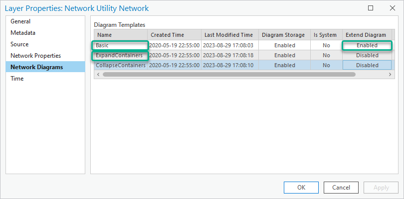
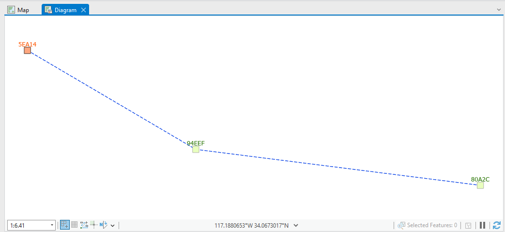
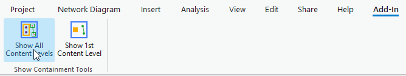
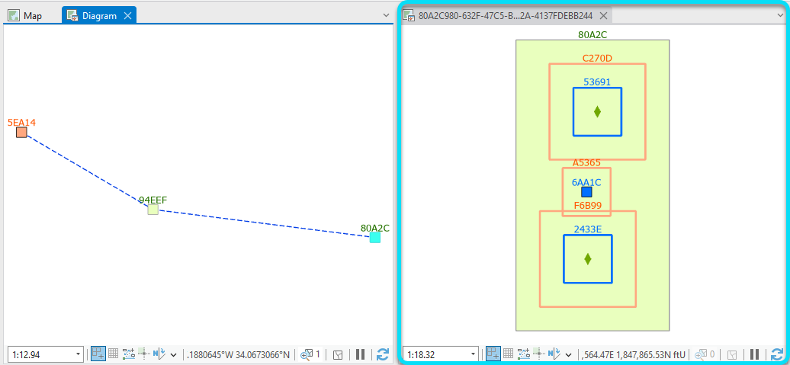
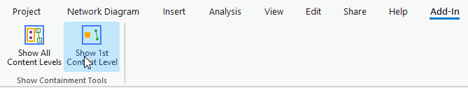
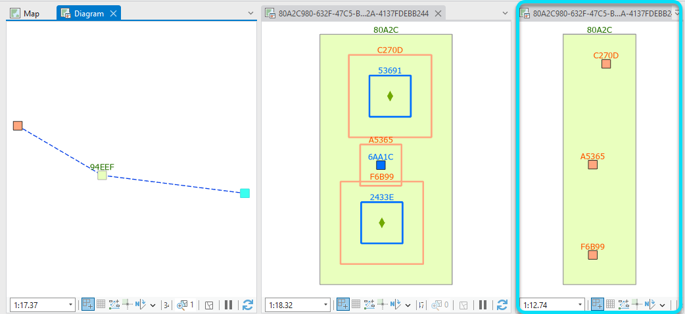
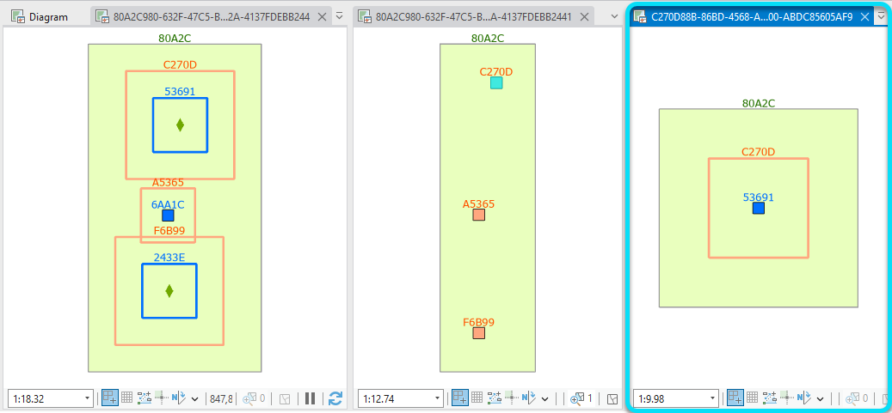
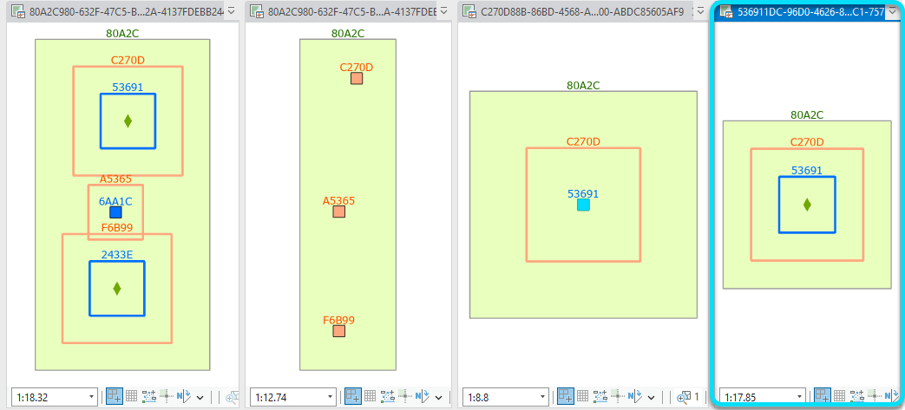

## ShowContainment

<!-- TODO: Write a brief abstract explaining this sample -->
 This is a very simple add-in code sample. The purpose is to demonstrate how to create a new diagram from diagram features selected in any open diagram.  
  
 In this sample, the two add-in command codes expect a diagram feature representing a container feature or container object in the utility network to be selected in any open diagram map.  
 Then they use this utility network container feature or object as the only input network element to generate another diagram.  
  
 The Show All Content Levels command creates a diagram starting from this input network element based on the ExpandContainers template available by default with any utility network.  
  
 The Show 1st Content Level command starts the creation of the resulting diagram using the Basic template. Then, it runs the Extend operation with the ExtendByContainment type to extend the diagram content by on containment level.  
 > NOTE: These two sample add-in commands are generic and work with any utility network when the Basic and ExpandContainers diagram templates installed by default at utility network creation still exist without any alteration of their settings.  
  
   


<a href="https://pro.arcgis.com/en/pro-app/sdk/" target="_blank">View it live</a>

<!-- TODO: Fill this section below with metadata about this sample-->
```
Language:              C#
Subject:               NetworkDiagram
Contributor:           ArcGIS Pro SDK Team <arcgisprosdk@esri.com>
Organization:          Esri, https://www.esri.com
Date:                  04/04/2024
ArcGIS Pro:            3.3
Visual Studio:         2022
.NET Target Framework: net8.0-windows
```

## Resources

[Community Sample Resources](https://github.com/Esri/arcgis-pro-sdk-community-samples#resources)

### Samples Data

* Sample data for ArcGIS Pro SDK Community Samples can be downloaded from the [Releases](https://github.com/Esri/arcgis-pro-sdk-community-samples/releases) page.  

## How to use the sample
<!-- TODO: Explain how this sample can be used. To use images in this section, create the image file in your sample project's screenshots folder. Use relative url to link to this image using this syntax:  -->
 The main workflow steps to test these commands are detailed below:  
   
  
1. In Visual Studio click the Build menu. Then select Build Solution.
 2. Click Start button to open ArcGIS Pro.  
 3. Load any utility network map.  
 4. In the Contents pane window, right-click the utility network layer and click Properties.  
 5. Click the Network Diagrams tab and have a look to the templates listed in the Diagram Templates table.  
   
 6. Verify that both the Basic and ExpandContainers templates exist in this list. Check also that the Extend Diagram cell displays Enabled for the Basic template.  
 7. These are pre-requisites for the add in commands to work without errors.  
 8. Search for any container feature or container object in your network and select one or more. You can also select some of its neighbor features if you want.  
 9. On the Utility Network tab in the ribbon, in the Diagram group, click the drop down arrow under New and click either CollapseContainers or Basic.  
   
 10. In the newly open diagram map, identify any diagram junction representing a utility network container and select it.  
 11. Click on the Add-In tab on the ribbon and click Show All Contents.  
   
 12. A diagram based on the ExpandContainers template opens in a new diagram map. It shows the whole containment hierarchy related to the utility network container you selected in your first diagram.  
   
 13. Go back to the first diagram map you created and make it the active diagram map.  
 14. Make sure the utility network container you selected in it is still selected.  
 15. Click on the Add-In tab on the ribbon and click Show 1st Content Level.  
   
 16. A diagram based on the Basic template opens in a new diagram map. This time, the new diagram shows the first level of containment related to the utility network container you selected.  
   
 17. For the case the newly open diagram references diagram junctions that represent utility network containers, select one of this junction, click on the Add-In tab on the ribbon and click Show 1st Content Level.  
   
 18. Another diagram based on the Basic template opens in a new diagram map showing the 1st level of containment related to this particular utility network container.  
 19. Starting from this new diagram, you can repeat the operation until you reach the very last containment hierarchy level if you want.  
   
   

<!-- End -->

&nbsp;&nbsp;&nbsp;&nbsp;&nbsp;&nbsp;
&nbsp;&nbsp;&nbsp;&nbsp;&nbsp;&nbsp;&nbsp;&nbsp;&nbsp;&nbsp;&nbsp;&nbsp;
[Home](https://github.com/Esri/arcgis-pro-sdk/wiki) | <a href="https://pro.arcgis.com/en/pro-app/latest/sdk/api-reference" target="_blank">API Reference</a> | [Requirements](https://github.com/Esri/arcgis-pro-sdk/wiki#requirements) | [Download](https://github.com/Esri/arcgis-pro-sdk/wiki#installing-arcgis-pro-sdk-for-net) | <a href="https://github.com/esri/arcgis-pro-sdk-community-samples" target="_blank">Samples</a>
