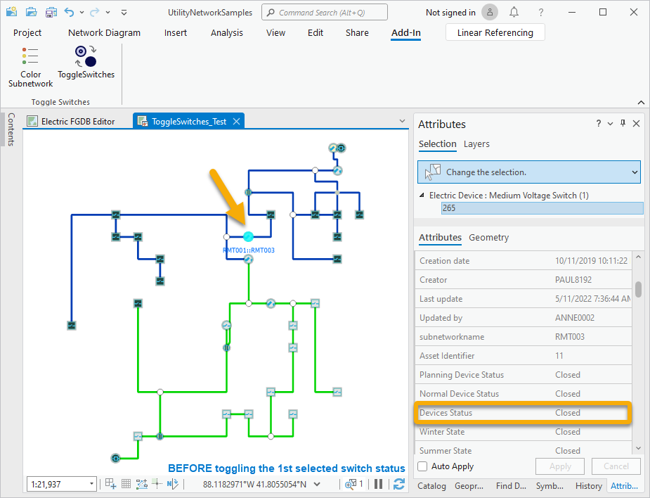
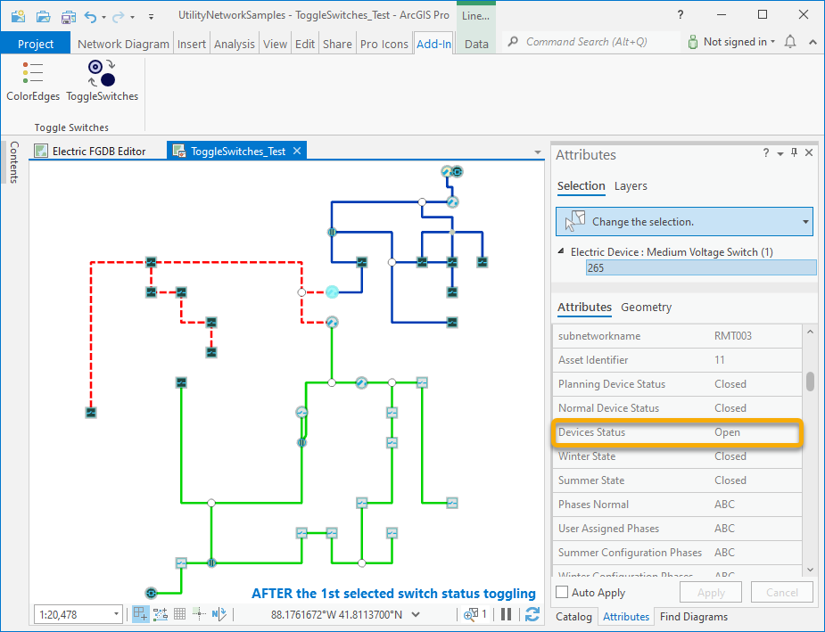
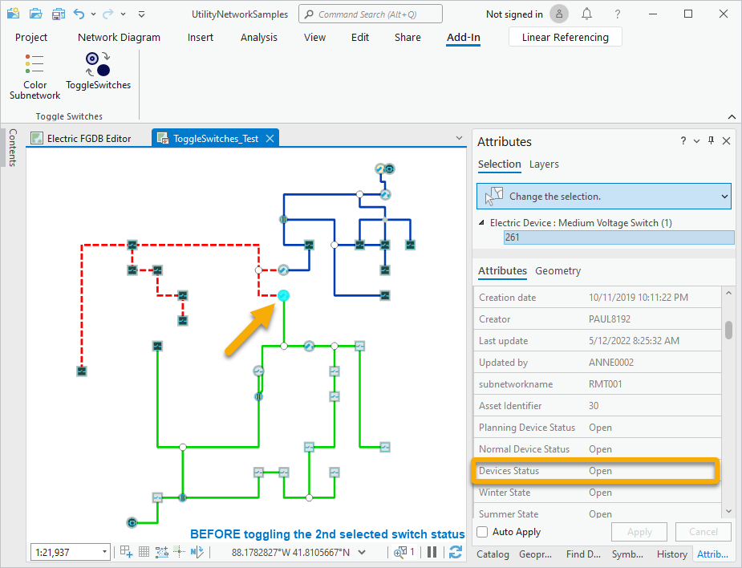
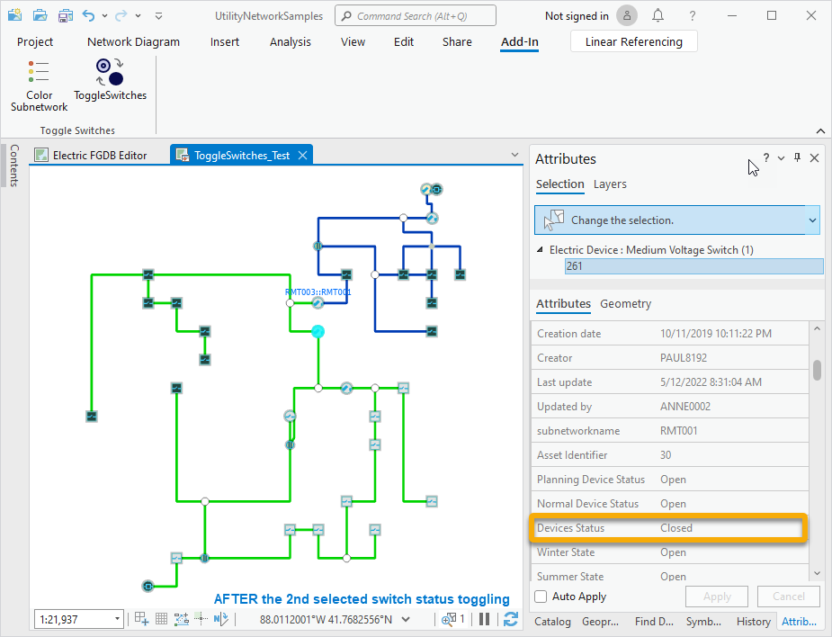

## ToggleSwitches

<!-- TODO: Write a brief abstract explaining this sample -->
 This add-in demonstrates toggling switches in an electric distribution network and the visual network diagram feedback.    
 Attributes cannot be manually edited from network diagrams; nor the attributes stored in the diagram feature classes, nor those coming from the join with the associated network source classes.  
 However, any editable attributes on the joined network feature class can be edited by code. In this add-in sample, you will learn about how to edit the Status attribute available on Switch devices.  
 This code sample is tied to the sample network dataset referenced in the workflow steps detailed below. But, it can be easily adapted for any utility network dataset.  
  
 Community Sample data (see under the "Resources" section for downloading sample data) has a CommunitySampleData-NetworkDiagrams zip file that contains a project that can be used with this sample.  
   


<a href="https://pro.arcgis.com/en/pro-app/sdk/" target="_blank">View it live</a>

<!-- TODO: Fill this section below with metadata about this sample-->
```
Language:              C#
Subject:               NetworkDiagram
Contributor:           ArcGIS Pro SDK Team <arcgisprosdk@esri.com>
Organization:          Esri, https://www.esri.com
Date:                  05/06/2025
ArcGIS Pro:            3.5
Visual Studio:         2022
.NET Target Framework: net8.0-windows
```

## Resources

[Community Sample Resources](https://github.com/Esri/arcgis-pro-sdk-community-samples#resources)

### Samples Data

* Sample data for ArcGIS Pro SDK Community Samples can be downloaded from the [Releases](https://github.com/Esri/arcgis-pro-sdk-community-samples/releases) page.  

## How to use the sample
<!-- TODO: Explain how this sample can be used. To use images in this section, create the image file in your sample project's screenshots folder. Use relative url to link to this image using this syntax:  -->
1. In Visual Studio click the Build menu.  Then select Build Solution.
 2. Click Start button to open ArcGIS Pro.    
 3. ArcGIS Pro will open.    
 4. Open C:\Data\NetworkDiagrams\SDKSampleNetwork\SDKSampleNetwork.aprx  
 5. Click on the Map tab on the ribbon. Then, in the Navigate group, expand Bookmarks and click Full Extent.  
 6. Click on the Utility Network tab in the ribbon. Then, in the Diagram group, click Find Diagrams.  
 7. In the Find Diagrams pane, search for the diagram stored as ToggleSwitches_Test and double click it so it opens  
 8. Click on the Add-in tab on the ribbon    
 9. In the Toggle Switches group, click on the Color Subnetwork tool so the diagram edges are colorized according the subnetwork to which they belong.  
 10. Select the medium voltage switch for which the Asset Identifier is 11 like in the following screenshot; this is, the one just above the switch labelled RMT001:RMT003:  
       
     Its Device Status is actually Closed.  
 11. In the Toggle Switches group, click on the Toggle Switches tool.  
 The process chains the following steps: the switch status is toggled (it moved from Closed to Open), the topology is validated and saved, the related subnetwork is updated, the diagram edge colors are updated to reflect the color of the subnetwork to which they belong.  
 There are some diagram edges previously related to the blue subnetwork that become de-energized; they became out of any subnetwork and display as dash red lines.  
     		  
 12. Select the medium voltage switch just below for which the Asset Identifier is 30 like in the following screenshot; this is the one previously labelled as RMT001:RMT003:  
       
     Its Device Status is actually Open.	  
 13. In the Toggle Switches group, click on the Toggle Switches tool.  
 The same process executes. The network features previously de-energized are now fed by the subnetwork controller CB:Line Side/RMT001; the diagram edges which represent features that now belong to this RMT001 subnetwork are colorized in green.  
       
 14. Select the two medium voltage switches for which you've changed the status since the beginning of this workflow.  
 15. In the Toggle Switches group, click on the Toggle Switches tool.  
 The status of the two selected switches are toggled and the two related subnetworks are updated. The utility network is back to its initial state.  
   

<!-- End -->

&nbsp;&nbsp;&nbsp;&nbsp;&nbsp;&nbsp;
&nbsp;&nbsp;&nbsp;&nbsp;&nbsp;&nbsp;&nbsp;&nbsp;&nbsp;&nbsp;&nbsp;&nbsp;
[Home](https://github.com/Esri/arcgis-pro-sdk/wiki) | <a href="https://pro.arcgis.com/en/pro-app/latest/sdk/api-reference" target="_blank">API Reference</a> | [Requirements](https://github.com/Esri/arcgis-pro-sdk/wiki#requirements) | [Download](https://github.com/Esri/arcgis-pro-sdk/wiki#installing-arcgis-pro-sdk-for-net) | <a href="https://github.com/esri/arcgis-pro-sdk-community-samples" target="_blank">Samples</a>
