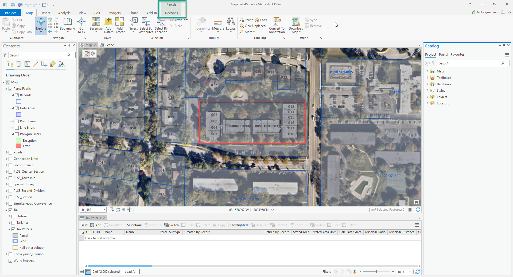
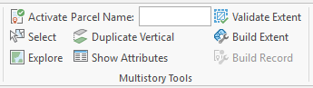
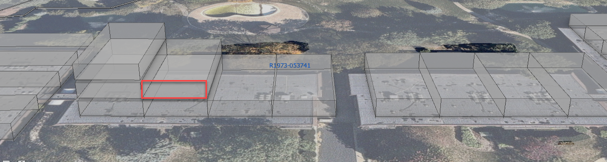
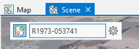

## ParcelFabricMultistoryTool

<!-- TODO: Write a brief abstract explaining this sample -->
 This sample illustrates how an add-in can create a new group of controls focused in support of a 3D parcel fabric editing workflow.  The 3D scene provides rendering of multistory parcel polygons, allowing an editor to accurately select and vertically duplicate parcels.     
  


<a href="http://pro.arcgis.com/en/pro-app/sdk/" target="_blank">View it live</a>

<!-- TODO: Fill this section below with metadata about this sample-->
```
Language:              C#
Subject:               Editing, Parcel Fabric
Contributor:           ArcGIS Pro SDK Team <arcgisprosdk@esri.com>
Organization:          Esri, http://www.esri.com
Date:                  7/17/2019
ArcGIS Pro:            2.5
Visual Studio:         2019
.NET Target Framework: 4.8
```

## Resources

* [API Reference online](https://pro.arcgis.com/en/pro-app/sdk/api-reference)
* <a href="https://pro.arcgis.com/en/pro-app/sdk/" target="_blank">ArcGIS Pro SDK for .NET (pro.arcgis.com)</a>
* [arcgis-pro-sdk-community-samples](https://github.com/Esri/arcgis-pro-sdk-community-samples)
* [ArcGIS Pro DAML ID Reference](https://github.com/Esri/arcgis-pro-sdk/wiki/ArcGIS-Pro-DAML-ID-Reference)
* [FAQ](https://github.com/Esri/arcgis-pro-sdk/wiki/FAQ)
* [ArcGIS Pro SDK icons](https://github.com/Esri/arcgis-pro-sdk/releases/tag/2.4.0.19948)


### Samples Data

* Sample data for ArcGIS Pro SDK Community Samples can be downloaded from the [repo releases](https://github.com/Esri/arcgis-pro-sdk-community-samples/releases) page.  

## How to use the sample
<!-- TODO: Explain how this sample can be used. To use images in this section, create the image file in your sample project's screenshots folder. Use relative url to link to this image using this syntax:  -->
 Using the sample:  
  
 1. Download the Community Sample data (see under the 'Resources' section for downloading sample data).  The sample data contains a dataset called ParcelFabricMultistoryTool.  Make sure that the Sample data is unzipped under C:\Data and the folder "C:\Data\ParcelFabric" is available.    
 1. Open the solution in Visual Studio 2017 or 2019.  
 1. Click the Build menu and select Build Solution.  
 1. Click the Start button to open ArcGIS Pro.   
 1. Open the project “NapervilleParcels.aprx" found in folder: “C:\data\ParcelFabric”.  
 1. The project opens in the 2D map view.  You can see two polygon layers displayed, Tax Parcels and Records, with an imagery basemap.  
 1. Click on the Condominium Units bookmark and you will find centered in the map a condominium complex, seen in the screenshot below with the red outline.  This will be the area for your parcel editing.  
 1. As a parcel fabric layer is contained in the map, the Parcels ribbon becomes available, as seen in the green outline in the screenshot below.  The Parcels ribbon consists of a Records tab, which contains tools and commands for editing parcels in a parcel fabric.  
   
  
 1. Click on the Records tab and review the tools which are organized into several groups.  The Pro add-in you built has added a new group called Multistory Tools, as seen below, which is located on the ribbon to the right of the Tools gallery.  This new group provides the tools needed to help sequence and streamline the editing work in this workflow.  
   
  
 1. Click on the 3D Scene map to view the dataset in 3D.  Using the scroll wheel on the mouse, tilt the perspective so that you can see the parcel polygons extruded in the view, as seen in the screenshot below.  Notice that some polygons for the second and third floors have been created.  
   
  
 1. Zoom into any parcel, such as the one outlined in red above.  Click on the Records tab, and in the add-in Multistory Tools group, click on the Activate tool.  This custom tool allows you a spatial approach to activating a parcel fabric record for a location, by clicking on an available polygon feature in the Records layer.  With the Activate tool, click on the location for the new tax parcel polygon.  You should see a message box appear confirming the activated record.  This record should also now be visible in the upper-left corner of the scene, for example:  
   
  
 1. Next, from the Multistory Tools group, click on the Select button, which will activate the Select By Rectangle tool.  Use the tool to select the parcel polygon outlined in red in the screenshot further above.  
 1. The workflow requires a new parcel name value which will be applied to the new created duplicate.  This will help ensure a unique name value when viewing the data in the attribute table.  Type a new value into the Parcel Name edit box in the Multistory Tools group.  Any lower-case letters will be set to uppercase when the new feature is created.  
 1. After setting the parcel name, press the Duplicate Vertical button.  The previously selected parcel will be duplicated and a new parcel feature will appear selected above it.  
 1. Next, press the Show Attributes button to open the Attributes pane.  You should see the attributes for your new parcel feature which is currently selected.  You can confirm that the Name attribute value you entered on the ribbon is reflected for the new feature.  You can make any additional attribute updates in the pane, and view and update for the selected record in the Tax Parcels attribute table.  
     
     
 Additional things you can try:  
 - Create new parcels in either 2D or 3D and modify existing parcels.  
 - Validate topology using the validate extent button and build parcels with the parcel fabric using the build extent or build with active record buttons.  
  


<!-- End -->

&nbsp;&nbsp;&nbsp;&nbsp;&nbsp;&nbsp;
&nbsp;&nbsp;&nbsp;&nbsp;&nbsp;&nbsp;&nbsp;&nbsp;&nbsp;&nbsp;&nbsp;&nbsp;
[Home](https://github.com/Esri/arcgis-pro-sdk/wiki) | <a href="https://pro.arcgis.com/en/pro-app/sdk/api-reference" target="_blank">API Reference</a> | [Requirements](https://github.com/Esri/arcgis-pro-sdk/wiki#requirements) | [Download](https://github.com/Esri/arcgis-pro-sdk/wiki#installing-arcgis-pro-sdk-for-net) | <a href="https://github.com/esri/arcgis-pro-sdk-community-samples" target="_blank">Samples</a>
