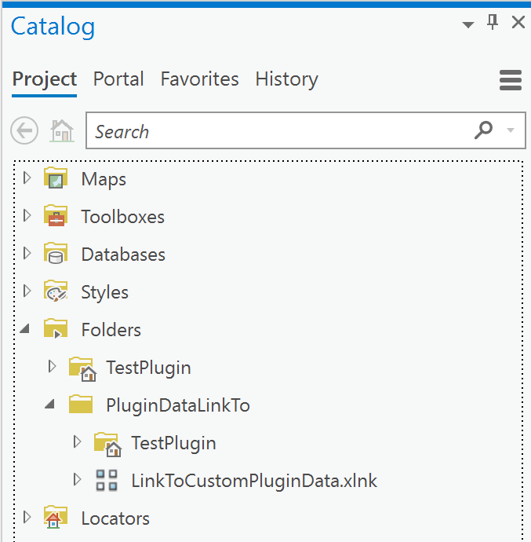
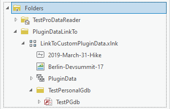
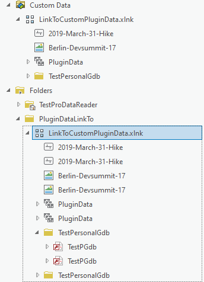

## ProDataReader

<!-- TODO: Write a brief abstract explaining this sample -->
ProDataReader implements two plugin datasources to allowing Pro viewing of the following formats:  
- Jpg photos with GPS metadata: smart phone and digital cameras have the option to capture GPS information when a photo is taken.  ProJpgPluginDatasource allows to access these GPS enable photos as a read-only feature class.  
- Gpx data: GPX (the GPS eXchange Format) is a data format for exchanging GPS data between programs and implemented by many GPS tracking devices. ProGpxPluginDatasource allows to access Gpx files as a read-only feature class.   
  


<a href="https://pro.arcgis.com/en/pro-app/sdk/" target="_blank">View it live</a>

<!-- TODO: Fill this section below with metadata about this sample-->
```
Language:              C#
Subject:               Framework
Contributor:           ArcGIS Pro SDK Team <arcgisprosdk@esri.com>
Organization:          Esri, https://www.esri.com
Date:                  10/01/2023
ArcGIS Pro:            3.2
Visual Studio:         2022
.NET Target Framework: net6.0-windows
```

## Resources

[Community Sample Resources](https://github.com/Esri/arcgis-pro-sdk-community-samples#resources)

### Samples Data

* Sample data for ArcGIS Pro SDK Community Samples can be downloaded from the [Releases](https://github.com/Esri/arcgis-pro-sdk-community-samples/releases) page.  

## How to use the sample
<!-- TODO: Explain how this sample can be used. To use images in this section, create the image file in your sample project's screenshots folder. Use relative url to link to this image using this syntax:  -->
1. Download the Community Sample data (see under the 'Resources' section for downloading sample data)
2. Make sure that the Sample data is unzipped in c:\data   
3. The data used in this sample is located in this folder 'C:\Data\PluginData' and 'C:\Data\PluginDataLinkTo'  
4. In Visual Studio click the Build menu. Then select Build Solution.  
5. Click Start button to open ArcGIS Pro.  
6. In ArcGIS Pro open this project: 'C:\Data\PluginDataLinkTo\TestPlugin\TestPlugin.aprx'  
7. Open the Catalog Dockpane and open Folder Connection to drill down to this folder: 'PluginDataLinkTo'  
    
8. The folder 'PluginDataLinkTo' is linked to 'C:\Data\PluginDataLinkTo' this folder contains a file called 'LinkToCustomPluginData.xlnk' with a file extension '.xlnk' that triggers the 'ProDataProjectItem' Custom Project Item class. 'LinkToCustomPluginData.xlnk' in turn contains all the folder paths which are scanned and processed by the Custom Project Item class.  
9. Open the 'LinkToCustomPluginData.xlnk' folder to find various GPX and JPG file data sources.   
    
10. In the source code look at the ProDataProjectItem class, which is used to implement the LinkToCustomPluginData.xlnk node in the Catalog dockpane.  
11. The ProDataProjectItem class is triggered by an entry in config.daml specifically the 'insertComponent' tag for id: ProDataReader_ProDataReader.  Under the 'content' tag you find the attribute fileExtension="xlnk" which triggers the instantiation of the ProDataProjectItem class whenever a file with this extension (case sensitive) is encountered.    
12. <B>Note: the fileExtension attribute is case sensitive, hence only file extensions matching a case sensitive compare with the fileExtension attribute will work</B>  
    
13. Under the 'LinkToCustomPluginData.xlnk' node you can see '2019-March-31-Hike' which represents a line feature class (GPS Track) and 'Berlin-Devsummit-17' which represents a point feature datasets containing the point location where the photo was taken.  In source code, the ProDataSubItem class is used to prepresent each node in the catalog browser.  
14. Right clicking on any of the feature classes or the 'MiscPictures Jpeg Images' image folder node allows the feature class(es) to be added to the current map.  In the source code this is done in the AddToCurrentMap button class.  
15. After you add an item to the current map, the ProPluginDatasource plug-in is used to convert the source data to a feature class that can be added to a map and displayed as an attribute table.  
   
  

<!-- End -->

&nbsp;&nbsp;&nbsp;&nbsp;&nbsp;&nbsp;
&nbsp;&nbsp;&nbsp;&nbsp;&nbsp;&nbsp;&nbsp;&nbsp;&nbsp;&nbsp;&nbsp;&nbsp;
[Home](https://github.com/Esri/arcgis-pro-sdk/wiki) | <a href="https://pro.arcgis.com/en/pro-app/latest/sdk/api-reference" target="_blank">API Reference</a> | [Requirements](https://github.com/Esri/arcgis-pro-sdk/wiki#requirements) | [Download](https://github.com/Esri/arcgis-pro-sdk/wiki#installing-arcgis-pro-sdk-for-net) | <a href="https://github.com/esri/arcgis-pro-sdk-community-samples" target="_blank">Samples</a>
