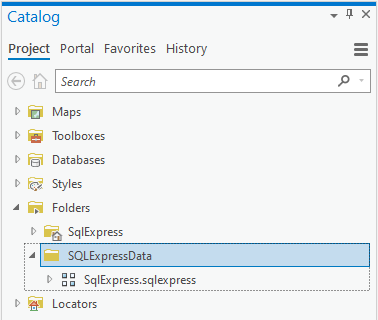
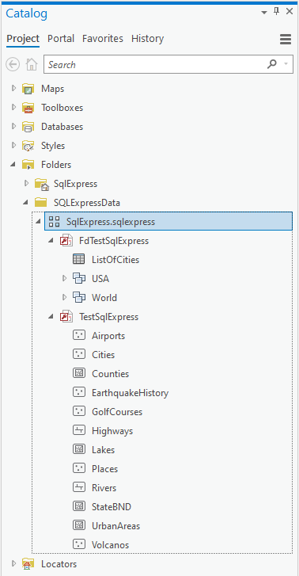
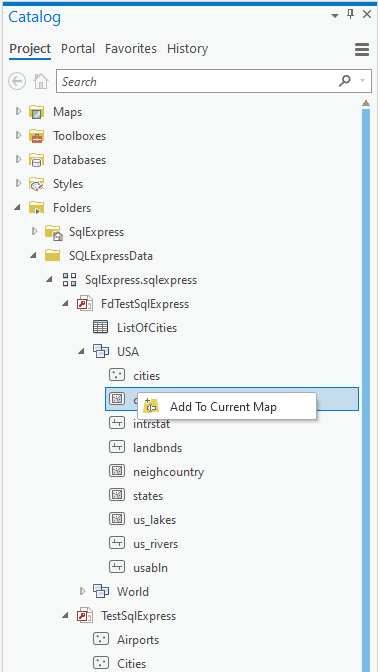
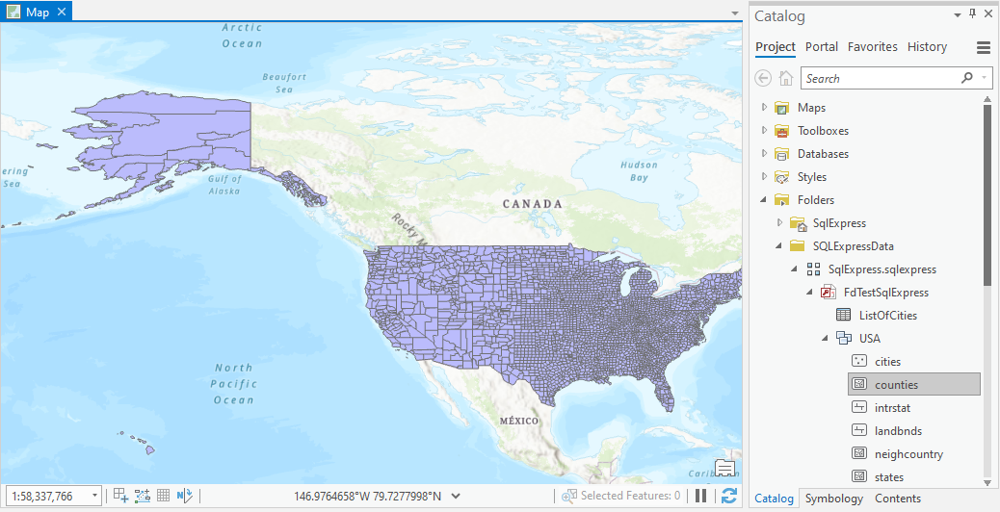
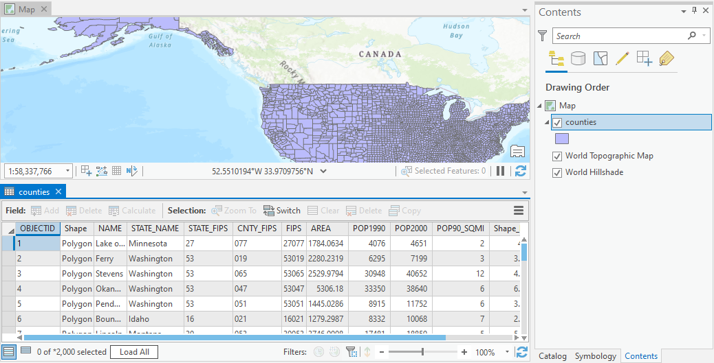

## ProSqlExpressReader

<!-- TODO: Write a brief abstract explaining this sample -->
ProSqlExpressReader implements a three plugin datasources to read the following:  
- Classic ArcGIS Personal Geodatabase: A personal geodatabase is a Microsoft Access database that can store, query, and manage both spatial and nonspatial data.  ProSqlExpressPluginDatasource implements read-only sql to personal geodatabase feature class data.  
  


<a href="http://pro.arcgis.com/en/pro-app/sdk/" target="_blank">View it live</a>

<!-- TODO: Fill this section below with metadata about this sample-->
```
Language:              C#
Subject:               Plugin
Contributor:           ArcGIS Pro SDK Team <arcgisprosdk@esri.com>
Organization:          Esri, http://www.esri.com
Date:                  6/27/2019
ArcGIS Pro:            2.4
Visual Studio:         2019
.NET Target Framework: 4.7.2
```

## Resources

* [API Reference online](https://pro.arcgis.com/en/pro-app/sdk/api-reference)
* <a href="https://pro.arcgis.com/en/pro-app/sdk/" target="_blank">ArcGIS Pro SDK for .NET (pro.arcgis.com)</a>
* [arcgis-pro-sdk-community-samples](https://github.com/Esri/arcgis-pro-sdk-community-samples)
* [ArcGIS Pro DAML ID Reference](https://github.com/Esri/arcgis-pro-sdk/wiki/ArcGIS-Pro-DAML-ID-Reference)
* [FAQ](https://github.com/Esri/arcgis-pro-sdk/wiki/FAQ)
* [ArcGIS Pro SDK icons](https://github.com/Esri/arcgis-pro-sdk/releases/tag/2.4.0.19948)


### Samples Data

* Sample data for ArcGIS Pro SDK Community Samples can be downloaded from the [repo releases](https://github.com/Esri/arcgis-pro-sdk-community-samples/releases) page.  

## How to use the sample
<!-- TODO: Explain how this sample can be used. To use images in this section, create the image file in your sample project's screenshots folder. Use relative url to link to this image using this syntax:  -->
1. Download the Community Sample data (see under the 'Resources' section for downloading sample data)  
1. Make sure that the Sample data is unzipped in c:\data   
1. The data used in this sample is located in this folder 'C:\Data\PluginData\SQLExpressData'  
1. In order to run this sample you have to install SQL Server Express, which can be downloaded and installed for free from Microsoft here: https://www.microsoft.com/en-us/download/details.aspx?id=13255.  The SQL Server version supported is 2017 or newer.    
1. Once SQL Server Express is installed and runnung, use 'Microsoft SQL Server Management Studio 18' to 'attach' the following database files:  
1. C:\Data\PluginData\SQLExpressData\TestSqlExpress.mdf and C:\Data\PluginData\SQLExpressData\FDTestSQLExpress.mdf.     
1. In Visual Studio click the Build menu. Then select Build Solution.  
1. Click Start button to open ArcGIS Pro.  
1. In ArcGIS Pro open this project: 'C:\Data\PluginData\SqlExpress\SqlExpress.aprx'  
1. Open the Catalog Dockpane and open Folder Connection to to drill down to this folder: 'SQLExpressData'  
    
  
1. The folder 'SQLExpressData' is linked to 'C:\Data\PluginData\SQLExpressData' this folder contains a file called 'SqlExpress.sqlexpress' with a file extension that triggers the 'ProDataProjectItem' Custom Project Item class. 'SqlExpress.sqlexpress' in turn contains lines of SQL Server RDMS conenction strings that are read and processed by the Custom Project Item class in order to explore the content of each database connection.  
1. Open the 'SqlExpress.sqlexpress' to find two connection strings to two databases: TestSqlExpress, FdTestSqlExpress  
1. Please note that each database contains tables (and feature class tables) that where copied from a personal (access) geodatabase.  The following 3 tables were also copied in order to manage feature datasets and spatial references: GDB_Items", GDB_GeomColumns, GDB_SpatialRefs.    
1. Back in ArcGIS Pro | Catalog dockpane you can see that each connection string is displayed with its database name and a drill down list comprised of tables, featureclasses, and feature datasets.  
    
  
1. In the source code look at the ProSqlProjectItem class, which is used to implement the "sqlexpress" file extension node in the Catalog dockpane.  
1. Under the FdTestSqlExpress node you can see all a table and feature datasets containing point, line, and polygon feature classes of the personal geodatabase.  In source code, the ProDataSubItem class is used to prepresent each table node in the catalog browser.  
1. Right clicking on any of the feature classes or feature datasets allows the feature class(es) to be added to the current map.  In the source code this is done in the AddToCurrentMap button class.  
    
  
1. After you add a ProSqlTable item to the current map, the ProSqlExpressPluginDatasource plug-in is used to convert the sql table content into a feature class that can be added to a map   
   
  
1. You can also view the attribute table for the plugindatasource featureclass that you added to your map  
   
  


<!-- End -->

&nbsp;&nbsp;&nbsp;&nbsp;&nbsp;&nbsp;
&nbsp;&nbsp;&nbsp;&nbsp;&nbsp;&nbsp;&nbsp;&nbsp;&nbsp;&nbsp;&nbsp;&nbsp;
[Home](https://github.com/Esri/arcgis-pro-sdk/wiki) | <a href="https://pro.arcgis.com/en/pro-app/sdk/api-reference" target="_blank">API Reference</a> | [Requirements](https://github.com/Esri/arcgis-pro-sdk/wiki#requirements) | [Download](https://github.com/Esri/arcgis-pro-sdk/wiki#installing-arcgis-pro-sdk-for-net) | <a href="https://github.com/esri/arcgis-pro-sdk-community-samples" target="_blank">Samples</a>
