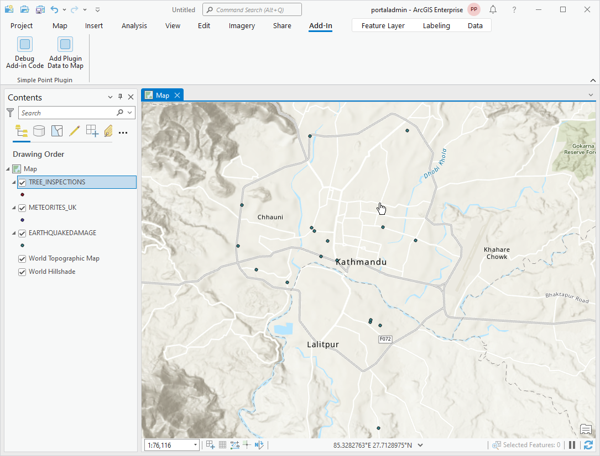

## SimplePointPluginTest

<!-- TODO: Write a brief abstract explaining this sample -->
SimplePointPluginTest implements a custom plugin datasource for reading csv files.  SimplePointPluginTest is an add-in that allows to access the custom datasource.  SimplePointPlugin contains the actual custom plugin datasource implementation to access csv data from within ArcGIS Pro.   
  


<a href="https://pro.arcgis.com/en/pro-app/sdk/" target="_blank">View it live</a>

<!-- TODO: Fill this section below with metadata about this sample-->
```
Language:              C#
Subject:               Geodatabase
Contributor:           ArcGIS Pro SDK Team <arcgisprosdk@esri.com>
Organization:          Esri, https://www.esri.com
Date:                  05/06/2025
ArcGIS Pro:            3.5
Visual Studio:         2022
.NET Target Framework: net8.0-windows
```

## Resources

[Community Sample Resources](https://github.com/Esri/arcgis-pro-sdk-community-samples#resources)

### Samples Data

* Sample data for ArcGIS Pro SDK Community Samples can be downloaded from the [Releases](https://github.com/Esri/arcgis-pro-sdk-community-samples/releases) page.  

## How to use the sample
<!-- TODO: Explain how this sample can be used. To use images in this section, create the image file in your sample project's screenshots folder. Use relative url to link to this image using this syntax:  -->
1. This solution is using the **RBush NuGet**.  If needed, you can install the NuGet from the "NuGet Package Manager Console" by using this script: "Install-Package RBush".
2. Download the Community Sample data (see under the 'Resources' section for downloading sample data)  
3. Make sure that the Sample data is unzipped in c:\data   
4. The data used in this sample is located in this folder 'C:\Data\SimplePointPlugin\SimplePointData'  
5. In Visual Studio click the Build menu. Then select Build Solution.  
6. Click Start button to open ArcGIS Pro.  
7. In ArcGIS Pro create a new Map.  
8. In Visual Studio set a break point inside the TestCsv8.OnClick code-behind.  
9. In ArcGIS Pro click on the 'Debug Add-in Code' button.  
10. You can now step through the code showing how to use a custom plugin in code.  
11. In ArcGIS Pro click on the 'Add Plugin Data to Map' button.  
12. The test data is now added to the current map.  
13. Use the test data on the map or via the attribute table.  
    
  

<!-- End -->

&nbsp;&nbsp;&nbsp;&nbsp;&nbsp;&nbsp;
&nbsp;&nbsp;&nbsp;&nbsp;&nbsp;&nbsp;&nbsp;&nbsp;&nbsp;&nbsp;&nbsp;&nbsp;
[Home](https://github.com/Esri/arcgis-pro-sdk/wiki) | <a href="https://pro.arcgis.com/en/pro-app/latest/sdk/api-reference" target="_blank">API Reference</a> | [Requirements](https://github.com/Esri/arcgis-pro-sdk/wiki#requirements) | [Download](https://github.com/Esri/arcgis-pro-sdk/wiki#installing-arcgis-pro-sdk-for-net) | <a href="https://github.com/esri/arcgis-pro-sdk-community-samples" target="_blank">Samples</a>
