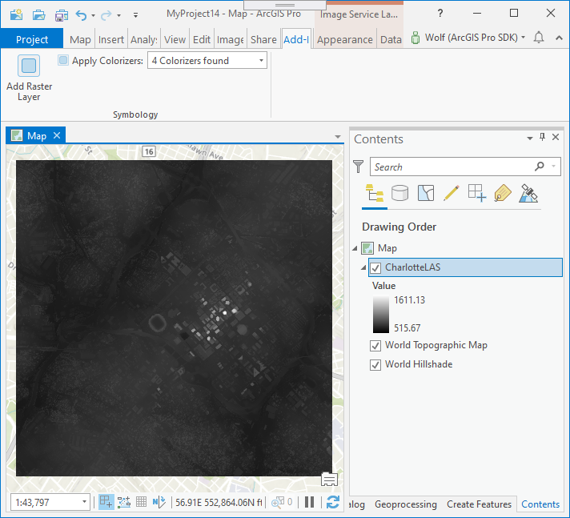
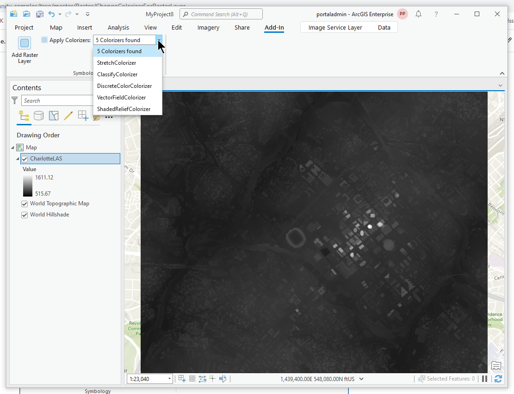
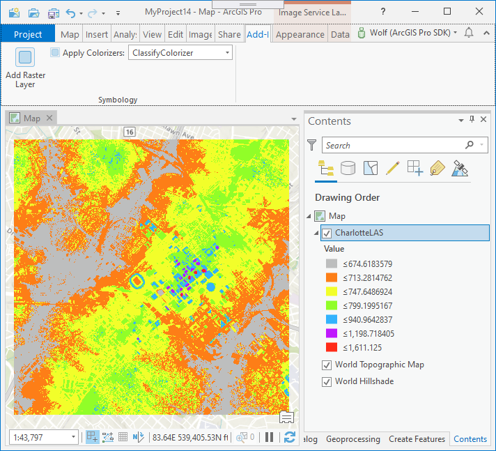
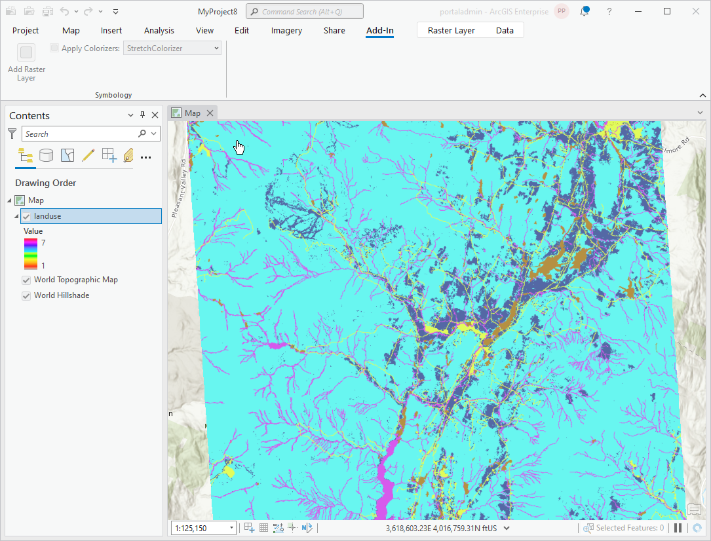

## ChangeColorizerForRasterLayer

<!-- TODO: Write a brief abstract explaining this sample -->
This sample demonstrates how to use the raster colorizer definitions to create a specific colorizer, and apply the new colorizer to the selected raster layer.    
The sample includes these functions:  
  
1. Creates a new image service layer and adds the layer to the current map.  
1. Displays a collection of colorizers in a combo box that can be applied to the selected layer.    
1. Sets the selected colorizer to the layer.  
  


<a href="http://pro.arcgis.com/en/pro-app/sdk/" target="_blank">View it live</a>

<!-- TODO: Fill this section below with metadata about this sample-->
```
Language:              C#
Subject:               Raster
Contributor:           ArcGIS Pro SDK Team <arcgisprosdk@esri.com>
Organization:          Esri, http://www.esri.com
Date:                  7/01/2020
ArcGIS Pro:            2.6
Visual Studio:         2017, 2019
.NET Target Framework: 4.8
```

## Resources

* [API Reference online](https://pro.arcgis.com/en/pro-app/sdk/api-reference)
* <a href="https://pro.arcgis.com/en/pro-app/sdk/" target="_blank">ArcGIS Pro SDK for .NET (pro.arcgis.com)</a>
* [arcgis-pro-sdk-community-samples](https://github.com/Esri/arcgis-pro-sdk-community-samples)
* [ArcGIS Pro DAML ID Reference](https://github.com/Esri/arcgis-pro-sdk/wiki/ArcGIS-Pro-DAML-ID-Reference)
* [FAQ](https://github.com/Esri/arcgis-pro-sdk/wiki/FAQ)
* [ArcGIS Pro SDK icons](https://github.com/Esri/arcgis-pro-sdk/releases/tag/2.4.0.19948)


### Samples Data

* Sample data for ArcGIS Pro SDK Community Samples can be downloaded from the [repo releases](https://github.com/Esri/arcgis-pro-sdk-community-samples/releases) page.  

## How to use the sample
<!-- TODO: Explain how this sample can be used. To use images in this section, create the image file in your sample project's screenshots folder. Use relative url to link to this image using this syntax:  -->
1. In Visual Studio click the Build menu. Then select Build Solution.  
1. Click Start button to open ArcGIS Pro.  
1. When ArcGIS Pro opens choose to create a new Map Project using the "Map" blank templates.    
1. Click on the ADD-IN tab and then click the "Add Raster Layer" button to add a new image service layer to the map from this location: http://sampleserver6.arcgisonline.com/arcgis/rest/services/CharlotteLAS/ImageServer    
  
  
1. Make sure the raster layer is selected on the Map's Contents pane.  
1. Click the drop down arrow of the "Apply Colorizers" combo box to display the list of applicable colorizers for the selected raster layer.  
  
  
1. Select different colorizers from the list to apply to the layer.   
1. Note that the raster layer is now rendered with different customized colorizers driven by the drop down selection.    
  
  
1. You can try the "Apply colorizers" functionality on your own layers.  But the selected layer has to be either a raster layer, an image service layer, or a mosaic layer.  
  
  


<!-- End -->

&nbsp;&nbsp;&nbsp;&nbsp;&nbsp;&nbsp;
&nbsp;&nbsp;&nbsp;&nbsp;&nbsp;&nbsp;&nbsp;&nbsp;&nbsp;&nbsp;&nbsp;&nbsp;
[Home](https://github.com/Esri/arcgis-pro-sdk/wiki) | <a href="https://pro.arcgis.com/en/pro-app/sdk/api-reference" target="_blank">API Reference</a> | [Requirements](https://github.com/Esri/arcgis-pro-sdk/wiki#requirements) | [Download](https://github.com/Esri/arcgis-pro-sdk/wiki#installing-arcgis-pro-sdk-for-net) | <a href="https://github.com/esri/arcgis-pro-sdk-community-samples" target="_blank">Samples</a>
