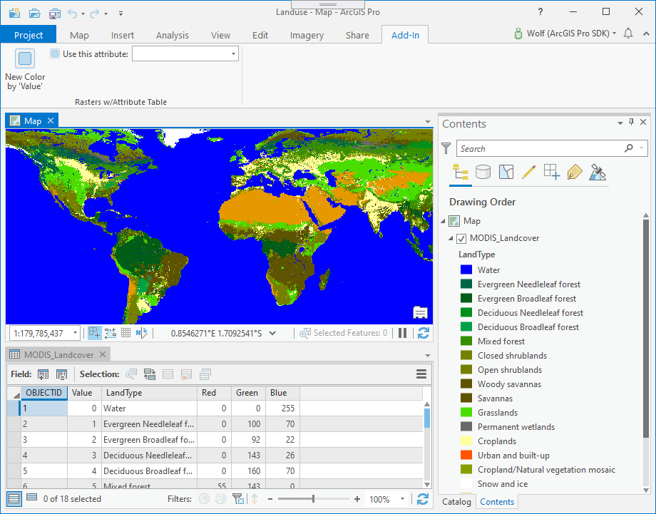
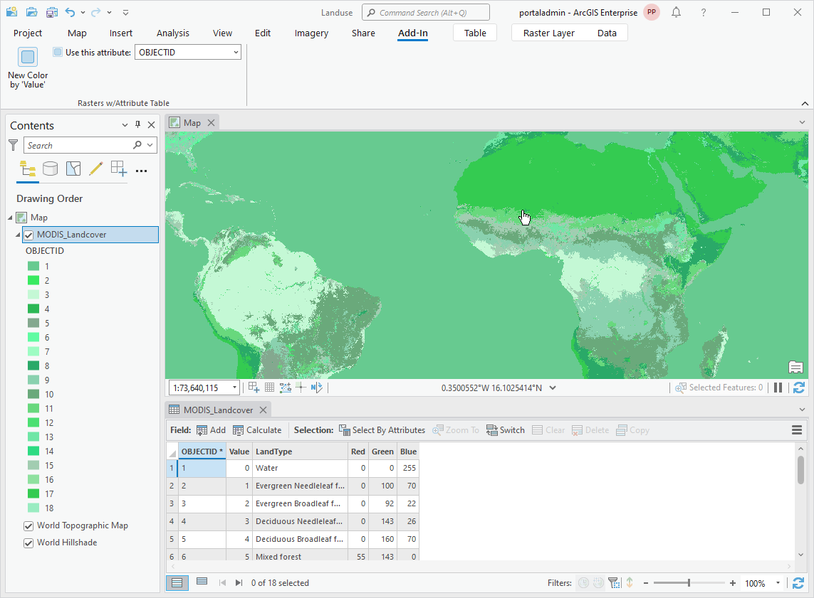
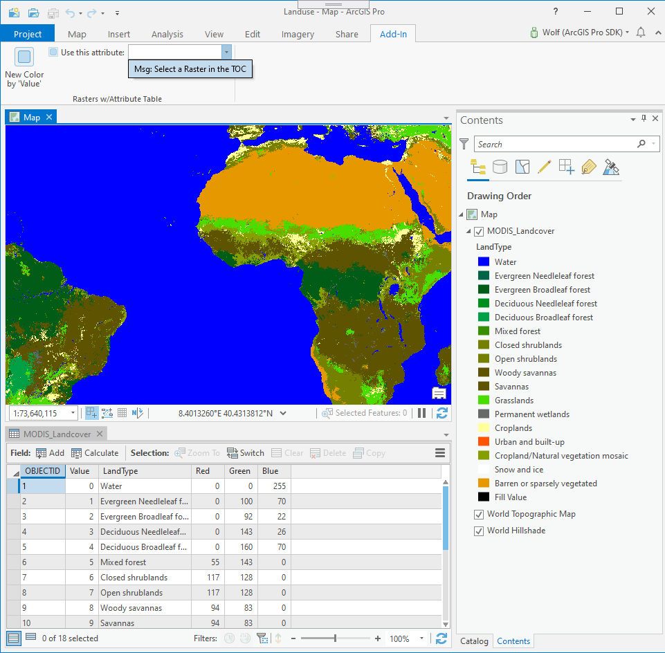
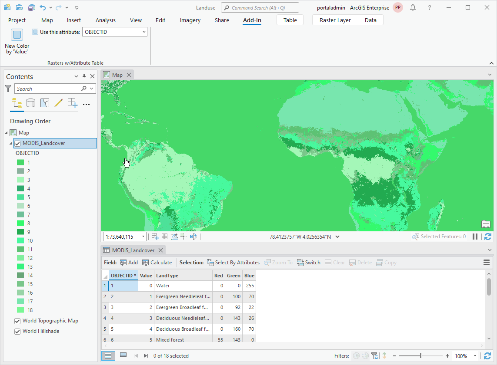
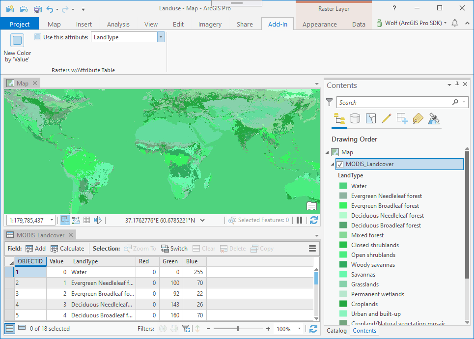
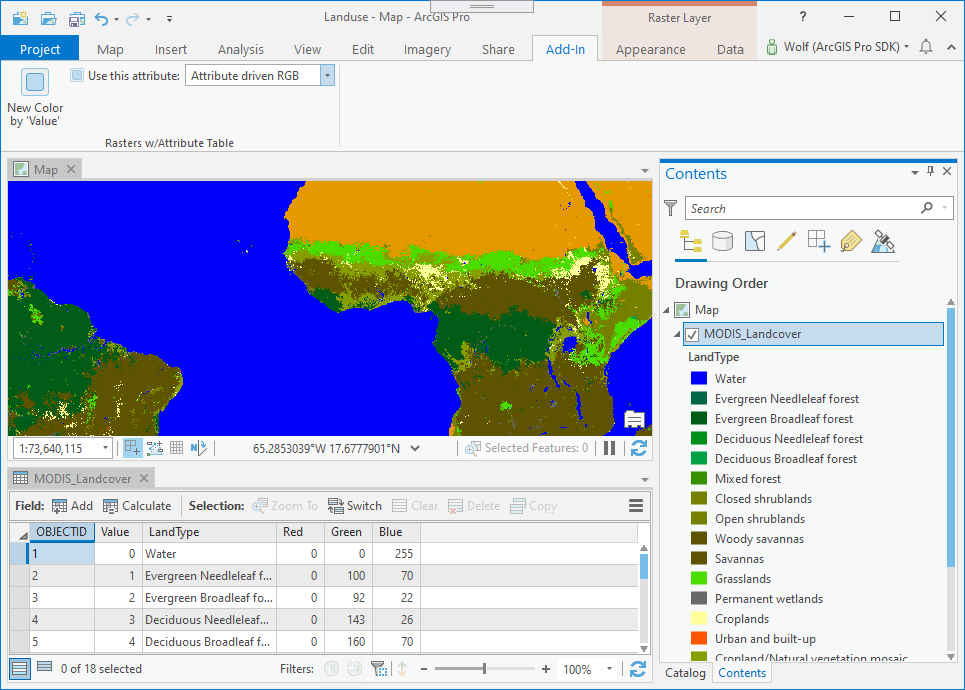

## Colorizer

<!-- TODO: Write a brief abstract explaining this sample -->
This sample demonstrates how to change colors for rasters that have attribute tables.  The colorizer has to contain the attribute field name that is then used on the TOC and is also used to define the colors.  
  


<a href="http://pro.arcgis.com/en/pro-app/sdk/" target="_blank">View it live</a>

<!-- TODO: Fill this section below with metadata about this sample-->
```
Language:              C#
Subject:               Raster
Contributor:           ArcGIS Pro SDK Team <arcgisprosdk@esri.com>
Organization:          Esri, http://www.esri.com
Date:                  11/01/2021
ArcGIS Pro:            2.9
Visual Studio:         2019
.NET Target Framework: 4.8
```

## Resources

[Community Sample Resources](https://github.com/Esri/arcgis-pro-sdk-community-samples#resources)

### Samples Data

* Sample data for ArcGIS Pro SDK Community Samples can be downloaded from the [Releases](https://github.com/Esri/arcgis-pro-sdk-community-samples/releases) page.  

## How to use the sample
<!-- TODO: Explain how this sample can be used. To use images in this section, create the image file in your sample project's screenshots folder. Use relative url to link to this image using this syntax:  -->
1. Download the Community Sample data (see under the 'Resources' section for downloading sample data).  The sample data contains a folder called 'C:\Data\Raster\Landuse' with sample data required for this solution.  Make sure that the Sample data is unzipped in c:\data and "C:\Data\Raster\Landuse" is available.  
1. In Visual Studio click the Build menu. Then select Build Solution.  
1. Click Start button to open ArcGIS Pro.  
1. In ArcGIS Pro the 'C:\Data\Raster\Landuse\Landuse.aprx' project.    
  
  
1. Click on the ADD-IN tab and then click the "New Color by 'Value'" button to change the raster image colors and break those colors up by using the 'Value' field in the raster's Attribute table.    
1. A message box will display: "In ArcGIS Pro 2.5 and older this method only works when using the 'value' field, unless you deploy the 'RecalculateColorizer' workaround."", click Ok.  
  
  
1. Open the map's content dockpane and select the raster in the TOC (table of content).  
  
  
1. The add-in automatically selects the first column in the attribute table, in this case the ObjectID column, and renders the raster with a color ramp using the 'ObjectID' column.  
  
  
1. On the 'Use this attribute' drop down select the 'LandType' attribute column and verify that the raster redraws with a color ramp using the 'LandType' column.  
  
  
1. On the 'Use this attribute' drop down select 'Attribute driven RGB', which will use the RGB values that are defined in the raster's attribute table to define the colors.  Verify that the raster redraws with colors defined by the 'Red', 'Green', and 'Blue' columns.  
  
  


<!-- End -->

&nbsp;&nbsp;&nbsp;&nbsp;&nbsp;&nbsp;
&nbsp;&nbsp;&nbsp;&nbsp;&nbsp;&nbsp;&nbsp;&nbsp;&nbsp;&nbsp;&nbsp;&nbsp;
[Home](https://github.com/Esri/arcgis-pro-sdk/wiki) | <a href="https://pro.arcgis.com/en/pro-app/latest/sdk/api-reference" target="_blank">API Reference</a> | [Requirements](https://github.com/Esri/arcgis-pro-sdk/wiki#requirements) | [Download](https://github.com/Esri/arcgis-pro-sdk/wiki#installing-arcgis-pro-sdk-for-net) | <a href="https://github.com/esri/arcgis-pro-sdk-community-samples" target="_blank">Samples</a>
