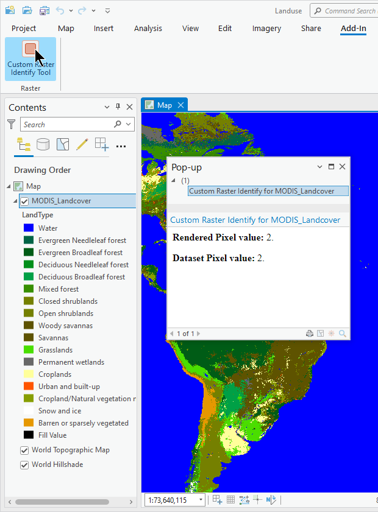

## CustomRasterIdentify

<!-- TODO: Write a brief abstract explaining this sample -->
This sample shows how to author a tool that can be used to identify raster pixel values and display  the results in a custom pop-up window. The popup window will show pixel values for the  rendered raster and the source raster dataset.  
Note: The identify is authored to query any raster, mosaic or image service layer(s) in the map that  are selected in the Contents pane.  
  


<a href="https://pro.arcgis.com/en/pro-app/sdk/" target="_blank">View it live</a>

<!-- TODO: Fill this section below with metadata about this sample-->
```
Language:              C#
Subject:               Raster
Contributor:           ArcGIS Pro SDK Team <arcgisprosdk@esri.com>
Organization:          Esri, https://www.esri.com
Date:                  11/04/2024
ArcGIS Pro:            3.4
Visual Studio:         2022
.NET Target Framework: net8.0-windows
```

## Resources

[Community Sample Resources](https://github.com/Esri/arcgis-pro-sdk-community-samples#resources)

### Samples Data

* Sample data for ArcGIS Pro SDK Community Samples can be downloaded from the [Releases](https://github.com/Esri/arcgis-pro-sdk-community-samples/releases) page.  

## How to use the sample
<!-- TODO: Explain how this sample can be used. To use images in this section, create the image file in your sample project's screenshots folder. Use relative url to link to this image using this syntax:  -->
1. In Visual Studio click the Build menu. Then select Build Solution.
2. Click Start button to open ArcGIS Pro.  
3. ArcGIS Pro will open.   
4. Open a map view and add a raster, mosaic dataset or image service to the map. Select the layer(s) you want to identify in the Contents pane.  
5. Click on the Add-In tab on the ribbon.  
5. Within this tab there is a Custom Raster Identify tool. Click it to activate the tool.  
6. In the map click a point on the raster you want to identify pixel values for.  
7. The pop-up window should display and you should see the results of the identify.  
8. You can click through the popup pages if you have multiple layers selected. Each page shows you the results for a selected raster, mosaic or image service layer.  
9. Press the escape key if you want to deactivate the tool.  
  
  

<!-- End -->

&nbsp;&nbsp;&nbsp;&nbsp;&nbsp;&nbsp;
&nbsp;&nbsp;&nbsp;&nbsp;&nbsp;&nbsp;&nbsp;&nbsp;&nbsp;&nbsp;&nbsp;&nbsp;
[Home](https://github.com/Esri/arcgis-pro-sdk/wiki) | <a href="https://pro.arcgis.com/en/pro-app/latest/sdk/api-reference" target="_blank">API Reference</a> | [Requirements](https://github.com/Esri/arcgis-pro-sdk/wiki#requirements) | [Download](https://github.com/Esri/arcgis-pro-sdk/wiki#installing-arcgis-pro-sdk-for-net) | <a href="https://github.com/esri/arcgis-pro-sdk-community-samples" target="_blank">Samples</a>
