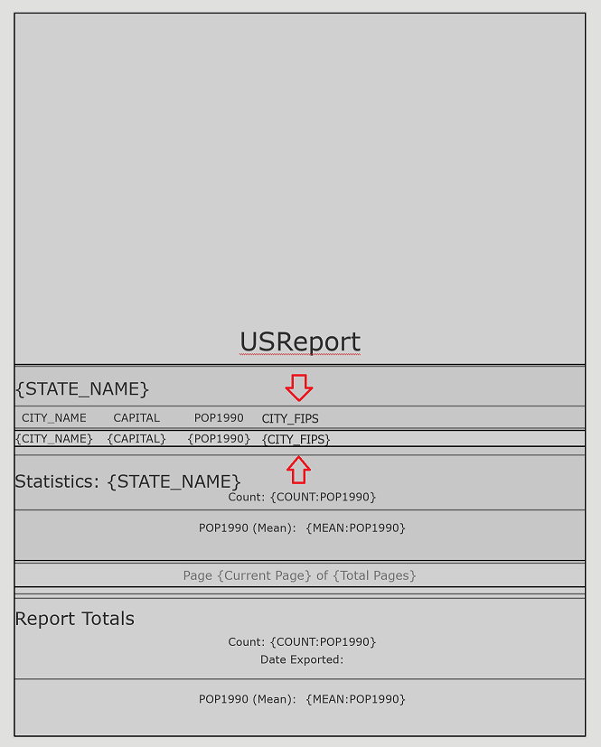

## CreateReport

<!-- TODO: Write a brief abstract explaining this sample -->
This sample demonstrate how to create a report and modify that report.  
  


<a href="https://pro.arcgis.com/en/pro-app/sdk/" target="_blank">View it live</a>

<!-- TODO: Fill this section below with metadata about this sample-->
```
Language:              C#
Subject:               Framework
Contributor:           ArcGIS Pro SDK Team <arcgisprosdk@esri.com>
Organization:          Esri, https://www.esri.com
Date:                  04/04/2024
ArcGIS Pro:            3.3
Visual Studio:         2022
.NET Target Framework: net8.0-windows
```

## Resources

[Community Sample Resources](https://github.com/Esri/arcgis-pro-sdk-community-samples#resources)

### Samples Data

* Sample data for ArcGIS Pro SDK Community Samples can be downloaded from the [Releases](https://github.com/Esri/arcgis-pro-sdk-community-samples/releases) page.  

## How to use the sample
<!-- TODO: Explain how this sample can be used. To use images in this section, create the image file in your sample project's screenshots folder. Use relative url to link to this image using this syntax:  -->
1. In Visual Studio click the Build menu. Then select Build Solution.
2. Click Start button to open ArcGIS Pro.  
3. ArcGIS Pro will open.   
4. Open any project file that contains feature layers. Activate the mapview with the feature layers.  
5. In the Add-In tab, click the Create Report button. This will display the Create Report dockpane.  
6. Pick a layer in the active map for which you want to use to generate a report.  Check the "Report uses only the selected features" check box if needed.  
7. Modify or accept the default Report Name.  
8. Pick the fields needed for the report.  
9. Pick a Grouping field. This is optional.  
10. Pick the templates and styling for report.  
11. Pick a field used to generate field statistics if required.  
12. Pick the Statistics option.  
13. Click Create Report.  The Report project item is generated. You can see this in the Catalog pane.  
14. Export the report to a PDF.  The report PDF file is exported to the project's home folder.  
    
###Modify an existing report by adding a new field  
15. You can modify this report that was just created. To modify the report, click/add additional fields in the fields listbox.  
16. The Update report button gets enabled when you add additional fields. Click Update Report.  
   
17. Notice the new fields added to the Report view.  
   
  

<!-- End -->

&nbsp;&nbsp;&nbsp;&nbsp;&nbsp;&nbsp;
&nbsp;&nbsp;&nbsp;&nbsp;&nbsp;&nbsp;&nbsp;&nbsp;&nbsp;&nbsp;&nbsp;&nbsp;
[Home](https://github.com/Esri/arcgis-pro-sdk/wiki) | <a href="https://pro.arcgis.com/en/pro-app/latest/sdk/api-reference" target="_blank">API Reference</a> | [Requirements](https://github.com/Esri/arcgis-pro-sdk/wiki#requirements) | [Download](https://github.com/Esri/arcgis-pro-sdk/wiki#installing-arcgis-pro-sdk-for-net) | <a href="https://github.com/esri/arcgis-pro-sdk-community-samples" target="_blank">Samples</a>
