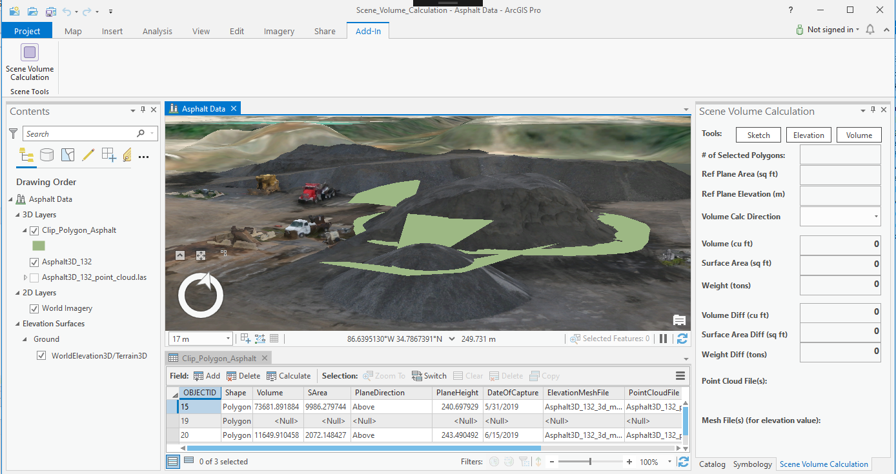
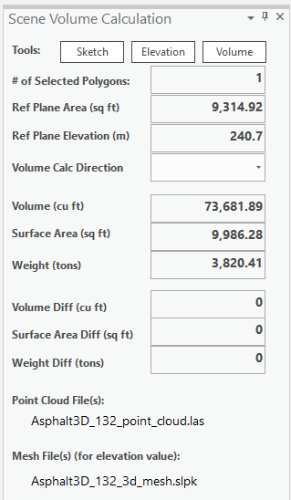
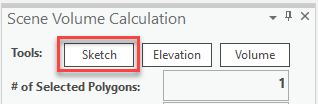
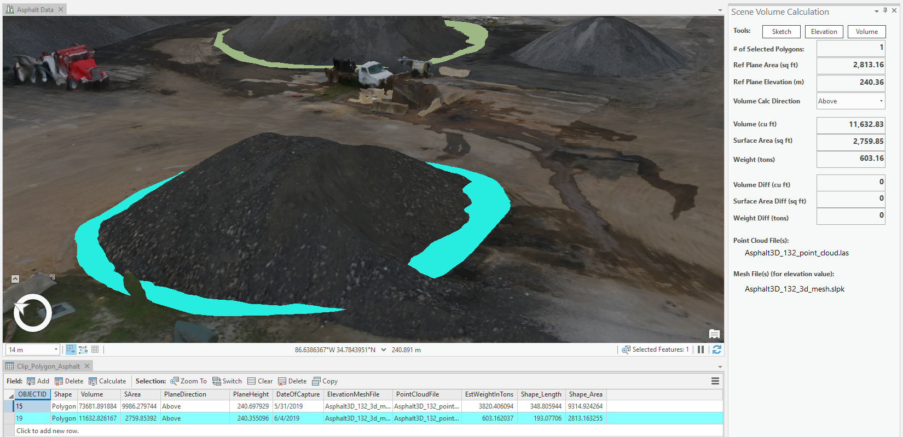
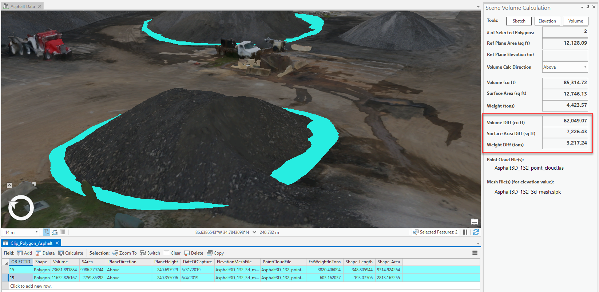

## SceneCalcTools

<!-- TODO: Write a brief abstract explaining this sample -->
This sample illustrates how an add-in can be used to provide tools which leverage a 3D scene layer package and point cloud dataset created from a drone survey with Drone2Map for ArcGIS software.  The tools allow you to interact with the scene layers and illustrate a workflow to calculate volume and other metrics on asphalt gravel stockpiles for general supply tracking.  
  


<a href="http://pro.arcgis.com/en/pro-app/sdk/" target="_blank">View it live</a>

<!-- TODO: Fill this section below with metadata about this sample-->
```
Language:              C#
Subject:               SceneLayers
Contributor:           ArcGIS Pro SDK Team <arcgisprosdk@esri.com>
Organization:          Esri, http://www.esri.com
Date:                  7/01/2020
ArcGIS Pro:            2.6
Visual Studio:         2017, 2019
.NET Target Framework: 4.8
```

## Resources

* [API Reference online](https://pro.arcgis.com/en/pro-app/sdk/api-reference)
* <a href="https://pro.arcgis.com/en/pro-app/sdk/" target="_blank">ArcGIS Pro SDK for .NET (pro.arcgis.com)</a>
* [arcgis-pro-sdk-community-samples](https://github.com/Esri/arcgis-pro-sdk-community-samples)
* [ArcGIS Pro DAML ID Reference](https://github.com/Esri/arcgis-pro-sdk/wiki/ArcGIS-Pro-DAML-ID-Reference)
* [FAQ](https://github.com/Esri/arcgis-pro-sdk/wiki/FAQ)
* [ArcGIS Pro SDK icons](https://github.com/Esri/arcgis-pro-sdk/releases/tag/2.4.0.19948)


### Samples Data

* Sample data for ArcGIS Pro SDK Community Samples can be downloaded from the [repo releases](https://github.com/Esri/arcgis-pro-sdk-community-samples/releases) page.  

## How to use the sample
<!-- TODO: Explain how this sample can be used. To use images in this section, create the image file in your sample project's screenshots folder. Use relative url to link to this image using this syntax:  -->
1. Download the Community Sample data (see under the 'Resources' section for downloading sample data). The sample data contains a dataset called VolumeCalcTools.  Make sure that the Sample data is unzipped under C:\Data and the folder "C:\Data\VolumeCalcTools\" is available.    
1. In Visual Studio click the Build menu. Then select Build Solution.  
1. Click Start button to open ArcGIS Pro.  
1. ArcGIS Pro will open.   
1. Open the project "Scene_Volume_Calculation.aprx" found in folder: "C:\Data\VolumeCalcTools\Scene_Volume_Calculation\"  
1. The demo dataset contains a 3D integrated mesh scene layer, Asphalt3D_132, which is visible as the project opens.  The default view is zoomed in to show three asphalt stockpiles.  There is also a bookmark, Asphalt Stockpiles, to restore this view for trying the add-in tools. There is a single “volume polygon” in green seen around the base of the largest stockpile, which is contained in the polygon feature layer, Clip_Polygon_Asphalt.  
1. Click on the Add-In Tab and you will find a new button provided by the add-in with the caption "Scene Volume Calculation".  Click the button to open the new dockpane which has the same caption.  Resize the dockpane as needed to view the text boxes.  
   
  
1. To view information on previously-calculated polygons, like the single feature provided, simply select them.  Use the Select By Rectangle tool (Map Tab > Selection group > Select By Rectangle) to select the existing volume polygon, and you should then see its values populated in the dockpane.  
   
  
1. Next, you will create a new volume polygon for another stockpile and calculate its values.  Clear the selection (Map Tab > Selection group > Clear) and then select the Bookmark, New Volume Polygon. The view will show directly above the stockpile.  Open the attribute table for the layer, Clip_Polygon_Asphalt, and adjust its size to view a few records.  
1. On the dockpane, click the Sketch tool at the top, which should change its color showing it as activated.  In the scene, the cursor will appear as a crosshair. Using the lasso, sketch a polygon outline around the base of the stockpile, and then double-click to complete.  You should see the new record appear in the attribute table, but you will not see the polygon until you set the polygon’s elevation in the next step.    
   
  
1. Click the Elevation tool to active it and in the scene, click on a spot near the base of the asphalt pile.  This will apply the elevation of the clicked location to the feature’s PlaneHeight attribute, which drives the polygon’s elevation via the layer properties.  You can select another elevation point and see how the height of the selected polygon adjusts.  
1. Next, in the Volume Calc Direction combobox, set the value to “Above” which specifies that you will calculate the volume of the stockpile above the reference plane of the volume polygon. Finally, with the single new polygon selected, click the Volume button on the dockpane.  When prompted, confirm “yes” to run the routine.  
1. Review the values for the selected feature in the dockpane, which shows the volume, surface area and estimated weight.  The Volume routine runs the Polygon Volume geoprocessing tool and calculates additional attributes in the edit operation and displays these in the dockpane.  
   
  
1. As a final step in the workflow, you can compare the new stockpile polygon’s volume value to the existing larger stockpile polygon.  Select both records within the attribute table and you will then see the values appear for the differences in volume, surface area and weight between the two polygons.  This works with any two calculated volume polygon features selected.  
   
  
1. Additional things you can try:  
- Remove existing volume polygons and create new ones.    
- Create multiple polygons for the same stockpile using different elevations and compare volume differences.  
- Re-calculate the same elevation for multiple selected polygons.  
  


<!-- End -->

&nbsp;&nbsp;&nbsp;&nbsp;&nbsp;&nbsp;
&nbsp;&nbsp;&nbsp;&nbsp;&nbsp;&nbsp;&nbsp;&nbsp;&nbsp;&nbsp;&nbsp;&nbsp;
[Home](https://github.com/Esri/arcgis-pro-sdk/wiki) | <a href="https://pro.arcgis.com/en/pro-app/sdk/api-reference" target="_blank">API Reference</a> | [Requirements](https://github.com/Esri/arcgis-pro-sdk/wiki#requirements) | [Download](https://github.com/Esri/arcgis-pro-sdk/wiki#installing-arcgis-pro-sdk-for-net) | <a href="https://github.com/esri/arcgis-pro-sdk-community-samples" target="_blank">Samples</a>
