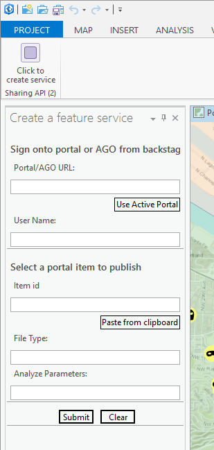
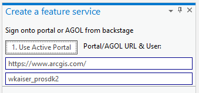
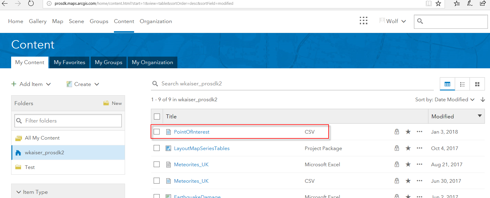
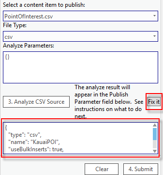
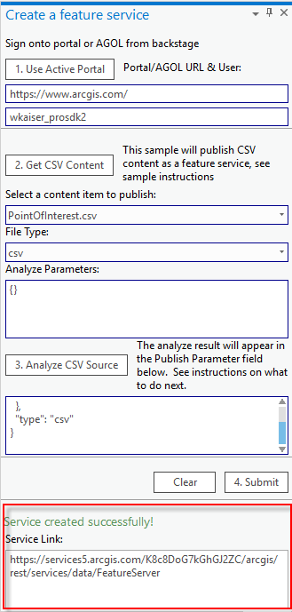
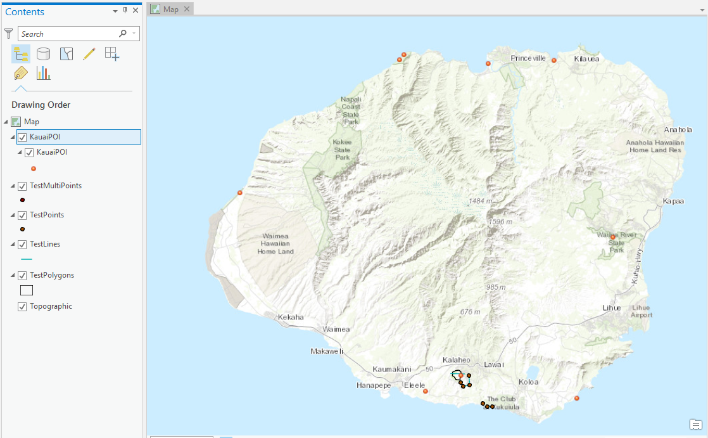

## CreateFeatureService

<!-- TODO: Write a brief abstract explaining this sample -->
This sample provides a dockpane allowing to create a feature service from the csv file that has been uploaded to AGOL or portal. see [ArcGIS REST API / Publish Item](http://resources.arcgis.com/en/help/arcgis-rest-api/index.html#//02r300000080000000)  
  


<a href="http://pro.arcgis.com/en/pro-app/sdk/" target="_blank">View it live</a>

<!-- TODO: Fill this section below with metadata about this sample-->
```
Language:              C#
Subject:               Sharing
Contributor:           ArcGIS Pro SDK Team <arcgisprosdk@esri.com>
Organization:          Esri, http://www.esri.com
Date:                  6/27/2019
ArcGIS Pro:            2.4
Visual Studio:         2015, 2017
.NET Target Framework: 4.6.1
```

## Resources

* [API Reference online](https://pro.arcgis.com/en/pro-app/sdk/api-reference)
* <a href="https://pro.arcgis.com/en/pro-app/sdk/" target="_blank">ArcGIS Pro SDK for .NET (pro.arcgis.com)</a>
* [arcgis-pro-sdk-community-samples](https://github.com/Esri/arcgis-pro-sdk-community-samples)
* [ArcGIS Pro DAML ID Reference](https://github.com/Esri/arcgis-pro-sdk/wiki/ArcGIS-Pro-DAML-ID-Reference)
* [FAQ](https://github.com/Esri/arcgis-pro-sdk/wiki/FAQ)
* [ArcGIS Pro SDK icons](https://github.com/Esri/arcgis-pro-sdk/releases/tag/2.4.0.19948)


### Samples Data

* Sample data for ArcGIS Pro SDK Community Samples can be downloaded from the [repo releases](https://github.com/Esri/arcgis-pro-sdk-community-samples/releases) page.  

## How to use the sample
<!-- TODO: Explain how this sample can be used. To use images in this section, create the image file in your sample project's screenshots folder. Use relative url to link to this image using this syntax:  -->
1. Download the Community Sample data (see under the 'Resources' section for downloading sample data)  
1. Make sure that the Sample data is unzipped in c:\data   
1. The project used for this sample is 'C:\Data\FeatureTest\FeatureTest.aprx'  
1. In Visual Studio click the Build menu. Then select Build Solution.  
1. Click Start button to open ArcGIS Pro.  
1. ArcGIS Pro will open, select the FeatureTest.aprx project  
1. Click on the Add-in tab on the ribbon and then on the "Click to create service" button which opens the 'Create a feature service' dockpane.  
    
  
1. Click the '1. Use Active Portal' button to fill in the current active portal and user name.  
    
  
1. Log into your active portal via a browser using the same credentials.    
1. Go to the 'My Content' page on the portal and use the 'Add Item' function to upload the PointOfInterest.csv file which can be found in the solution folder for this add-in sample.  
    
  
1. Click the '2. Get CSV Content' button to populate the 'Content Item to Publish' list and select 'PointOfInterest' from the drop-down list.  
    
  
1. Click the '3. Analyze CSV Source' button to populate the 'Publish Parameter' field.  
1. Copy the content of the 'Publish Parameter' field into a json editor (i.e. Visual Studio)  
1. Edit the json according to ArcGIS REST API requirements to ensure that your data can be published.  In order to publish the sample PointOfInterest.csv file you can simply click the 'Fix it' button to paste in the content from PointOfInterest.json which is also provided in this solution.  
   
  
1. The 'Fix It' button pastes the edited content into the  'Publish Parameter' field   
1. Click the '4. Submit' button.  
   
  
1. Copy the link returned by the successful Publish operation and use 'Map | Add Data From Path' dialog to paste in the link to the newly created feature data.    
1. Open the Content dockpane and zoom the newly added KauaiPOI layer.  
   
  


<!-- End -->

&nbsp;&nbsp;&nbsp;&nbsp;&nbsp;&nbsp;
&nbsp;&nbsp;&nbsp;&nbsp;&nbsp;&nbsp;&nbsp;&nbsp;&nbsp;&nbsp;&nbsp;&nbsp;
[Home](https://github.com/Esri/arcgis-pro-sdk/wiki) | <a href="https://pro.arcgis.com/en/pro-app/sdk/api-reference" target="_blank">API Reference</a> | [Requirements](https://github.com/Esri/arcgis-pro-sdk/wiki#requirements) | [Download](https://github.com/Esri/arcgis-pro-sdk/wiki#installing-arcgis-pro-sdk-for-net) | <a href="https://github.com/esri/arcgis-pro-sdk-community-samples" target="_blank">Samples</a>
