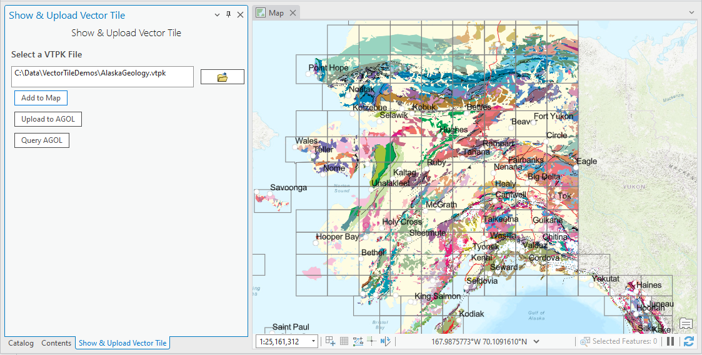
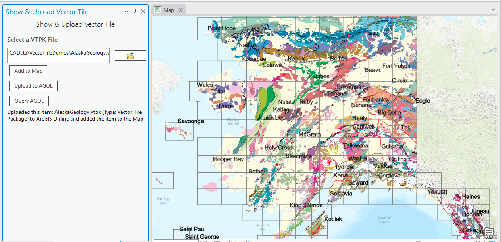

## UploadVtpkToAgol

<!-- TODO: Write a brief abstract explaining this sample -->
This sample shows how to add a vector tile package file to a map both from disk and ArcGIS Online.  The sample also has code to 'upload' a vtpk file to ArcGIS Online.    
  


<a href="http://pro.arcgis.com/en/pro-app/sdk/" target="_blank">View it live</a>

<!-- TODO: Fill this section below with metadata about this sample-->
```
Language:              C# 6.0
Subject:               Sharing
Contributor:           ArcGIS Pro SDK Team <arcgisprosdk@esri.com>
Organization:          Esri, http://www.esri.com
Date:                  6/28/2017
ArcGIS Pro:            2.0
Visual Studio:         2015, 2017
.NET Target Framework: 4.6.1
```

## Resources

* [API Reference online](http://pro.arcgis.com/en/pro-app/sdk/api-reference)
* <a href="http://pro.arcgis.com/en/pro-app/sdk/" target="_blank">ArcGIS Pro SDK for .NET (pro.arcgis.com)</a>
* [arcgis-pro-sdk-community-samples](http://github.com/Esri/arcgis-pro-sdk-community-samples)
* [ArcGISPro Registry Keys](http://github.com/Esri/arcgis-pro-sdk/wiki/ArcGIS-Pro-Registry-Keys)
* [FAQ](http://github.com/Esri/arcgis-pro-sdk/wiki/FAQ)
* [ArcGIS Pro SDK icons](https://github.com/Esri/arcgis-pro-sdk/releases/tag/1.4.0.7198)
* [ProConcepts: ArcGIS Pro Add in Samples](https://github.com/Esri/arcgis-pro-sdk-community-samples/wiki/ProConcepts-ArcGIS-Pro-Add-in-Samples)


* [ProSnippets: 2.0 Migration](http://github.com/Esri/arcgis-pro-sdk/wiki/ProSnippets-Migrating-to-2.0)  
* [ProSnippets: 2.0 Migration Samples](http://github.com/Esri/arcgis-pro-sdk/wiki/ProSnippets-2.0-Migration-Samples)  
* [ProConcepts: 2.0 Migration](http://github.com/Esri/arcgis-pro-sdk/wiki/ProConcepts-2.0-Migration-Guide)  

### Samples Data

* Sample data for ArcGIS Pro SDK Community Samples can be downloaded from the [repo releases](https://github.com/Esri/arcgis-pro-sdk-community-samples/releases) page.  

## How to use the sample
<!-- TODO: Explain how this sample can be used. To use images in this section, create the image file in your sample project's screenshots folder. Use relative url to link to this image using this syntax:  -->
1. Make sure that the Sample data is unzipped in c:\data       
1. The data used for this sample is 'C:\Data\VectorTileDemos\AlaskaGeology.vtpk'      
1. In Visual Studio click the Build menu. Then select Build Solution.    
1. This solution is using the **Newtonsoft.Json Nuget**.  If needed, you can install the Nuget from the "Nuget Package Manager Console" by using this script: "Install-Package Newtonsoft.Json".   
1. Click Start button to open ArcGIS Pro.    
1. ArcGIS Pro will open.     
1. Open a new map project.     
1. Click on the *Upload to ArcGIS Online* tab on the ribbon.    
1. Within this tab there is a *Show & Upload Vector Tile* button.  Click the button to display the *Show & Upload Vector Tile* dockpane.    
1. On the *Show & Upload Vector Tile* dockpane click the open file button and open *C:\Data\VectorTileDemos\AlaskaGeology.vtpk*.    
1. Click the *Add To Map* button to add the vector tile package to the current map.    
    
  
1. Click the *Upload to ArcGIS Online (AGOL)* button to upload the vector tile package (referenced under 'Select a VTPK File').    
1. The upload status will be updated once the upload completes.    
1. Click the "Query AGOL' button to download the previously uploaded VTPK vector tile service that was created by AGOL using the uploaded vector tile package.    
1. Look in the code to see the query conditions.    
     
  


<!-- End -->

&nbsp;&nbsp;&nbsp;&nbsp;&nbsp;&nbsp;
&nbsp;&nbsp;&nbsp;&nbsp;&nbsp;&nbsp;&nbsp;&nbsp;&nbsp;&nbsp;&nbsp;&nbsp;
[Home](https://github.com/Esri/arcgis-pro-sdk/wiki) | <a href="http://pro.arcgis.com/en/pro-app/sdk/api-reference" target="_blank">API Reference</a> | [Requirements](https://github.com/Esri/arcgis-pro-sdk/wiki#requirements) | [Download](https://github.com/Esri/arcgis-pro-sdk/wiki#installing-arcgis-pro-sdk-for-net) | <a href="http://github.com/esri/arcgis-pro-sdk-community-samples" target="_blank">Samples</a>
