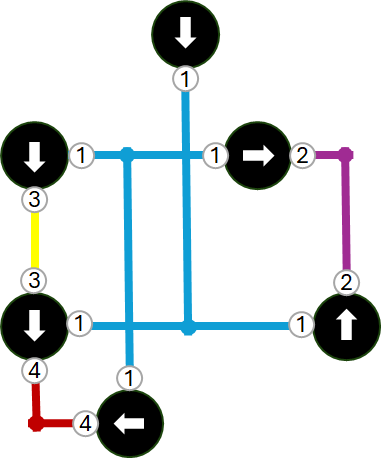

# Infer Subnetworks
This analysis will identify which features could act as subnetwork controllers for a particular tier in your network. It will analyze the features connected to the desired terminals on each subnetwork controller for a tier, and identify the features that would belong to that subnetwork along with the controllers for that subnetwork. This can be useful when you don't have clear or accurate records of which devices are subnetwork controllers, or if you need subnetworks that use digitized direction. The tool will create graphical representations of the extents of each potential subnetwork. You cannot perofrm any upstream/downstream analysis in the inferred subnetworks until the corresponding subnetwork have been imported and successfully updated in the utility network.

The following example shows subnetwork controllers being identified for the terminals on each device in the network.

The following example shows subnetwork controllers being identified for only downstream terminals on each device in the network.

The following example shows subnetwork controllers being identified for only upstream terminals on each device in the network. Note that the areas with black lines have no subnetwork.

## Use Cases
Common examples include:
- Identifying all the low voltage equipment associated with each Distribution Transformer ([Electric](JSON%20Configurations/Infer_Electric_MediumVoltage.json))
- Identifying all the pressure zones in a network ([Gas](JSON%20Configurations/Infer_Pipeline_Pressure.json) and [Water](JSON%20Configurations/Infer_Water_Pressure.json))
- Identifying the outfalls associated with each watershed in your network ([Stormwater](JSON%20Configurations/Infer_Storm_Watershed.json))
- Identifying the lift zones associated with each lift or pump station ([Wastewater](JSON%20Configurations/Infer_Sewer_Sewershed.json))
- Identifying the cathodic structures for each anode and rectifier (Gas and Water)

## Parameters
These additional parameters are avaialble when running this analysis:
- Analysis
  - type: Type of analysis to perform
  - analysisName: name of the analysis
  - domainName: The domain to infer subnetworks for
  - tierName: The tier to infer subnetworks for
  - terminals: Which terminals to use to infer subnetworks: Upstream, Downstream, or Both
- Input
  - inputWorkspace: Location of the utility network used for analysis
  - portalUrl (optional): Url of the portal to authenticate with. Only required when the input workspace is a feature service.
  - portalUser (optional): User name for the portal. Only required when establishing the credential for the application.
  - portalPassword (optional): Password for the portal. Only required when establishing the credential for the application for the first time. Remove once the application is authenticated.
  - sourceUtilityNetwork: Name of the utility network
  - definitionQuery (optional): The definition query to be applied to start locations
- Output
  - outputWorkspace: Location of the geodatabase to store the output
  - [outputPoints](ReadMe.md#aggregated-geometry-point-line-polygon) (optional): Name of the Aggregated Point output class
  - [outputPolylines](ReadMe.md#aggregated-geometry-point-line-polygon) (optional): Name of the Aggregated Line output class
  - [outputPolygons](ReadMe.md#aggregated-geometry-point-line-polygon) (optional): Name of the Aggregated Polygon output class
  - [outputTable](ReadMe.md#output-table) (optional): Name of the table to persist the results of the analysis
  - outputBarriers (optional): When set to true the output table will only include controllers, barriers, and subnetwork lines. When set to false the table will include all subnetwork features. Setting this value to true will affect the performance of the trace.

- outputFile (optional): The Subnetwork Controllers CSV file to create
- outputFunctionCount (optional): How many output fields should be added to the output feature classes to store Summaries from the subnetwork definition. Aliases must be applied manually once the table is created.
- useDigitizedDirection (optional): Whether tracing should use the digitized direction of lines

---

## Subnetwork CSV
There are several outputs that are unique to this analysis types. The tool can output CSV files that can be used by the Import Subnetwork Controllers GP tool to create subnetworks in your utility network. When the tool is run with the outputFile parameter specified, a CSV file will be created containing all the unique identifiers for the inferred subnetwork controlleres.

The CSV file is created to meet the requirements of the Import Subnetwork Controllers GP tool. The following columns are populated with placeholder values by the tool:
- Subnetwork Name: The name of the analysis followed by a sequence number.
- Subnetwork Controller Name: The Global ID of the feature along with the name of the terminal.

You can see an example of a subnetworks CSV file below.

If any subnetwork controllers were discovered internal to an inferred subnetwork, they will be placed in a separate CSV file with a suffix of "_Internal". You should not import the "_Internal" CSV file, it is included for reference purposes.

---

## Output Elements

When an output table is specified for Infer Subnetworks it will include output the significant features in the subnetwork to this tale, along with important information about the feature's role in the subnetwork in the Source Identifier column. Possible values include:
- Subnetwork controller - These are features that were identified as subnetwork controllers. If an output file was specified they will be included in that file.
- Internal controller - These are features that were identified as subnetwork controllers, but were located completley within a subnetwork. If an output file was specified they will be included in the "*_Internal.csv" file.
- Barrier - These are only included when the outputBarriers flag is set to true. They are features that are barriers to the subnetwork.
- Subnetwork line - These features have an asset type that is configured to be part of the aggregated subnetwork line.
- Content - These are features that were identified in the trace results that were not identified as a subnetwork controller, barrier, or subnetwork line.

You can see an example of the information below:

