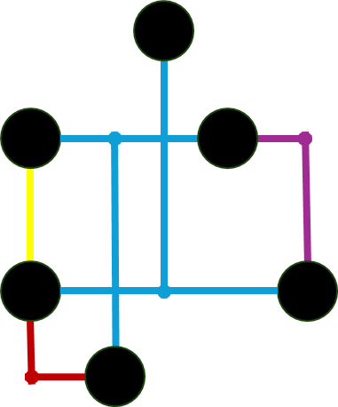

# Partition Network
This analysis will analyze your network to identify all the unique groupings of features within a specific asset group. It does this by running the specified named trace configuraiton for each starting feature to identify which features it shares an area of the network with, until it has identified the area for each feature.

The following example shows the lines in the network being partitioned, stopping at significant devices.

The following example shows devices in the network being partitioned, stopping at significant lines.

## Use Cases
Common use cases include:
- Calculating isolation zones for risk management or operational purposes (Electric, [Gas](JSON%20Configurations/Partition_Pipeline_Isolation.json), [Water](JSON%20Configurations/Partition_Water_Isolation.json))
- Identifying the Tap (or other fitting) that connects each Customer to the distribution system ([Gas](JSON%20Configurations/Partition_Pipeline_Customers.json) and [Water](JSON%20Configurations/Partition_Water_Customers.json))
- Identifying the Transformer that connects each Customer to the distribution system ([Electric](JSON%20Configurations/Partition_Electric_Customers.json))
- Identifying local drainage areas for each outfall ([Stormwater](JSON%20Configurations/Partition_Storm_LocalDrainage_.json))
- Identifying life zones for each pump/lift stations ([Sewer](JSON%20Configurations/Partition_Sewer_LiftStation_.json))

## Parameters
These additional parameters are avaialble when running this analysis:
- Analysis
  - type: Type of analysis to perform
  - analysisName: name of the analysis
  - networkSourceName: The name of the class to use as start locations
  - assetGroupCode: The asset group code (subtype) to use as start locations
  - namedTraceConfigurtion: The named trace configuration to use for analysis
  - definitionQuery (optional): The definition query to be applied to start locations
- Input
  - inputWorkspace: Location of the utility network used for analysis
  - portalUrl (optional): Url of the portal to authenticate with. Only required when the input workspace is a feature service.
  - portalUser (optional): User name for the portal. Only required when establishing the credential for the application.
  - portalPassword (optional): Password for the portal. Only required when establishing the credential for the application for the first time. Remove once the   application is authenticated.
  - sourceUtilityNetwork: Name of the utility network
- Output
  - outputWorkspace: Location of the geodatabase to store the output
  - [outputPoints](readme.md#aggregated-geometry-point-line-polygon) (optional): Name of the Aggregated Point output class
  - [outputPolylines](readme.md#aggregated-geometry-point-line-polygon) (optional): Name of the Aggregated Line output class
  - [outputPolygons](readme.md#aggregated-geometry-point-line-polygon) (optional): Name of the Aggregated Polygon output class
  - [outputTable](readme.md#output-table) (optional): Name of the table to persist the results of the analysis
  - sourceResultField (optional): The field name on the source feature that contains the result name that will be stored in the output table
  - outputFunctionCount (optional): How many output fields should be added to the output feature classes to store Function results from the named trace configuration. Aliases must be applied manually once the table is created.