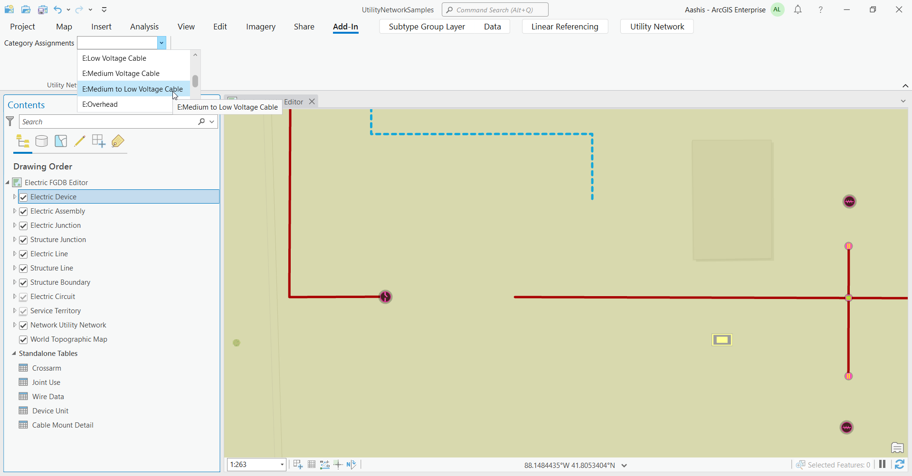
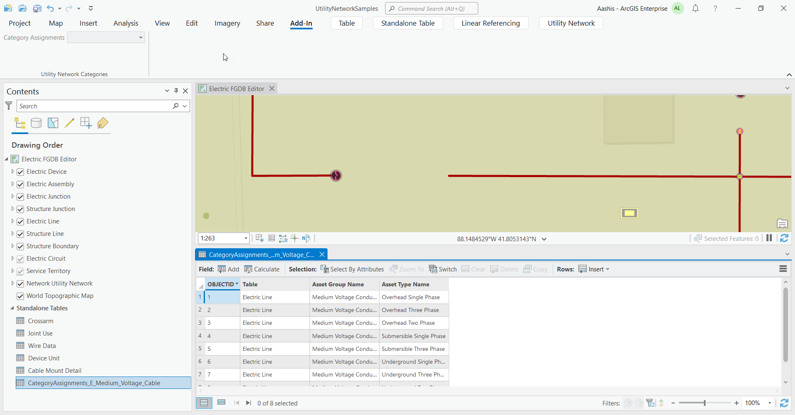

## CategoriesUsage

<!-- TODO: Write a brief abstract explaining this sample -->
This add-in creates temporary tables listing out the asset types in a utility network that support a particular  utility network category.  
  
Community Sample data (see under the "Resources" section for downloading sample data) has a UtilityNetworkSamples.aprx  project that contains a utility network that can be used with this sample.  This project can be found under the   
C:\Data\UtilityNetwork folder. Alternatively, you can also use any utility network data with this sample.  
  
  


<a href="https://pro.arcgis.com/en/pro-app/sdk/" target="_blank">View it live</a>

<!-- TODO: Fill this section below with metadata about this sample-->
```
Language:              C#
Subject:               UtilityNetwork
Contributor:           ArcGIS Pro SDK Team <arcgisprosdk@esri.com>
Organization:          Esri, https://www.esri.com
Date:                  05/06/2025
ArcGIS Pro:            3.5
Visual Studio:         2022
.NET Target Framework: net8.0-windows
```

## Resources

[Community Sample Resources](https://github.com/Esri/arcgis-pro-sdk-community-samples#resources)

### Samples Data

* Sample data for ArcGIS Pro SDK Community Samples can be downloaded from the [Releases](https://github.com/Esri/arcgis-pro-sdk-community-samples/releases) page.  

## How to use the sample
<!-- TODO: Explain how this sample can be used. To use images in this section, create the image file in your sample project's screenshots folder. Use relative url to link to this image using this syntax:  -->
  
  
1. In Visual Studio click the Build menu.  Then select Build Solution.
2. Click Start button to open ArcGIS Pro.  
3. ArcGIS Pro will open.  
4. Open C:\Data\UtilityNetwork\UtilityNetworkSamples.aprx or a map view that references a utility network  
5. Click on the Add-in tab on the ribbon  
6. Select a feature layer or subtype group layer that participates in a utility network or a utility network layer  
7. The Category Assignments combobox lists all the categories in the utility network  
  
8. Selecting a category will generate and display a table that lists the feature classes, asset groups, and asset types that reference the selected category  
  
  

<!-- End -->

&nbsp;&nbsp;&nbsp;&nbsp;&nbsp;&nbsp;
&nbsp;&nbsp;&nbsp;&nbsp;&nbsp;&nbsp;&nbsp;&nbsp;&nbsp;&nbsp;&nbsp;&nbsp;
[Home](https://github.com/Esri/arcgis-pro-sdk/wiki) | <a href="https://pro.arcgis.com/en/pro-app/latest/sdk/api-reference" target="_blank">API Reference</a> | [Requirements](https://github.com/Esri/arcgis-pro-sdk/wiki#requirements) | [Download](https://github.com/Esri/arcgis-pro-sdk/wiki#installing-arcgis-pro-sdk-for-net) | <a href="https://github.com/esri/arcgis-pro-sdk-community-samples" target="_blank">Samples</a>
