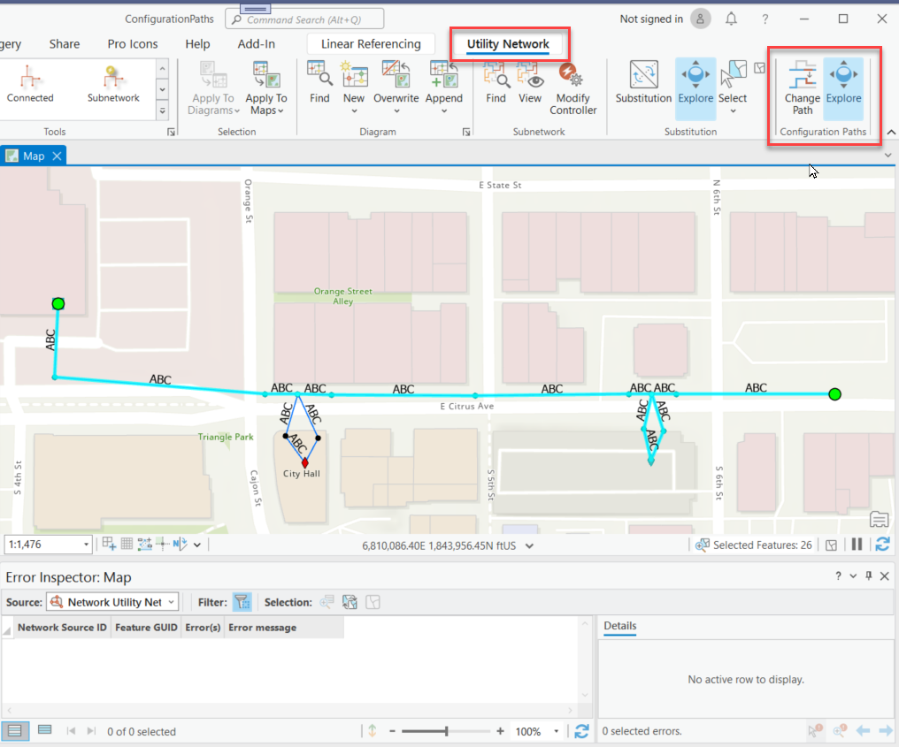
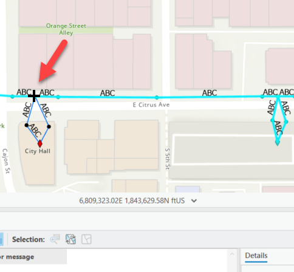
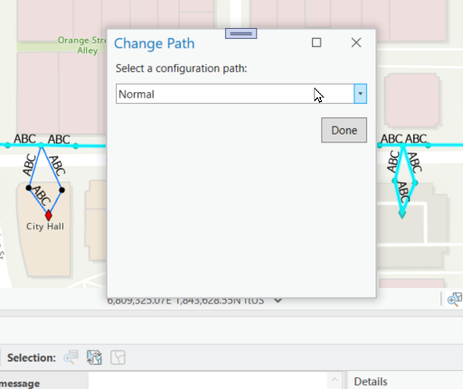
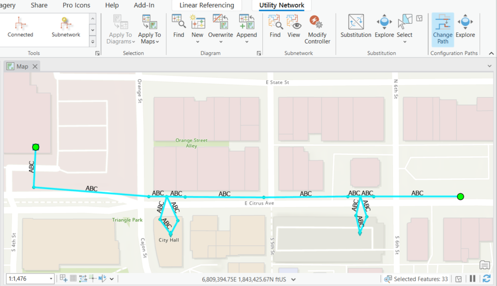

## ConfigurationPathsAddIn

<!-- TODO: Write a brief abstract explaining this sample -->
This sample provides a mechanism for a user to change a network path for a feature that has multiple paths configured in the terminal configuration.  
The conditions are:    
- The selected feature is from the Device or Junction Object class  
- The selected feature is configured with a terminal configration  
- and there is more that one path  
  


<a href="https://pro.arcgis.com/en/pro-app/sdk/" target="_blank">View it live</a>

<!-- TODO: Fill this section below with metadata about this sample-->
```
Language:              C#
Subject:               Utility Network
Contributor:           ArcGIS Pro SDK Team <arcgisprosdk@esri.com>
Organization:          Esri, https://www.esri.com
Date:                  04/04/2024
ArcGIS Pro:            3.3
Visual Studio:         2022
.NET Target Framework: net8.0-windows
```

## Resources

[Community Sample Resources](https://github.com/Esri/arcgis-pro-sdk-community-samples#resources)

### Samples Data

* Sample data for ArcGIS Pro SDK Community Samples can be downloaded from the [Releases](https://github.com/Esri/arcgis-pro-sdk-community-samples/releases) page.  

## How to use the sample
<!-- TODO: Explain how this sample can be used. To use images in this section, create the image file in your sample project's screenshots folder. Use relative url to link to this image using this syntax:  -->
For sample data, download CommunitySampleData-UtilityNetwork-mm-dd-yyyy.zip from https://github.com/Esri/arcgis-pro-sdk-community-samples/releases and unzip it into c:\. We will be using the project in the "c:\Data\UtilityNetwork\ConfigurationPaths" folder as an example for this AddIn.  
  
1. In Visual Studio open this solution and then rebuild the solution.
2. Click Start button to open ArcGIS Pro.  
3. ArcGIS Pro will open.   
4. Open the ConfigurationPaths.aprx file from the "c:\Data\UtilityNetwork\ConfigurationPaths" folder you just downloaded.    
5. Make sure that the map view that contains utility network data is the active map view.  
6. Open the 'Utility Network' tab on the Pro ribbon and note the 'Configuration Paths' group.  
7. Also note the shortest path between the two end points below.  
  
8. Click on the 'Change Path' tool and click on a feature from the Device or Junction Object class that is configured with a terminal configration.  
  
9. Click on a valid Device or Junction Object class feature and the the 'Change Path' dialog opens.   
10. Change the 'Configuration Path' dropdown list to a different path and click 'OK'.  
  
11. Rerun the shortest path and note that the path has now changed.    
  
  

<!-- End -->

&nbsp;&nbsp;&nbsp;&nbsp;&nbsp;&nbsp;
&nbsp;&nbsp;&nbsp;&nbsp;&nbsp;&nbsp;&nbsp;&nbsp;&nbsp;&nbsp;&nbsp;&nbsp;
[Home](https://github.com/Esri/arcgis-pro-sdk/wiki) | <a href="https://pro.arcgis.com/en/pro-app/latest/sdk/api-reference" target="_blank">API Reference</a> | [Requirements](https://github.com/Esri/arcgis-pro-sdk/wiki#requirements) | [Download](https://github.com/Esri/arcgis-pro-sdk/wiki#installing-arcgis-pro-sdk-for-net) | <a href="https://github.com/esri/arcgis-pro-sdk-community-samples" target="_blank">Samples</a>
