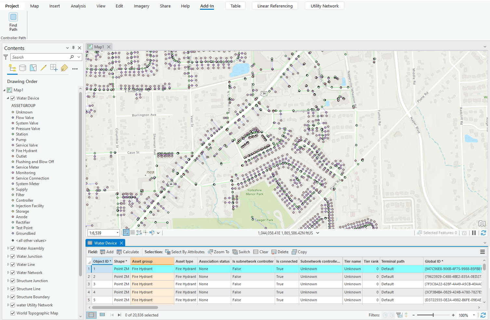
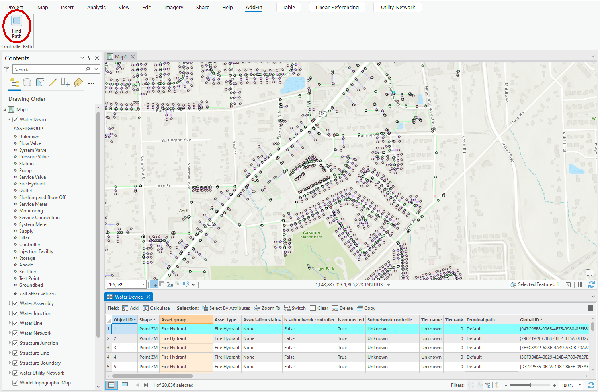
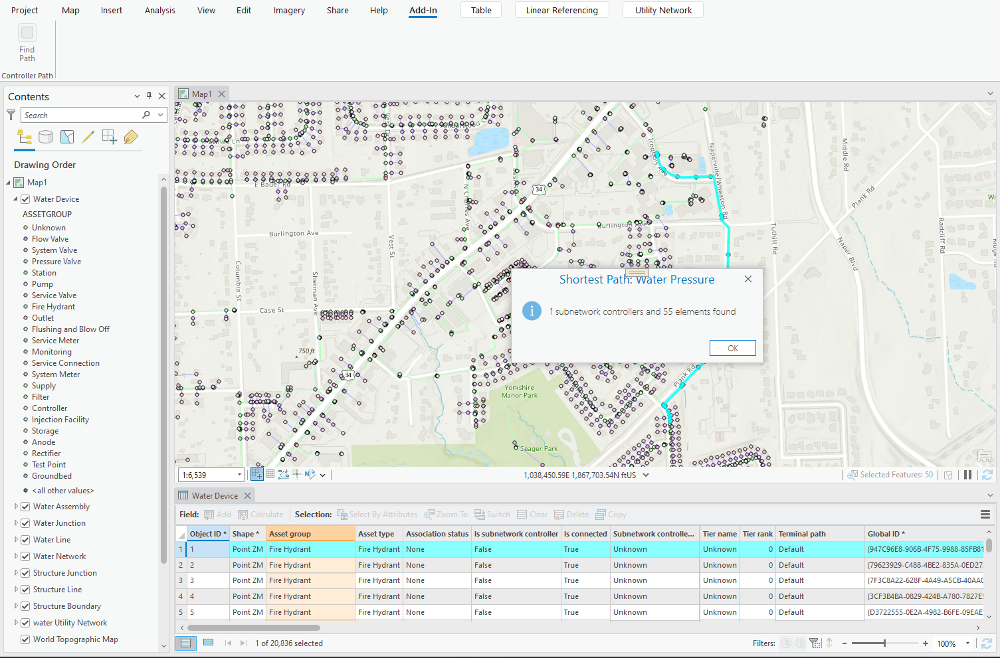
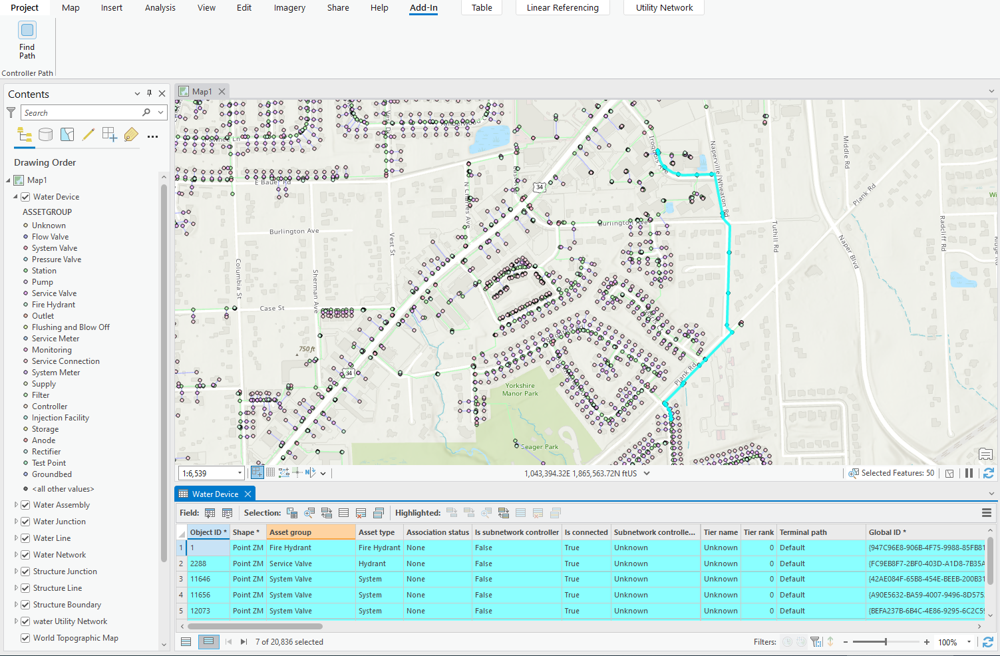

## ControllerPath

<!-- TODO: Write a brief abstract explaining this sample -->
This add-in demonstrates how to use the Pro SDK for .Net to find the shortest path between a feature  and its subnetwork controller by leveraging the Utility Network Trace API. The add-in is designed to work with pressure zones and pressure systems.  
  
The functionality includes:  
  
1. Subnetwork controller trace  
2. Connectivity trace  
3. Shortest path trace  
4. Discover multiple flow paths  
5. Highlight features that are on the path a subnetwork controller  
6. Fetch feature information (network and field attributes) during  trace  
  
The sample uses the NapervilleWater.gdb, a file geodatabase available in the Community Sample data at C:\Data\UtilityNetwork (see under the "Resources" section for downloading sample data).  
  
  


<a href="https://pro.arcgis.com/en/pro-app/sdk/" target="_blank">View it live</a>

<!-- TODO: Fill this section below with metadata about this sample-->
```
Language:              C#
Subject:               Framework
Contributor:           ArcGIS Pro SDK Team <arcgisprosdk@esri.com>
Organization:          Esri, https://www.esri.com
Date:                  11/04/2024
ArcGIS Pro:            3.4
Visual Studio:         2022
.NET Target Framework: net8.0-windows
```

## Resources

[Community Sample Resources](https://github.com/Esri/arcgis-pro-sdk-community-samples#resources)

### Samples Data

* Sample data for ArcGIS Pro SDK Community Samples can be downloaded from the [Releases](https://github.com/Esri/arcgis-pro-sdk-community-samples/releases) page.  

## How to use the sample
<!-- TODO: Explain how this sample can be used. To use images in this section, create the image file in your sample project's screenshots folder. Use relative url to link to this image using this syntax:  -->
1. In Visual Studio click the Build menu.  Then select Build Solution.
 2. Click Start button to open ArcGIS Pro.  
 3. ArcGIS Pro will open.  
 4. Open a map view referencing a utility network with the correct schema (Naperville Water).  
   
 5. Select a feature that belongs in a pressure system (for example, a fire hydrant) as a starting element.  
     
   
 6. Click on the **Find Path** button on the add-in.  
   
   
 7. You will see the number of subnetwork controllers including the shortest path between selected element and its controller.  
   
     
  

<!-- End -->

&nbsp;&nbsp;&nbsp;&nbsp;&nbsp;&nbsp;
&nbsp;&nbsp;&nbsp;&nbsp;&nbsp;&nbsp;&nbsp;&nbsp;&nbsp;&nbsp;&nbsp;&nbsp;
[Home](https://github.com/Esri/arcgis-pro-sdk/wiki) | <a href="https://pro.arcgis.com/en/pro-app/latest/sdk/api-reference" target="_blank">API Reference</a> | [Requirements](https://github.com/Esri/arcgis-pro-sdk/wiki#requirements) | [Download](https://github.com/Esri/arcgis-pro-sdk/wiki#installing-arcgis-pro-sdk-for-net) | <a href="https://github.com/esri/arcgis-pro-sdk-community-samples" target="_blank">Samples</a>
