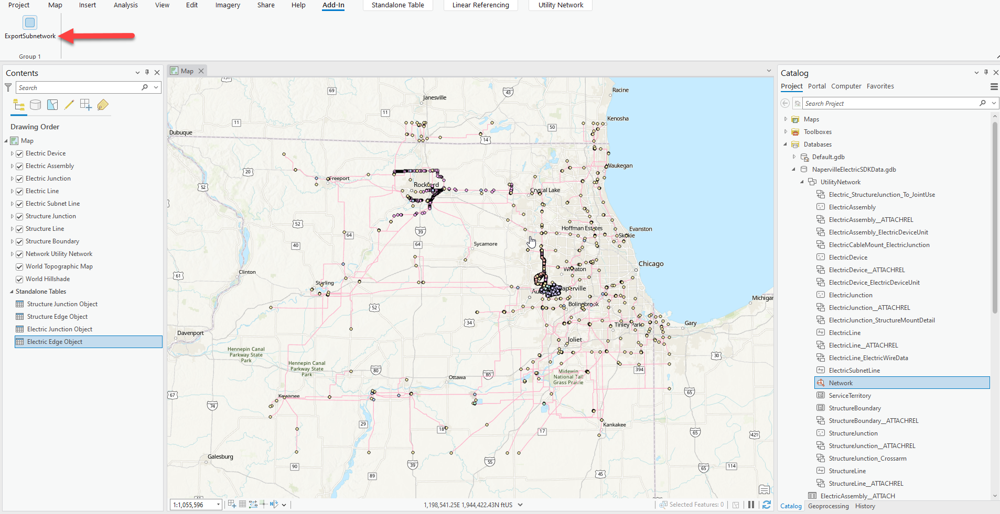
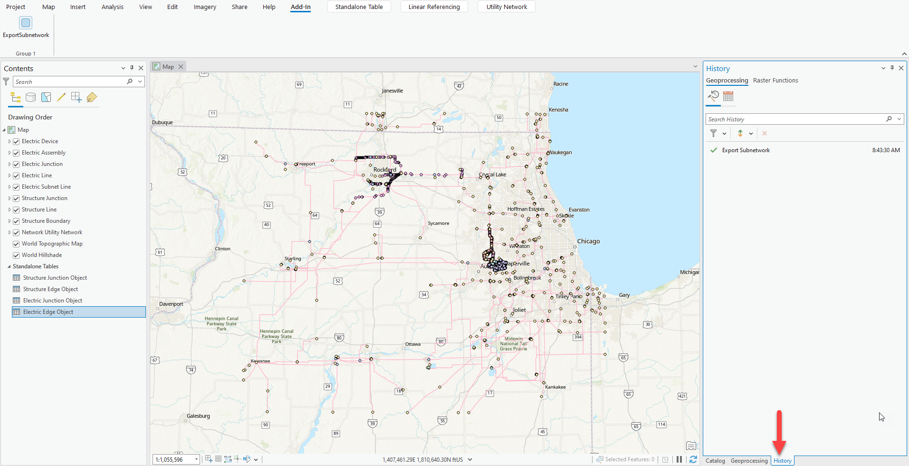

## ExportSubnetwork

<!-- TODO: Write a brief abstract explaining this sample -->
This add-in demonstrates how to use the Export Subnetwork GP tool to export subnetwork from the Utility Network using the Pro SDK for .Net.   
The sample uses the NapervilleElectricSDKData.gdb, a file geodatabase available in the Community Sample data at C:\Data\UtilityNetwork (see under the "Resources" section for downloading sample data).    
You can use any utility network data with this sample, although constant values may need to be changed.  
  


<a href="https://pro.arcgis.com/en/pro-app/sdk/" target="_blank">View it live</a>

<!-- TODO: Fill this section below with metadata about this sample-->
```
Language:              C#
Subject:               Framework
Contributor:           ArcGIS Pro SDK Team <arcgisprosdk@esri.com>
Organization:          Esri, https://www.esri.com
Date:                  05/06/2025
ArcGIS Pro:            3.5
Visual Studio:         2022
.NET Target Framework: net8.0-windows
```

## Resources

[Community Sample Resources](https://github.com/Esri/arcgis-pro-sdk-community-samples#resources)

### Samples Data

* Sample data for ArcGIS Pro SDK Community Samples can be downloaded from the [Releases](https://github.com/Esri/arcgis-pro-sdk-community-samples/releases) page.  

## How to use the sample
<!-- TODO: Explain how this sample can be used. To use images in this section, create the image file in your sample project's screenshots folder. Use relative url to link to this image using this syntax:  -->
1. In Visual Studio click the Build menu.  Then select Build Solution.
2. Click Start button to open ArcGIS Pro.    
3. ArcGIS Pro will open.    
4. Open C:\Data\UtilityNetwork\UtilityNetworkSamples.aprx or a map view that references a utility network with the correct schema    
  
5. Click on the **ExportSubnetwork** button on the add-in to trigger the **Export Subnetwork Tool** from the Utility Network Tools toolbox.  
  
6. On successful completion of the export operation, the resulting output, Export.json, is exported into the path of the directory designated for temporary files.  
```json
 {
  "controllers" : [
    {
      "networkSourceId" : 6,
      "globalId" : "{2F82291C-ED2E-40F5-AB36-FEB0C50E3353}",
      "objectId" : 9990,
      "terminalId" : 16,
      "assetGroupCode" : 26,
      "assetTypeCode" : 503,
      "geometry" : {
        "x" : 1028298.19683201239,
        "y" : 1863426.35552436113,
        "z" : 0,
        "m" : null
      },
      "networkSourceName" : "ElectricDevice",
      "assetGroupName" : "Medium Voltage Circuit Breaker",
      "assetTypeName" : "Three Phase Circuit Breaker",
      "terminalName" : "CB:Line Side"
    }
  ],
  "connectivity" : [
    {
      "viaNetworkSourceId" : 6,
      "viaGlobalId" : "{BBB77A64-8CB6-4754-AD95-0F4E91A6B283}",
      "viaObjectId" : 11132,
      "viaPositionFrom" : 0,
      "viaPositionTo" : 1,
      "viaGeometry" : {
        "x" : 1027726.15827792883,
        "y" : 1863365.88910986483,
        "z" : 0,
        "m" : null
      },
      "fromNetworkSourceId" : 6,
      "fromGlobalId" : "{BBB77A64-8CB6-4754-AD95-0F4E91A6B283}",
      "fromObjectId" : 11132,
      "fromTerminalId" : 7,
      "fromGeometry" : {
        "x" : 1027726.15827792883,
        "y" : 1863365.88910986483,
        "z" : 0,
        "m" : null
          .
          .
          .
          . 
 ```
  

<!-- End -->

&nbsp;&nbsp;&nbsp;&nbsp;&nbsp;&nbsp;
&nbsp;&nbsp;&nbsp;&nbsp;&nbsp;&nbsp;&nbsp;&nbsp;&nbsp;&nbsp;&nbsp;&nbsp;
[Home](https://github.com/Esri/arcgis-pro-sdk/wiki) | <a href="https://pro.arcgis.com/en/pro-app/latest/sdk/api-reference" target="_blank">API Reference</a> | [Requirements](https://github.com/Esri/arcgis-pro-sdk/wiki#requirements) | [Download](https://github.com/Esri/arcgis-pro-sdk/wiki#installing-arcgis-pro-sdk-for-net) | <a href="https://github.com/esri/arcgis-pro-sdk-community-samples" target="_blank">Samples</a>
