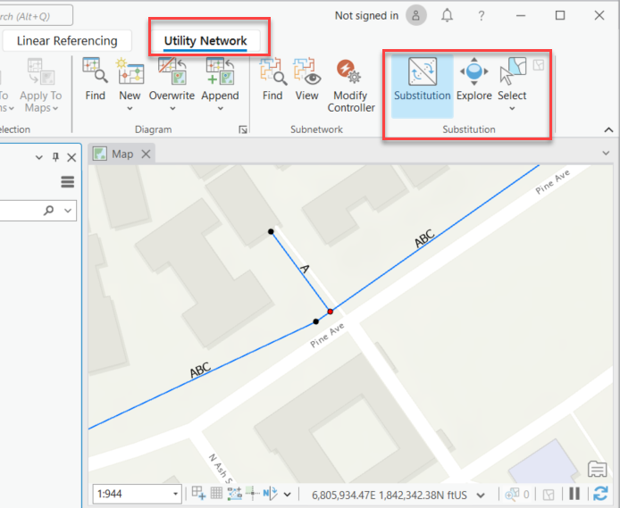
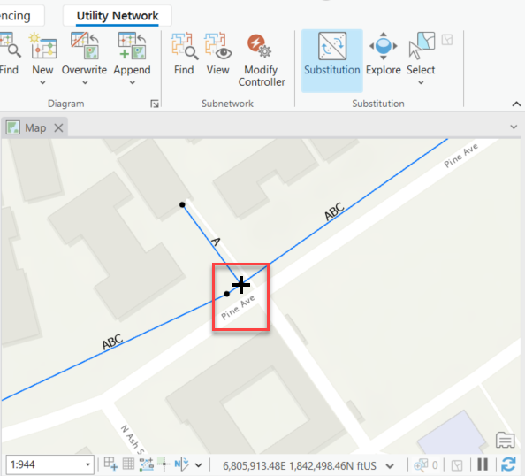
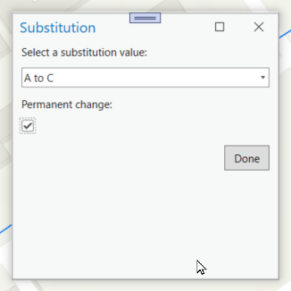
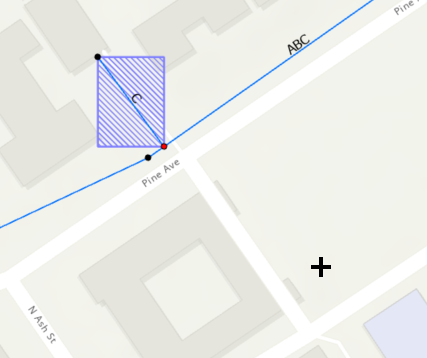

## SubstitutionAddIn

<!-- TODO: Write a brief abstract explaining this sample -->
This sample provides a mechanism for a user to choose to turn a simple substitution setting into a permanent substitution.    
This means it will end up copying the calculated values for propagated attribute into the original attribute that was propagated.    
In electric networks this usually means copying the phases energized values back into the phases current values.  
  


<a href="https://pro.arcgis.com/en/pro-app/sdk/" target="_blank">View it live</a>

<!-- TODO: Fill this section below with metadata about this sample-->
```
Language:              C#
Subject:               Utility Network
Contributor:           ArcGIS Pro SDK Team <arcgisprosdk@esri.com>
Organization:          Esri, https://www.esri.com
Date:                  05/06/2025
ArcGIS Pro:            3.5
Visual Studio:         2022
.NET Target Framework: net8.0-windows
```

## Resources

[Community Sample Resources](https://github.com/Esri/arcgis-pro-sdk-community-samples#resources)

### Samples Data

* Sample data for ArcGIS Pro SDK Community Samples can be downloaded from the [Releases](https://github.com/Esri/arcgis-pro-sdk-community-samples/releases) page.  

## How to use the sample
<!-- TODO: Explain how this sample can be used. To use images in this section, create the image file in your sample project's screenshots folder. Use relative url to link to this image using this syntax:  -->
For sample data, download CommunitySampleData-UtilityNetwork-mm-dd-yyyy.zip from https://github.com/Esri/arcgis-pro-sdk-community-samples/releases and unzip it into c:\. We will be using the project in the "c:\Data\UtilityNetwork\Substitution" folder as an example for this AddIn.  
  
1. In Visual Studio open this solution and then rebuild the solution.
2. Click Start button to open ArcGIS Pro.  
3. ArcGIS Pro will open.   
4. Open the Substitution.aprx file from the "c:\Data\UtilityNetwork\Substitution" folder you just downloaded.    
5. Make sure that the map view that contains utility network data is the active map view.  
6. Open the 'Utility Network' tab on the Pro ribbon and note the 'Substitution' group.  
  
7. Click on the 'Substitution' tool and click on a feature that is configured with the 'Attribute Substitution' category.  In this electric network this is a Tap feature.  
  
8. Once you clicked on a feature the add-in checks that its assettype has the 'Attribute Substitution' category.  Then the add-in finds the network attribute that has a Network Attribute to Substitute set on it, then finds the field for the substitution by checking assignments, checking if it already has a value and then opens the 'Substitution' dialog.   
  
9. Change the substitution from the dropdown list and check the 'Permanent Change' checkbox and click 'OK'.  
  
Once the ok button is pressed the update is displayed on the map.    
  
  

<!-- End -->

&nbsp;&nbsp;&nbsp;&nbsp;&nbsp;&nbsp;
&nbsp;&nbsp;&nbsp;&nbsp;&nbsp;&nbsp;&nbsp;&nbsp;&nbsp;&nbsp;&nbsp;&nbsp;
[Home](https://github.com/Esri/arcgis-pro-sdk/wiki) | <a href="https://pro.arcgis.com/en/pro-app/latest/sdk/api-reference" target="_blank">API Reference</a> | [Requirements](https://github.com/Esri/arcgis-pro-sdk/wiki#requirements) | [Download](https://github.com/Esri/arcgis-pro-sdk/wiki#installing-arcgis-pro-sdk-for-net) | <a href="https://github.com/esri/arcgis-pro-sdk-community-samples" target="_blank">Samples</a>
