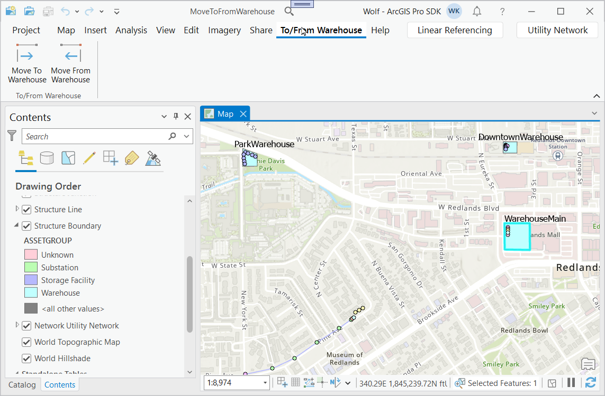
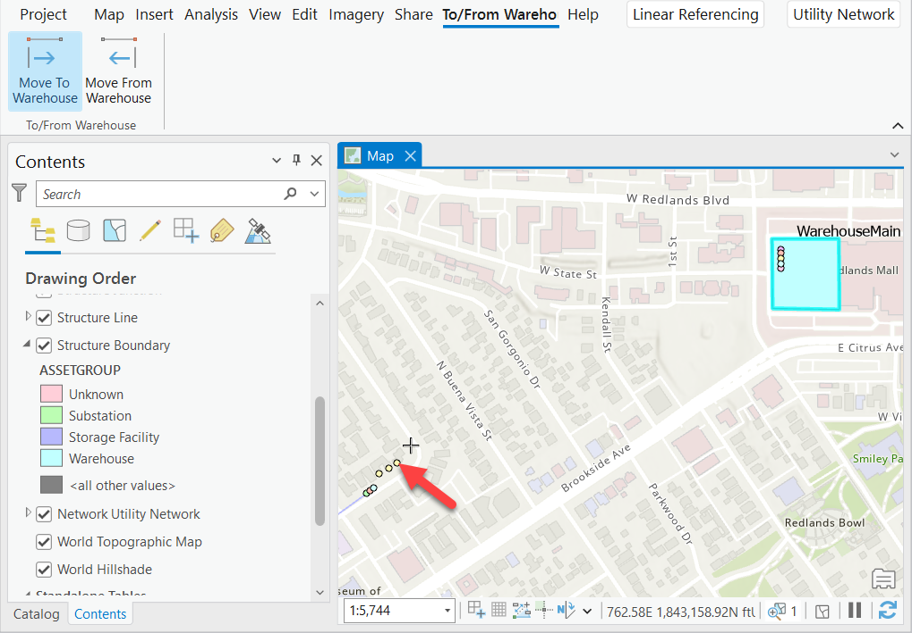
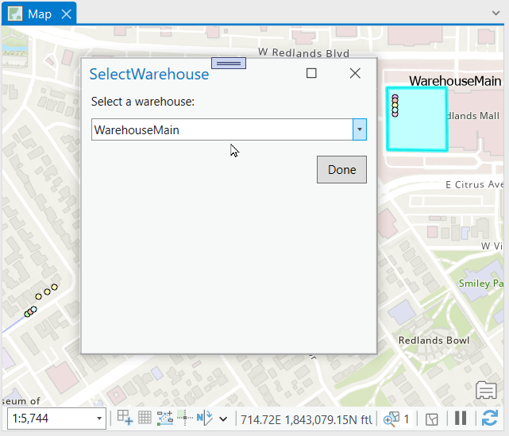
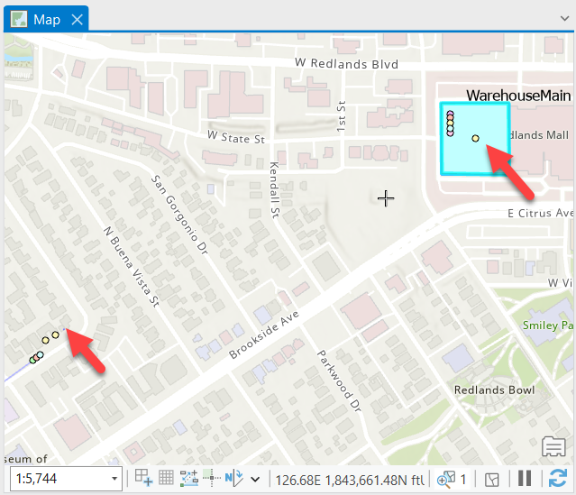
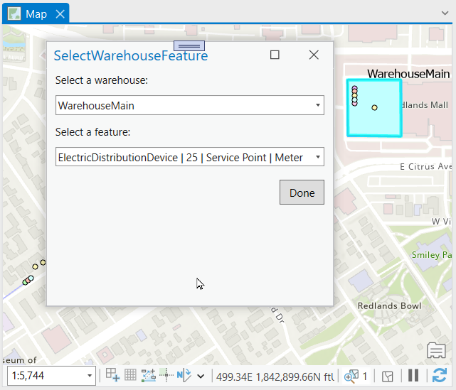
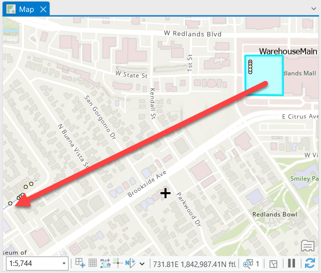

## ToFromWarehouse

<!-- TODO: Write a brief abstract explaining this sample -->
This sample provides a quick way of moving features to and from a warehouse.  A warehouse is designated by adding a new category to the utility network. That category value can then be assinged to certain asset types.  
To create your own warehouse category you can follow these steps:  
  
1. Run the gp tool Add Network Category and create a category called 'Warehouse'.  
2. Run the gp tool Set Network Category and assign the newly created Warehouse category to an asset group and asset type for a polygon feature from the structure boundary class.  
3. Add a field called Name to the structure boundary class.  
4. Make sure to run the Add Rule geoprocessing tool to allow for containment associations between this asset group and asset type and any other features that you would like to have moved to or from it.  
5. Create at least one new feature of this asset type and make sure to provide a name in the Name field.  
  


<a href="https://pro.arcgis.com/en/pro-app/sdk/" target="_blank">View it live</a>

<!-- TODO: Fill this section below with metadata about this sample-->
```
Language:              C#
Subject:               Utility Network
Contributor:           ArcGIS Pro SDK Team <arcgisprosdk@esri.com>
Organization:          Esri, https://www.esri.com
Date:                  05/06/2025
ArcGIS Pro:            3.5
Visual Studio:         2022
.NET Target Framework: net8.0-windows
```

## Resources

[Community Sample Resources](https://github.com/Esri/arcgis-pro-sdk-community-samples#resources)

### Samples Data

* Sample data for ArcGIS Pro SDK Community Samples can be downloaded from the [Releases](https://github.com/Esri/arcgis-pro-sdk-community-samples/releases) page.  

## How to use the sample
<!-- TODO: Explain how this sample can be used. To use images in this section, create the image file in your sample project's screenshots folder. Use relative url to link to this image using this syntax:  -->
For sample data, download CommunitySampleData-UtilityNetwork-mm-dd-yyyy.zip from https://github.com/Esri/arcgis-pro-sdk-community-samples/releases and unzip it into c:\. We will be using the project in the "c:\Data\UtilityNetwork\MoveToFromWarehouse" folder as an example for this AddIn.  
  
1. In Visual Studio open this solution and then rebuild the solution.
2. Click Start button to open ArcGIS Pro.  
3. ArcGIS Pro will open.   
4. Open the MoveToFromWarehouse.aprx file from the "c:\Data\UtilityNetwork\MoveToFromWarehouse" folder you just downloaded.    
5. Open the 'To/From Warehouse' tab on the ribbon.    
  
6. Moving a feature to a Warehouse:  Click on the "Move To Warehouse" tool button.  
7. Click on a UN feature on the map to select the feature to move to a warehouse.  Note: make sure to click on a UN class and feature.    
  
8. A dialog pops up to allow the selection of the destination warehouse  
  
9. After selecting a warehouse from the dropdown and clicking 'Done' the Addin creates a new containment association between the clicked feature and the selected warehouse feature.    
  
10. Move a feature from a Warehouse: Click on the "Move From Warehouse' tool button.  
11. Click on the map to set the destination location of the warehouse feature.    
12. A dialog pops up that to selection a warehouse and then a feature in that warehouse.  
  
13. Select a warehouse and feature and click 'Done'. This removes the containment association between the chosen feature and the warehouse and then moves the feature to the clicked on location on the map.  
  
  

<!-- End -->

&nbsp;&nbsp;&nbsp;&nbsp;&nbsp;&nbsp;
&nbsp;&nbsp;&nbsp;&nbsp;&nbsp;&nbsp;&nbsp;&nbsp;&nbsp;&nbsp;&nbsp;&nbsp;
[Home](https://github.com/Esri/arcgis-pro-sdk/wiki) | <a href="https://pro.arcgis.com/en/pro-app/latest/sdk/api-reference" target="_blank">API Reference</a> | [Requirements](https://github.com/Esri/arcgis-pro-sdk/wiki#requirements) | [Download](https://github.com/Esri/arcgis-pro-sdk/wiki#installing-arcgis-pro-sdk-for-net) | <a href="https://github.com/esri/arcgis-pro-sdk-community-samples" target="_blank">Samples</a>
